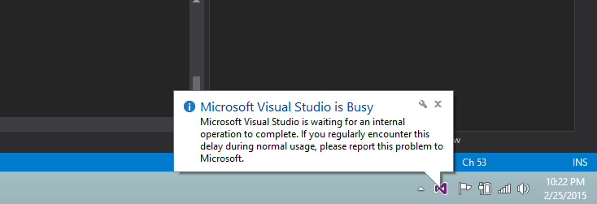

I've been trying out Visual Studio 2015 CTP (Community Technology Preview 5 for those of you who are curious to know what CTP means but not curious enough to look it up) for a while now and I was having an issue with using gulp from the task runner explorer. In CTP 5 the Task Runner Explorer didn't find/recognize the .gulpfile so it couldn't be set up to use the special build hooks.

There was also an issue where Visual Studio would freeze, it wouldn't use more RAM or CPU just freeze and politely tell me it was busy every so often from the system tray.

Turns out is was because of saving the .gulpfile causes a node process to start and if Gulp is only installed as a dev dependency Visual Studio just sits and waits while I can only assume the Node process is in an error state. To fix this I had terminate Visual Studios and then uninstalling Gulp locally and installing Gulp globally. I also terminated Node.Js processes in the Task Manager before opening Visual Studio again.

Playing around with it afterwards to try and duplicate the problem I have found that you don't need a Gulp task that is not functioning correctly for Visual Studio to freeze like this, just have gulp installed locally, not globally and save a .gulpfile. You can also get Visual Studio to unfreeze by ending the Node.Js processes in the Task Manager.

Will this be an issue in the future? That's hard to say. Using the local copy of Gulp allows a dev team to be sure they are using the same setup for processes but if Visual Studios only uses the global copy of Gulp there could be some big issues especially with Gulp 4\* on the horizon.

\*If your new to using Node packages and SemVer, like me, a Major version number change means the new version API is not compatable with the old versions
