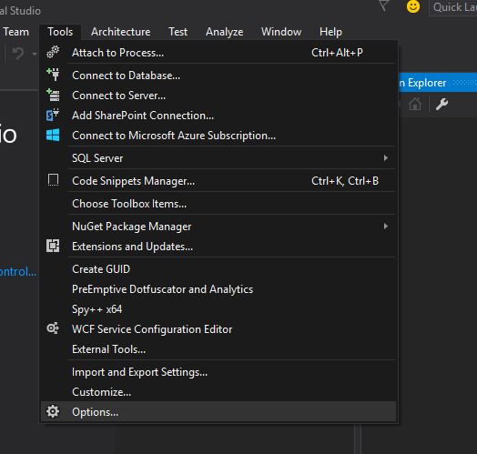
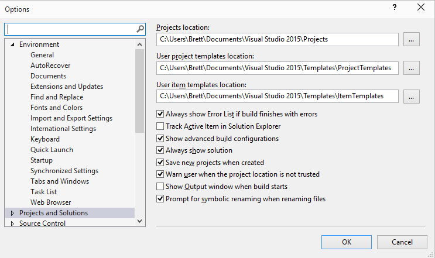
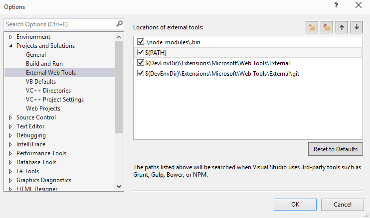

The Ladies, Gents and Paperclips at Microsoft are taking the easy road with some aspects of the web development tool chain this go around. Instead of reinventing the wheel that the rest of the web development community is already taking around the block they are just including some of those preexisting tools. What do I mean by this? Well, Visual Studios 2015 installs copies of popular web related applications/tools like Node.js, NPM, Grunt, Bower, and Git.

This is all well and good and helps ease a web forms developer into the strange new world of CSS pre-compiling and bundling or JavaScript Linting and Uglification without the use of System.Web.Optimization. But what if you already have Node.js or use io.js? What happens when you don't want to use Grunt or plan on using something besides Bower?

### Change the Settings of Course!

The nice people at Microsoft have made it easy to tell Visual Studio where to look for external tools.

Go to Tool -> Options

Expand Projects and Solutions

And then External Web Tools

Here you can see the list of Paths that Visual Studios will check for external tools and change the order to how you would like.

This will check the system path before the External Tools folder that ships with Visual Studios 2015.

With this change you should be using the version that you installed outside of Visual Studios. This will allow you to update and change out External tools as you choose.

### Should you delete the External Tools folder path?

Probably not since there may be tools that it includes that you are not aware of and don't have an alternative installed on your machine. Even if you have all the tools installed outside of Visual Studios currently there is the chance that a future update will add new tools to the folder and your Visual Studio would not be looking for it even as a fall back.
