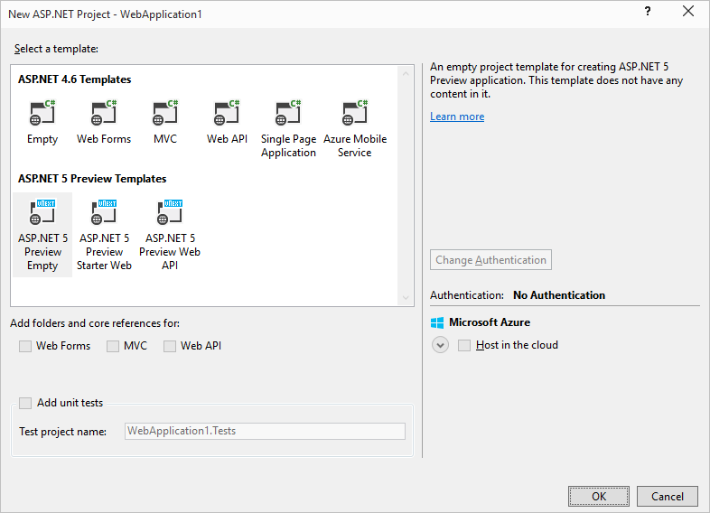
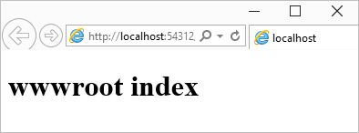
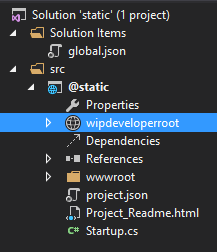
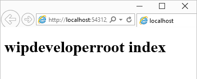

Things are changing on the web in the Microsoft world. ASP.NET 5 uses a different approach to static files than previous iterations. While before the root of your project was the root of your website that is now not the case.

### Which Root is Root

In this post we will walk through setting up an ASP.NET site that serves just static files along with some explanations of new things. I started with a new ASP.NET Web Application and chose the "ASP.NET 5 Preview Empty" template but you can use any web project you would like.

 



Since I used the empty template I have to add a dependency for static files to my project.json so it looks like this:

```javascript
"dependencies": {
    "Microsoft.AspNet.Server.IIS": "1.0.0-beta3",
    "Microsoft.AspNet.StaticFiles": "1.0.0-beta3"
},
```

This will allow the server to give out content from the static folder.

To tell the server to serve static files we have to call UseStaticFiles() on the app in the Configure method of the startup.cs

```csharp
public void Configure(IApplicationBuilder app)  
{
    app.UseStaticFiles();
}
```

With this complete, the server side of this setup is ready to serve static files. But from where?

### Enter the wwwroot

By default a new ASP.NET 5 site is setup to use the "wwwroot" folder as the root of the website.

We can verify that we are serving files from the "wwwroot" by adding an html page into the "wwwroot" folder. Just right click the "wwwroot" -> Add -> New Item -> select "HTML Page." Give it a name (or not). I used index. Once you have your new html page, give it some sample text like `<h1>wwwroot index</h1>` in the body.

Now run it with IIS Express by selecting the green arrowed button at the top or pressing f5.


Your page should look somewhat like this:



The root folder you are using can be changed to something that is more suited to your tastes in the project.json.

From:

```javascript
"webroot": "wwwroot",
```

To:

```javascript
"webroot": "wipdeveloperroot",
```

This of course means you need a folder by the same name so we have to add a wipdeveloperroot folder and some content to it.

With the webroot set to wipdeveloperroot and a folder of the same name added the file structure will look something like this:

 



You might have noticed the globe icon next to the wipdeveloperroot folder instead of the usual folder icon (the wwwroot now has a normal folder icon, in case you were keeping tabs at home). I think (but I can't confirm) this is just a quick visual indication to tell where the site root is located.

Add an index.html page to the wipdeveloperroot folder similar to the one you used for the wwwroot but this time use something creative like `<h1>wipdeveloperroot index</h1>` in the body.

Run the project and you should see:

 



With this new knowledge you could create a static website and serve it from an ASP.NET 5 setup on Windows, Mac or Linux.
