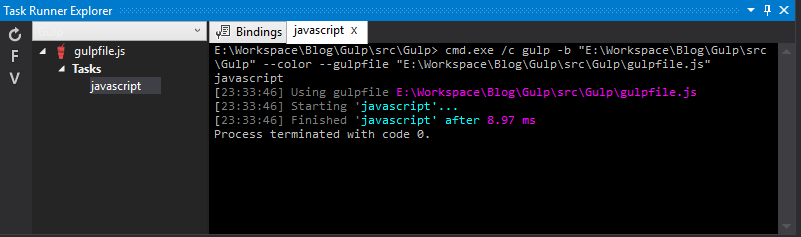

This is the third post in a series about using Gulp with Visual Studio. If you missed the first post feel free to take the time to go back and read it [Visual Studio 2015 CTP 6 and Gulp - Episode I: Getting Started](https://www.wipdeveloper.com/2015/04/27/visual-studio-2015-ctp-6-and-gulp-episode-i-getting-started/) or the second post [Visual Studio 2015 CTP 6 and Gulp Episode II: First Task](https://www.wipdeveloper.com/2015/04/29/visual-studio-2015-ctp-6-and-gulp-episode-ii-first-task/).

#### Great, now how can I use it?

You could run this from the console window by typing `gulp javascript` but we are using Visual Studio and have this fancy Task Runner Explorer we want to use. If you already had the Task Runner Explorer open you may have seen it change from this

##### Before

 


to this

##### After


when we created the `javascript` task.

> If you did not go to your _View -> Other Windows -> Task Runner Explorer_ to open it. 

Now you can see all the tasks you currently have set up, in this case just the one. To run it, right click and select run or double click it. This will open a window to the right of the available tasks and show the console output of the task you ran.



If you are following along at home you should now have a file in your `wwwroot` named `app.js` that looks like this.

```javascript
document.addEventListener("DOMContentLoaded",function(){alert("This page loaded!")});  
document.addEventListener("DOMContentLoaded",function(){var e=2e3;window.setTimeout(function(){var e=document.getElementById(e);e.className+=" delayed"},e)});  
```

> You may notice the lack of whitespace shortened variable names and removal off comments but it looks like it's all there.

If you add a reference to `app.js` in your index page and run IIS, the page should load and alert you that "this page loaded!"

Conclude your epic journey with [Visual Studio 2015 and Gulp Episode IV: The Styles](https://www.wipdeveloper.com/2015/05/05/visual-studio-2015-and-gulp-episode-iv-the-styles/).
