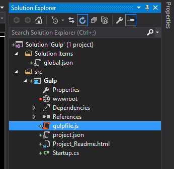

This is the second post in a series about using Gulp with Visual Studio. If you missed the first post feel free to take the time to go back and read it [Visual Studio 2015 CTP 6 and Gulp - Episode I: Getting Started](https://www.wipdeveloper.com/2015/04/27/visual-studio-2015-ctp-6-and-gulp-episode-i-getting-started/).

Now that we have all the required tools installed, we need to create our `gulpfile.js`. So Add a New Item how ever you choose and name it gulpfile.js. If you are following along, your file structure should look similar to this:



#### I have an empty gulpfile.js now what?

Open your newly created gulpfile.js and start setting up the tools, starting with Gulp.

```javascript
var gulp = require('gulp'),  
    uglify = require('gulp-uglify'),
    sass = require('gulp-sass'),
    concat = require('gulp-concat');
```

> On a side note I have added the static files dependency, an index.html inside the `wwwroot` and a `src` folder to hold my source files. For more information on how this can be done see my previous post [ASP.NET 5 and Static Files](https://www.wipdeveloper.com/2015/04/02/asp-net-5-and-static-files/)

Now that you have the beginning of your `gulpfile.js` we should create a few things we might want to concatenate and minify and a SCSS style sheet that needs to be converted to CSS. I will create 2 JavaScript files, one named `alert.js` and the other names `delay.js` and one SCSS file names `styles.scss`.

##### delay.js

```javascript
document.addEventListener('DOMContentLoaded', function () {  
    var time = 2000;
    //some comment
    window.setTimeout(function () {
        var mainDiv = document.getElementById(mainDiv);
        mainDiv.className += ' delayed';

    }, time)

});
```

##### alert.js

```javascript
document.addEventListener('DOMContentLoaded', function () {  
    // some comment here
    alert('This page loaded!');

});
```

##### style.scss

```css
body {  
    color: blue;
    background-color: black;

    div {

        & > div {
            background-color: grey;
            color: black;
        }
    }

    .delayed {
        background-color: blue;
        color: black;
    }
}
```

#### But I only want one JavaScript file

Back in your `gulpfile.js` we are going to create a task to concatenate the JavaScript files. In gulp terms a task is a function you assign a name, declare dependencies and define the function it will preform. Tasks can require other tasks to be accomplished before they are executed, allowing you to build complex build processes one little task at a time. Dependencies are optional and since this is a pretty simple process I will omit the array that represents them this time.

```javascript
gulp.task('javascript', function () {  
// do work here
});
```

This is pretty straight forward so far. I have created a task named 'javascript' and given it a function that does nothing. I will add the following lines in place of `// do work here`

1. `gulp.src('src/*.js')` - gets the JavaScript files into a stream.
2. `.pipe(uglify())` - performs the default uglify work of mangling names, compression, and comment removal.
3. `.pipe(concat('app.js'))` - concatenates the files into a new file names 'app.js'.
4. `.pipe(gulp.dest('./wwwroot/'));` - saves the new 'app.js' file into the `wwwroot` directory.

So our final task looks like this:

```javascript
gulp.task('javascript', [], function () {  
    var appName = 'app.js',
        root = './wwwroot/';

    deleteFile(root + appName); //helper function

    gulp.src('src/*.js')
    .pipe(uglify())
    .pipe(concat(appName))
    .pipe(gulp.dest(root));
});
```

> I have added a helper function to delete files if they exist shown bellow. It uses the Node.js fs functions [`existsSync`](https://nodejs.org/api/fs.html#fs_fs_existssync_path) and [`unlinkSync`](https://nodejs.org/api/fs.html#fs_fs_unlinksync_path).

```javascript
function deleteFile(filePath) {  
    if (fs.existsSync(filePath)) {
        fs.unlinkSync(filePath);
    }
}
```

Fade to back, roll credits....

Ok, you probably get the joke by now. Continue your foray with [Visual Studio 2015 and Gulp Episode III: Assigning to a Build Step](https://www.wipdeveloper.com/2015/05/01/visual-studio-2015-and-gulp-episode-iii-assigning-to-a-build-step/).
