When working in Visual Studios it sometimes becomes required to open the command line in your current folder structure. While it's possible to **Window** + **X** choose command prompt and cd your way to your current project; wouldn't it just be easier if you could get there straight from Visual Studio?

 

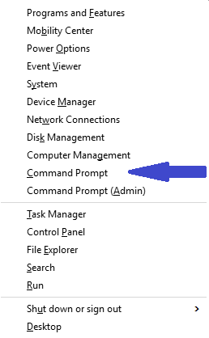

(And right clicking in the Solution Explorer choosing **Open Folder in File Explorer** and then holding shift while right clicking to get the option to **Open command window here** doesn't count)

 

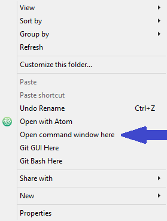

### Enter Extensions!

Extensions are a way to add features and functionality to Visual Studio. Anyone can create them and Microsoft has handy guides and templates if you would like to try your hand at it. For our current issue of wanting the command line with fewer steps we just need to know they exist. Some very nice people have already created and shared their creations for others to use.

We are going to install the _Open Command Line_ extension created by internet famous Mads Kristensen. You can do this by going to Tools -> Extensions and Updates...

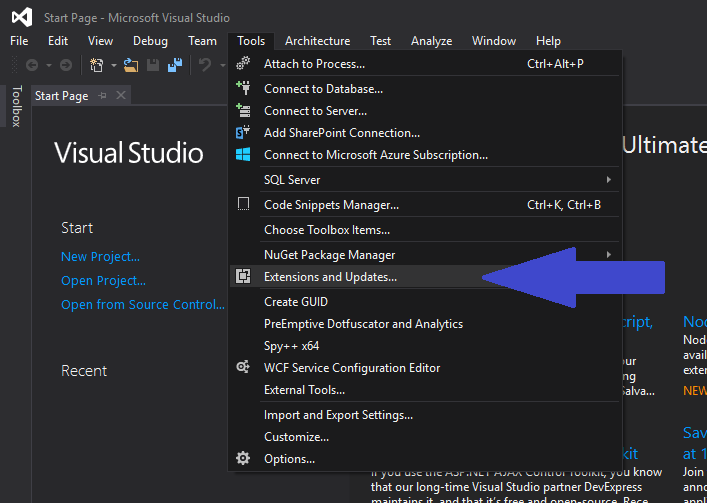

This will open the _Extensions and Updates_ window showing what you already have installed and should look like this.

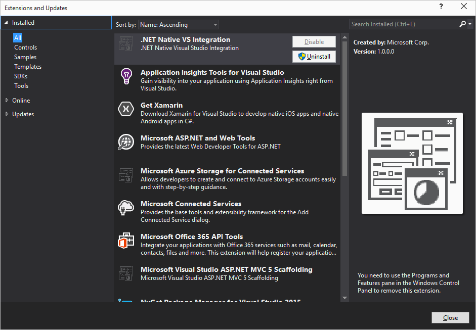

On the left hand side choose _Online_ and wait briefly for it to load. Your window should now look like this.

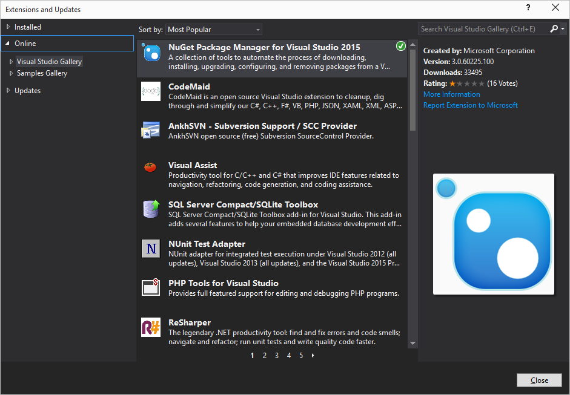

From here you could browse thousands of options or use the search box in the upper right hand corner.

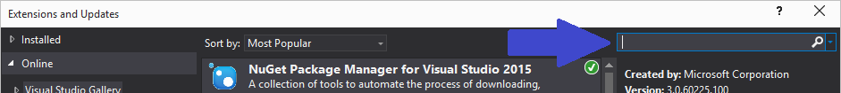

Enter "Open Command Line" in the search box and we should get something like this.

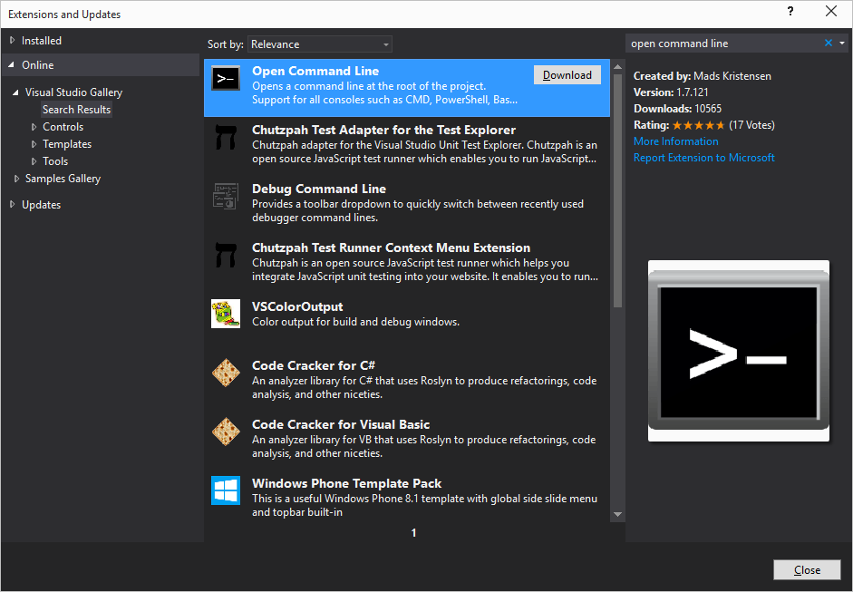

Select "Open Command Line" and then click the **Download** button.

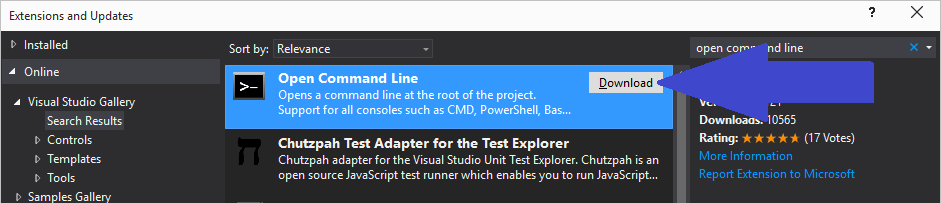

'Read' the license and if you agree click the **Install** button

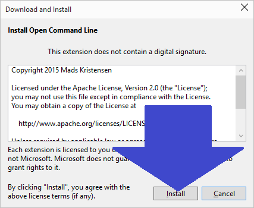

Restart Visual Studios and Enjoy!

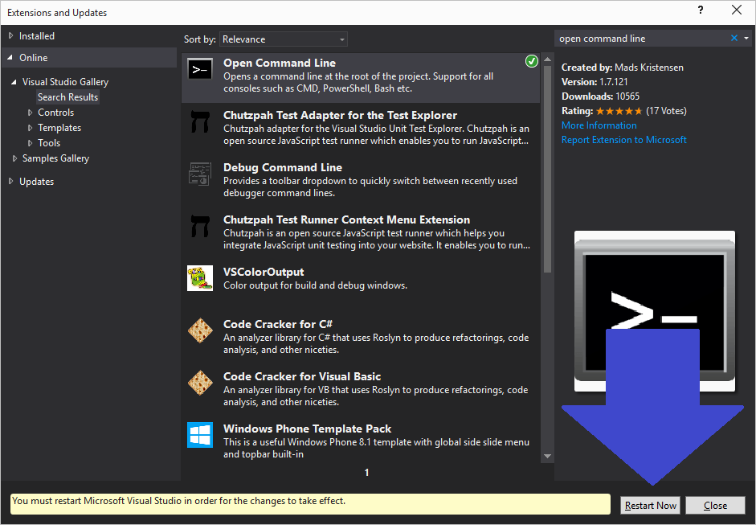

### Enjoy How?

Glad you asked! Press '**Alt**' + the **space bar**. If you have a solution open a command prompt should have opened up to the directory you have in focus.

If you would like to have it always open to the solution level folder there is an option for that and a few other settings that can be found in your Tools -> Options than Environment -> Command Line

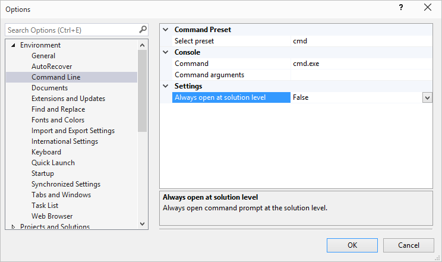
