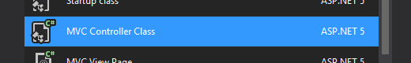
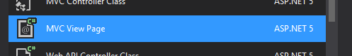
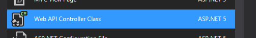
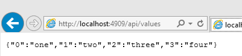

This is the second post about ASP.NET MCV and Web API Controllers. If you missed the first post feel free to take the time to go back and read [ASP.NET 5 MVC Controllers: Setup](/2015/05/15/asp-net-5-mvc-controllers-setup/).

#### All that work and it still wont run

So now that we have the bare minimum set up we can actually add our first MVC controller. To do so use the add new item menu inside the `Controllers` folder and choose "MVC Controller Class".



Name it as you see fit, I kept it as `HomeController` since that is how we named the view folder for it already.

Open up the `HomeController.cs` and add the line `ViewBag.Message = DateTime.Now;` before the `return View();` line inside the `Index()` action. The final results should look similar to this:

##### HomeController.cs

```csharp
namespace Controllers.Controllers  
{
    public class HomeController : Controller
    {
        // GET: /<controller>/
        public IActionResult Index()
        {
            ViewBag.Message = DateTime.Now;   // Added line
            return View();
        }
    }
}
```

> In case you didn't know `Actions` are the methods that handle the http requests on the controller. In this example there is only one action `Index`.

#### So close, yet so far away

Now that we have a `HomeController` with an `Index` action we need to add a view. In the `Views/Home` folder add a new `MVC View Page`.



Name it `Index` and open it up. We will uncomment the `ViewBag.Title = "Home Page";` so we can set the page title and add some html so our page isn't completely boring and white and we also prove that we can pass the message from the controller through the ViewBag, like so:

```html
@{
    //set the page title on the _Layout.cshtml
    ViewBag.Title = "Home Page";
}
<h1>  
    Home Index
</h1>

<p>@ViewBag.Message</p>  
```

#### Now we can run it

No really it should run and give you the time, YAY!

#### Adding a Web API endpoint

For Web API endpoints the you can skip most of the adding of folders and views since they are not required. So after you have configured you `Startup.cs` and added the `Controllers` folder you can just add a new `Web API Controller Class`.



I kept the default name of `ValuesController` but you can name it how you see fit. After opening the `ValuesController.cs` I made a few changes to the `get` actions so we can verify the different endpoints can be accessed:

##### ValuesController.cs

```csharp
private Dictionary<int, string> _collection;

 public ValuesController()
 {
     _collection = new Dictionary<int, string>();
     _collection.Add(0, "one");
     _collection.Add(1, "two");
     _collection.Add(2, "three");
     _collection.Add(3, "four");
 }

 // GET: api/values
 [HttpGet]
 public IEnumerable<KeyValuePair<int, string>> Get()
 {
     return _collection;
 }

 // GET api/values/5
 [HttpGet("{id}")]
 public string Get(int id)
 {
     return _collection[id];
 }
```

Now when we run our little site if we go to the `/api/values/` we should get all the values like so:



And if we go to `/api/values/3` we should get only the one value, like so:


Using the other actions `put`, `post`, `patch`, and `delete` would require a persistent data store and that's not something we have set up yet.

This is just the scratching the surface of how to use ASP.NET 5 and what can be done. Adding persistent data storage, using dependency injection, using a Single Page Application Framework and not to mention running your site on a Windows, Mac or Linux machine are among just a few of the more exciting things that can be done with just a little more understanding.
