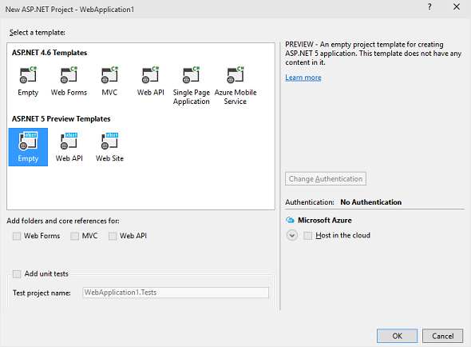
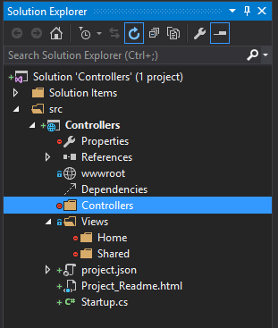

Previous versions of ASP.NET MVC and Web API had 2 different kinds of controllers. One was the "C" in MVC and the other was the controller that was the endpoint for Web API. While they both performed similar functions and had access to similar features they were actually two different beasts.

That all changes with ASP.NET 5. The Controller base class that is used for MVC is the same base class that will be used for Web API endpoints. This will simplify setup and reduce required dependencies.

#### Where to begin?

Using Visual Studio 2015 RC, I will begin with an ASP.NET 5 Preview Empty Template.



This way I can opt into things rather than trying to figure out what to remove. This, of course, starts off with a rather spartan solution structure and we will have to add things to get a working MVC app. Before we start adding to the folder structure though lets get the required dependencies.

In the `project.json` file add `"Microsoft.AspNet.Mvc": "6.0.0-beta4"` to the dependencies so it should look like so:

```
"dependencies": {
  "Microsoft.AspNet.Server.IIS": "1.0.0-beta4",
  "Microsoft.AspNet.Server.WebListener": "1.0.0-beta4",

  //add for using mvc
  "Microsoft.AspNet.Mvc": "6.0.0-beta4"
},
```

With the dependencies set it's time to configure the app. Your `StartUp.cs` should already have methods named `ConfigureServices` and `Configure`, if not feel free to add them now. In the `Configure` method we will call `app.UseMvc` and pass in a Linq expression to configure the default route. In the `ConfigureServices` we call `services.AddMvc()` so that the require MVC services are configured. Your `Startup.cs` should look like this now:

##### Startup.cs

```csharp
public void ConfigureServices(IServiceCollection services)  
{
    //configure MVC services
    services.AddMvc();
}

public void Configure(IApplicationBuilder app)  
{
    // Add MVC to the request pipeline.
    app.UseMvc(routes =>
    {
      // configure degfault MVC route
        routes.MapRoute(
            name: "default",
            template: "{controller}/{action}/{id?}",
            defaults: new { controller = "Home", action = "Index" });
    });
}
```

#### Folders are boring

Now that the configuration, is out of the way we can have fun adding some folders. Create two folders for your web project: `Controllers` and `Views`. This is the general MVC convention for setting up the project and things will not work properly if you don't set it up correctly. The `Controllers` folder is used to contain the controllers that will be added later. And the `Views` folder contains the `.cshtml` files that will represent our markup with Razor syntax.

> Razor syntax is a combination of C# and html that is processed into pure html before being served to the client. A brief introduction to Razor syntax can be found at [http://www.asp.net/](http://www.asp.net/web-pages/overview/getting-started/introducing-razor-syntax-(c))

Inside the `Views` folder add two more folders: `Home` and `Shared`. Home will be used for the HomeController we create later. And `Shared` is used for views that are accessed by multiple controllers or you could think of them as views that are "shared."

Now that we have some folders in place our solution explorer should look like this:



Of course if we ran it now it wouldn't work since there are no controllers, there are no views and there is no static content.

> See [ASP.NET 5 and Static Files](/2015/04/02/asp-net-5-and-static-files/) to learn about adding static content to your ASP.NET 5 project.

The first thing we should add is a `_ViewStart.cshtml` file to our `Views` folder. This can be used to declare code that we want to execute on the start of every view. In this case we will set the layout that will be used.

##### \_ViewStart.cshtml

```
@{
    Layout = "_Layout";
}
```

This of course means we need to have a `.cshtml` file named `_Layout` in the shared folder or in every view folder. Since it's easier to add it just once lets create a file named `_Layout.cshtml` in the `Shared` folder.

##### \_Layout.cshtml

```html
<doctype html />  
<html>  
<head>  
    <title>@ViewBag.Title</title>
</head>  
<body>  
    @RenderBody()
</body>  
</html>  
```

> You may have noticed the use of the @ViewBag here this is a dynamic object that can be used to pass values between the controller and the view. Normally I would recommend avoiding it's use and add the value to the model the view is using, but we are not going to be playing with models this time around.

The `@RenderBody()` is where the view will be rendered when the page is generated for clients on request.

This is just the beginning of the process tune it next time for [ASP.NET 5 MVC Controllers: Controllers](/2015/05/18/asp-net-5-mvc-controllers-controllers/).
