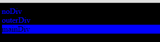
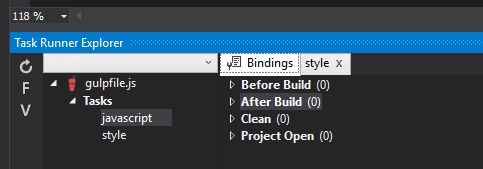
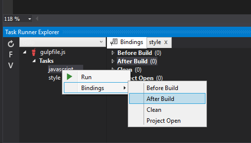
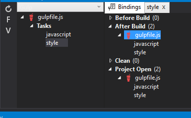

This is the forth post in a series about using Gulp with Visual Studio. If you missed the first post feel free to take the time to go back and read it [Visual Studio 2015 CTP 6 and Gulp - Episode I: Getting Started](https://www.wipdeveloper.com/2015/04/27/visual-studio-2015-ctp-6-and-gulp-episode-i-getting-started/), second [Visual Studio 2015 CTP 6 and Gulp Episode II: First Task](https://www.wipdeveloper.com/2015/04/29/visual-studio-2015-ctp-6-and-gulp-episode-ii-first-task/) or the third post [Visual Studio 2015 and Gulp Episode III: Assigning to a Build Step](https://www.wipdeveloper.com/2015/05/01/visual-studio-2015-and-gulp-episode-iii-assigning-to-a-build-step/).

#### What about my Styles?

Well we can create a similar task to handle our SCSS file(s).

```javascript
gulp.task('style', [], function () {  
    var stylesName = 'styles.css',
        root = './wwwroot/';

    deleteFile(root + stylesName);

    gulp.src('src/*.scss')
    .pipe(sass())
    .pipe(concat(stylesName))
    .pipe(gulp.dest(root));
});
```

If we run this the file it creates in the `wwwroot` should look similar to this:

```css
body {  
  color: blue;
  background-color: black; }
  body div > div {
    background-color: grey;
    color: black; }
  body .delayed {
    background-color: blue;
    color: black; }
```

Now lets add a reference to it and see it on our page.



### But you said I could assign these tasks to run during the build process!

And so I did. If you go to the Bindings tab in Task Runner Explorer it should look similar to this with expandable `Before Build`, `After Build`, `Clean` and `Project Open`.



To set a task to run after build right click on the task to go bindings and select the step you would like the task to run at.



> It is possible to set more than one task to the same step and to set a task to run at more than one step. If you want to run your `javascript` and `style` tasks after every build just set both tasks to `After Build`. If you want to set `javascript` to run at `Project Open` and `After Build` just go though the process to set it twice choosing a different option the second time.



Now every time I build this project the `style` and `javascript` task will run making sure I always have a fresh set to serve. This seems a bit wasteful though since we had to assign 2 tasks to to the `After Build` binding. If we make a third task named `build` and pass in `javascript` and `styles` as dependencies we can assign the binding to `build` and have multiple tasks run without extra work on our part.

```javascript
gulp.task('build', ['style', 'javascript']);  
```

After this is assigned to `After Build` and `javascript` and `style` is removed, if we build the project we will see that both tasks do run.

```
E:WorkspaceBlogGulpsrcGulp> cmd.exe /c gulp -b "E:WorkspaceBlogGulpsrcGulp" --color --gulpfile "E:WorkspaceBlogGulpsrcGulpgulpfile.js" build  
[17:04:30] Using gulpfile E:WorkspaceBlogGulpsrcGulpgulpfile.js
[17:04:30] Starting 'style'...
[17:04:30] Finished 'style' after 7.48 ms
[17:04:30] Starting 'javascript'...
[17:04:30] Finished 'javascript' after 3.36 ms
[17:04:30] Starting 'build'...
[17:04:30] Finished 'build' after 3.42 μs
Process terminated with code 0.
```
