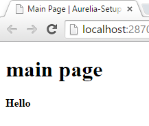

In this post we will go over getting started with [Aurelia](http://aurelia.io/) and ASP.NET 5 using Visual Studio 2015. You should have NodeJs already installed since it came with Visual Studio 2015.

If you aren't familiar with Aurelia it is a next generation JavaScript framework that allows development with little boilerplate code and can utilize a transpiler with some polyfills to target ES6 and ES7 for development.

## Pre-Setup

We are going to create a ASP.NET 5 similar to what was done in [ASP.NET 5 and Static Files](/2015/04/02/asp-net-5-and-static-files/). Once you have reached the point of serving a static web page we are going to install jspm.

> jspm is a JavaScript package manager that uses SystemJS to load modules in the browser.

In the console in your project directory, in my case this is `E:WorkspaceBlogAurelia-SetupsrcAurelia-Setup`, type `npm install jspm -g` and let it install jspm. Once this in done you can use `jspm init`. Since we used an empty web project we will now have to answer some questions regarding the package.json and how it should be configured.

Most options can use the default selection but we need to specify the baseURL. So you can hit enter for until it prompts the baseURL enter `./wwwroot` so it can use the default webroot folder of ASP.NET

```
Package.json file does not exist, create it? [yes]:  
Would you like jspm to prefix the jspm package.json properties under jspm? [yes]:  
Enter server baseURL (public folder path) [./]:./wwwroot  
Enter jspm packages folder [wwwrootjspm_packages]:  
Enter config file path [wwwrootconfig.js]:  
Configuration file wwwrootconfig.js doesn't exist, create it? [yes]:  
Enter client baseURL (public folder URL) [/]:  
Which ES6 transpiler would you like to use, Traceur or Babel? [traceur]:Babel  
```

> I also used the `Babel` transpiler

If you want to use the ES7 features such as annotations we will have to alter the config.js to enable them. In you wwwroot folder open up the config.js and add `"stage": 0` in the `"babelOptions"`

##### Like So

```javascript
"babelOptions": {
  "optional": [
    "runtime"
  ],
  "stage": 0
},
```

Now that that's out of they way let set up Aurelia.

## Setup

Back in the console we are going to install 2 aurelia frameworks: `aurelia-framework` and `aurelia-bootstrapper`. `Aurelia-framework` consolidates all the core Aurelia libraries. `Aurelia-bootstrapper` is used to get set up and running with little fuss. So do a `jspm install aurelia-framework` in the console and wait for it to run. Once that's done run `jspm install aurelia-bootstrapper` and wait again.

Now in the `wwwroot` folder let's add an `index.html` page. Open your `index.html` page and lets add some script tags for our `jspm_packages/system.js`, `config.js` in the `head`. With those scripts referenced we can import the `aurealia-bootstrapper` by adding a script tag with `System.import('aurelia-bootstrapper');`

#### Look At My Head

```markup
<head>  
    <meta charset="utf-8" />
    <title></title>
    http://jspm_packages/system.js
    http://config.js
    System.import('aurelia-bootstrapper');
</head>  
```

Now lets add a `div` to the body with an `aurelia-app` attribute.

```markup
<body>
```

</body>

With these changes to our html we just need to get some app logic setup

In the `wwwroot` folder create an `app.js` file and open it up and add the following:

```javascript
export class App {  
    configureRouter(config, router){
        config.title = 'Aurelia-Setup';
        config.map([
          { route: ['','main'], name: 'main',      moduleId: './main',      nav: true, title:'Main Page' }
        ]);

        this.router = router;
    }
}
```

We will also need an `app.html` file that looks like this:

```markup
<template>  
        <router-view></router-view>
</template>  
```

Lets also add a `main.js` and a `main.html`. In the `main.js` add a class similar to this:

```javascript
export class Main{  
    message = 'Hello';
}
```

In the `main.html` add the following template:

```markup
<template>  
    <h1>main page</h1>
    <h4>${message}</h4>
</template>  
```

#### Start It Up

With all this in place we can start it up and see our main page including the text we set in the `Main` class.


