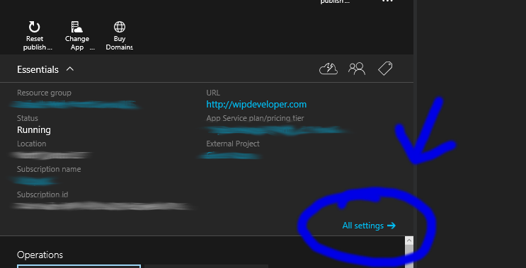
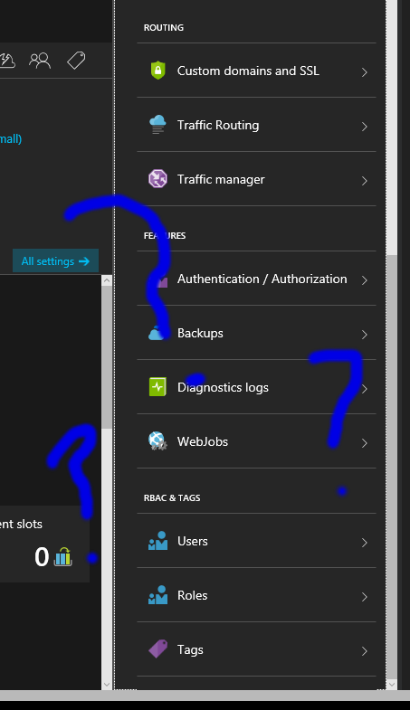
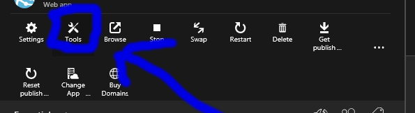
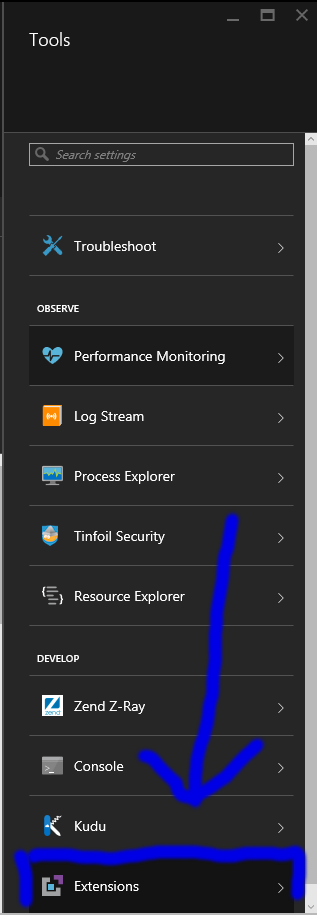
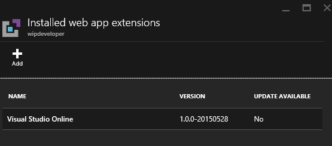
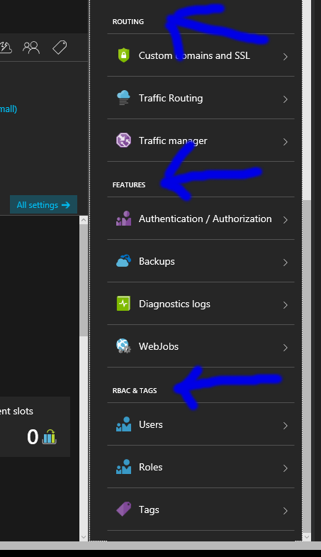

The other day while trying to make a change to one of my sites on Azure using the [Preview portal](portal.azure.com) I could not find the extensions under all settings.

Usually after login in and going to my Web App I would go to `All settings ->`

scroll to the bottom and find the extensions there. This time though, Extensions was missing. (dun dun dunnnn)

Now how was I going to use the `Visual Studio Online "Monaco"` editor to make changes to my site, while it's running in production (Protip: Don't edit your code in production)?

Well I looked around some and tried some buttons out because it's not like I'm going to stop and read the manual (or update email I may have ignored.)

At the top of the menu for the Web App there is a group of buttons and one of them is `Tools`.

It brings up the `Tools` menu (I know it surprised me too.) In the `Tools` menu at the bottom I found the `Extensions` menu button.

Now I could access my long lost extensions and start `live coding` (because live coding means in production, right?)

#### Something Else

One thing I did notice (besides moving my cheese) the Azure team organized menus into sections.

So that's neat if you like things grouped together that have some sort of commonality.
