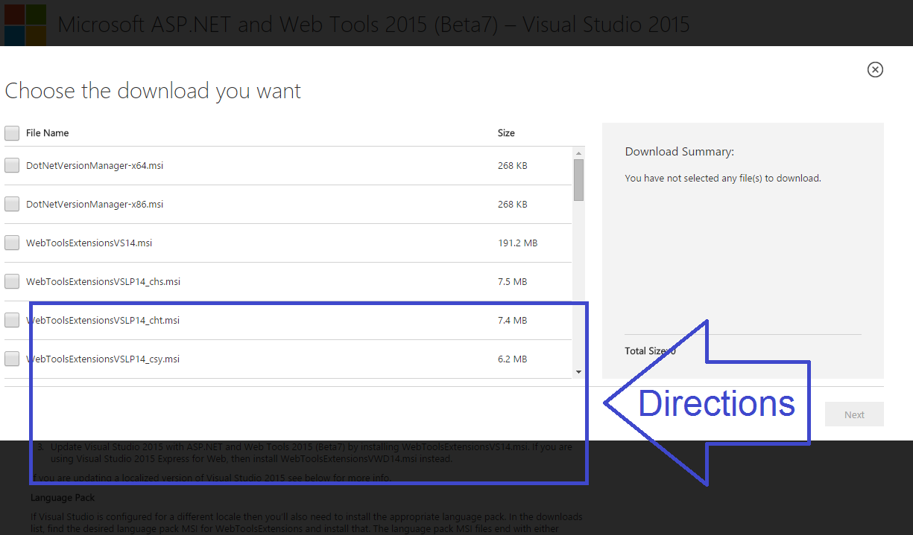
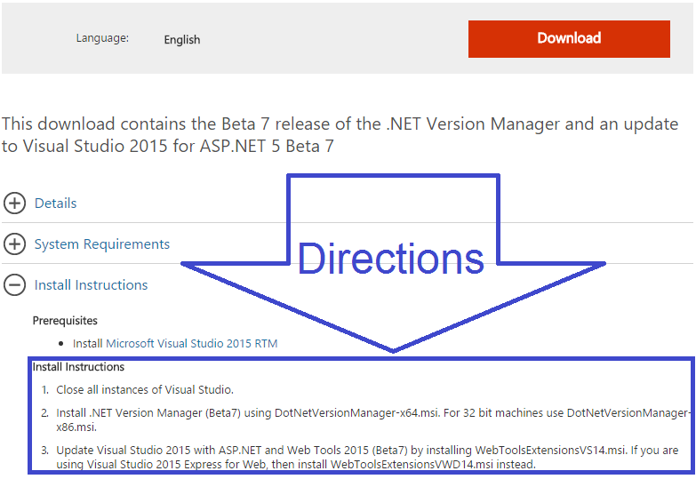

ASP.NET Beta7 was [anounced](http://blogs.msdn.com/b/webdev/archive/2015/09/02/announcing-availability-of-asp-net-5-beta7.aspx) earlier this month. In the announcement it says to go [download](http://www.microsoft.com/en-us/download/details.aspx?id=48738&fa43d42b-25b5-4a42-fe9b-1634f450f5ee=True) the beta7 version (14.0.60831.0) of ASP.NET and Web Tools 2015.

Now if you're like me you see the big old Download button.

And you click it because you just want to get the install and move on. Unfortunately if you do this you will miss the instructions since the download choices now cover all the text you, or I, didn't read originally.

##### So here's the things to know.

If you are on a **64 bit** machine get **DotNetVersionManager-x64.msi**. If you are on a **32** bit machine get **DotNetVersionManager-x86.msi**

To update your **Visual Studios 2015** get **WebToolsExtensionsVS14.msi**. If you are using **Visual Studios 2015 Express for Web** get **WebToolsExtensionsVWD14.msi**

> It's all stated in the Install Instructions, I just missed it. 

##### What About the Other 24 Downloads?!?

The rest of the Downloads are language packs so, unless you usually get language packs, you can ignore them.

Hopefully this helps make installing ASP,NET a little smoother experience for you.
