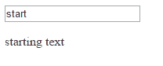

> This is the thirteenth post in a series on getting to know TypeScript. If you missed the few posts feel free to go back and read them.
> 
> 1. [Intro to TypeScript 1.5 beta - Types](/2015/05/29/intro-to-typescript-1-5-beta-types/)
> 2. [Intro to TypeScript 1.5 beta - Interfaces](/2015/06/01/intro-to-typescript-1-5-beta-interfaces/)
> 3. [Intro to TypeScript 1.5 beta - Functions Part 1](/2015/06/04/intro-to-typescript-1-5-beta-functions-part-1/)
> 4. [Intro to TypeScript 1.5 beta - Functions Part 2](/2015/06/05/intro-to-typescript-1-5-beta-functions-part-2/)
> 5. [Intro to TypeScript 1.5 beta - Functions Part 3](/2015/06/08/intro-to-typescript-1-5-beta-functions-part-3/)
> 6. [Intro to TypeScript 1.5 beta - Classes Part 1](/2015/06/10/intro-to-typescript-1-5-beta-classes-part-1/)
> 7. [Intro to TypeScript 1.5 beta - Classes Part 2](/2015/06/05/intro-to-typescript-1-5-beta-functions-part-2/)
> 8. [Intro to TypeScript 1.5 beta - Intro to Modules](/2015/07/28/intro-to-typescript-1-5-beta-intro-to-modules/)
> 9. [Intro to TypeScript 1.5 - External Modules](/2015/07/30/intro-to-typescript-1-5-external-modules/)
> 10. [Intro to TypeScript 1.5 - Modules Remainders](/2015/08/07/intro-to-typescript-1-5-modules-remainders/)
> 11. [Intro to TypeScript 1.5 - Module Output Formats](/2015/08/20/intro-to-typescript-1-5-module-output-formats/)
> 12. [Intro to TypeScript 1.5 - Mixins](/2015/08/28/intro-to-typescript-1-5-mixins/)

If you have been reading along so far you may be thinking, "Ok, now I can write TypeScript but what if I want to reuse my code in different projects?" and I got to say, that is a great question. If you decided to compose a JavaScript Library in TypeScript it would be possible to output a single JavaScript file and a definition file without using any extra tools.

> A sample project with the example code used can be found on GitHub at [BrettMN/Sample-JavaScript-Library](https://github.com/BrettMN/Sample-JavaScript-Library)

When creating a large JavaScript Library splitting your code between multiple files makes sense. Using `namespace`s to organize your code into a logical structure allows you to output your code into one file if you add `out` with the target files path and name to your `compilerOptions` in your tsconfig.json

> The [TypeScript Wiki article on the compiler options](https://github.com/Microsoft/TypeScript/wiki/Compiler-Options) says that `out` is deprecated and to use `outfile` instead but as of the time of this writing `outfile` isn't working for me. So I used `out`. If you are using the command line the compiler options flag is `--out` If you have been using TypeScript awhile and are unfamiliar with the tsconfig.json file it might be because support for it was added in TypeScript 1.5

Since I want to make things easier for anyone, including myself, to consume the library later I also include the `declaration` option with the value of `true`.

##### tsconfig.json

```javascript
{
  "compilerOptions": {
    "module": "amd",
    "noEmitOnError": false,
    "noImplicitAny": false,
    "removeComments": false,
    "sourceMap": true,
    "target": "es5",
    "declaration": true,
    "outfile": "output/helper.js"
  }
}
```

Now for demo purposes in my `Helper` "library" I created three source files an `input`, `output` and `setup`.

- `input` is constructed with the id of an input element, has a function to return the value of that element and a function to set the `oninput` event handler.
- `output` is constructed with the id of a paragraph element and has a function to set the text.
- `setup` is constructed with the ids of an input element and a paragraph element and sets everything up to work.

With the options we set in the `tsconfig.json` the output should go to our `output` folder and create three files: `helper.js`, `helper.d.ts`, and `helper.ts`. We can copy these to out sample site `libs` folder for use with out **super** _cool_ website.

#### Setting Up The Site

To use our new super awesome JavaScript library I created an `index.html`, a `js` folder for our app 'code' and we have the `libs` folder we already copied our library to.

Our `index.html` is pretty simple with 2 script references, one for our app and one for out library, a text input and a paragraph element.

##### index.html

```markup
<!DOCTYPE html>  
    <html>
        <head>
             http://libs/helper.js
        </head>
        <body>

            <input type="text" id="input" value="start" >
            <p id="output">
                starting text
            </p>
             http://js/app.js
        </body>
    </html>
```

Then in out `js` folder we add a `app.ts` file and do the setup for the library.

##### app.ts

```javascript
/// <reference path="../libs/helper" />
new Helper.Setup('input', 'output');  
```

This is just creating a new Helper.Setup with the ids of our input and paragraph element.

#### Now Watch the Magic

At this point if you run the page you can see that our library is doing it's job.



> If you want to see the code behind this example remember to check it out on GitHub at [BrettMN/Sample-JavaScript-Library](https://github.com/BrettMN/Sample-JavaScript-Library)

Some things to consider. This is just a simple example of how this could be done. If I was going to seriously consider creating a library I would also want to include testing and probably have the un-minified version available with comments for people who don't necessarily want to use TypeScript. That being said I would probably use a task runner like Gulp to actually do the building of the library since tests could be ran and multiple outputs could be created.
