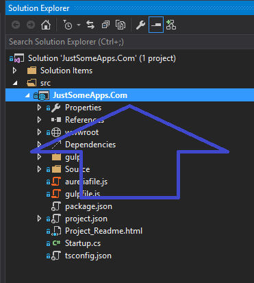
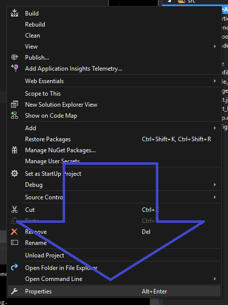
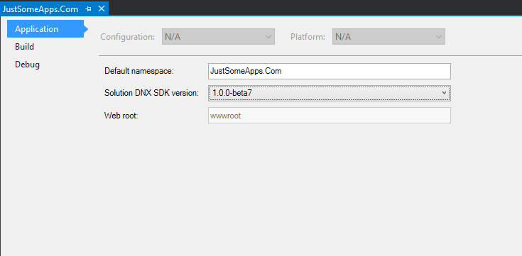
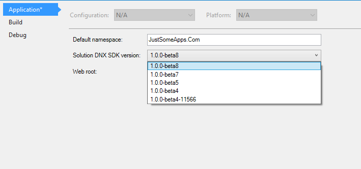

Last week the ASP.NET team [announced](http://blogs.msdn.com/b/webdev/archive/2015/10/15/announcing-availability-of-asp-net-5-beta8.aspx) the availability of ASP.NET 5 Beta8. This of course means it’s time to update our sample projects. Oh what Fun!

Basically the steps are they same as the last time, when we installed [Beta7](/2015/09/16/asp-net-5-installing-beta7/). This time the download is located **[here](http://www.microsoft.com/en-us/download/details.aspx?id=49442)**.

> Be sure to get the `DotNetVersionManager-x**.msi` and the `WebToolsExtensionsVWD14.msi`

Once that is all done there are a few changes that need to be made to the `project.json`.

- “Microsoft.AspNet.Server.IIS” is replaced with “Microsoft.AspNet.IISPlatformHandler”
- “Microsoft.AspNet.Server.WebListener” is replaced with “Microsoft.AspNet.Server.Kestrel”
- replace all your `beta*` with beta\*
- And the “web” command is changed to use “Microsoft.AspNet.Server.Kestrel”

My overly simple projects `project.json` looks like this:

##### `project.json` after changes

```
{
  "webroot": "wwwroot",
  "version": "1.0.0-*",

  "dependencies": {
    "Microsoft.AspNet.IISPlatformHandler": "1.0.0-beta8",
    "Microsoft.AspNet.Server.Kestrel": "1.0.0-beta8",
    "Microsoft.AspNet.StaticFiles": "1.0.0-beta8"
  },

  "commands": {
    "web": "Microsoft.AspNet.Server.Kestrel"
  },

  "frameworks": {
    "dnx451": { },
    "dnxcore50": { }
  },

  "exclude": [
    "wwwroot",
    "node_modules"
  ],
  "publishExclude": [
    "**.user",
    "**.vspscc"
  ]
}
```

Now since we removed the `--config hosting.ini` property from the `web` command we no longer need the \`hosting.ini file and can delete it. Now we just have to change the “Solution DNX SDK Version” and we will be ready to go.

Right click on your project name



Choose “properties”



That should open the Properties window for the project



Now change the “Solution DNX SDK Version” to “1.0.0-Beta8” and you should be set to run your project with the latest ASP.NET Beta.



Hope this helps you update your projects and if you have any questions feel free to ask in the comments.
