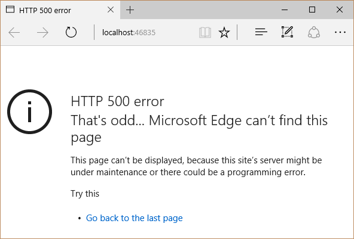
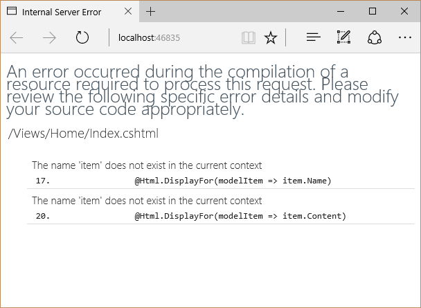

Sometimes when you are working on a web application you are going to though an exception or two. When this happens it might be nice if your project returns a more complete error page than a Server 500 exception.

> As before we will be starting with an empty web project and adding to it. Before this demo you should already configure your project for MVC similar to what can be seen in [ASP.NET 5 MVC Controllers: Setup](/2015/05/15/asp-net-5-mvc-controllers-setup/) and [ASP.NET 5 MVC Controllers: Controllers](/2015/05/18/asp-net-5-mvc-controllers-controllers/) but use

#### Enter `app.UseDeveloperExceptionPage()`

With ASP.NET 5 you can add robust error output when a server error occurs by adding a dependency for `Microsoft.AspNet.Diagnostics` in your `project.json`. So your dependencies should look something like this:

##### `project.json` Dependencies

```
"dependencies": {
    "Microsoft.AspNet.IISPlatformHandler": "1.0.0-beta8",
    "Microsoft.AspNet.Server.Kestrel": "1.0.0-beta8",
    "Microsoft.AspNet.StaticFiles": "1.0.0-beta8",
    "Microsoft.AspNet.Mvc": "6.0.0-beta8",
    "Microsoft.AspNet.Diagnostics": "1.0.0-beta8"
  }
```

Now to make use of the diagnostic features you just imported to your project we need to add the proper configuration to the `startup.cs` `Configure` method. In the `startup.cs`’s `Configure` add this line `app.UseDeveloperExceptionPage();` so your `Configure` method should look similar to this:

##### `startup.cs` `Configure` Method

```csharp
public void Configure(IApplicationBuilder app)  
{
    app.UseDeveloperExceptionPage();

    // Add the platform handler to the request pipeline.
    app.UseIISPlatformHandler();

    app.UseStaticFiles();
    app.UseMvc(routes =>
    {
         routes.MapRoute(
             name: "default",
             template: "{controller=Home}/{action=Index}/{id?}");
    });
}
```

> In an application you plan on using for production I would recommend only using the developers exceptions in the development environment. We’ll probably talk about that at a later time so we will skip the details of how for now.

Now you may be wondering what the `UseDeveloperExceptionPage` extension method does, well according to the summary it

```
Captures synchronous and asynchronous exceptions from the pipeline and generates HTML error responses. Full error details are only displayed by default if 'host.AppMode' is set to 'development' in the IApplicationBuilder.Properties.  
```

Did you get that? It creates HTML error responses with full details when the app is built in development. So now if you are have server side code that was throwing an exception instead of

##### Server 500



We get something somewhat useful, like this:

##### Error Message



> In case you are wondering to generate this error I changed the name of a variable inside a `foreach` loop of a razor view.

There’s more to the `Microsoft.AspNet.Diagnostics` package but this should help you get started. If you have any questions feel free to leave a comment and I will see how I can help.
