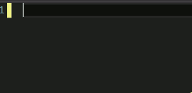
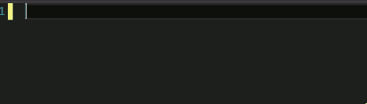
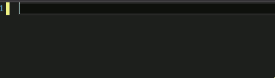

> This is a follow-up post to [Creating Code Snippets in Visual Studio](/2015/10/06/creating-code-snippets-in-visual-studio/).

When creating a Code Snippet for Visual Studio there are a few things to keep in mind.

#### It's the $end$ of the World

You can use the `$end$` keyword in your code snippet to specify where the cursor will be placed after the snippet is inserted. If we wanted to place the cursor at the end of out code snippet from [Creating Code Snippets in Visual Studio](/2015/10/06/creating-code-snippets-in-visual-studio/) we would add `$end$` after `console.log('hello');` making our code node look like the following:

##### Updated `hello`

```
<Code Language="JavaScript" Delimiter="~">  
  <![CDATA[console.log('hello');$end$]]>
</Code>  
```

Now when we use our snippet the cursor should be placed after the semicolon.



##### Creating a Surrounds With Snippet

If you would like to create a code snippet that surrounds a block of text you have selected that is possible as well. First thing that you will have to do is add the `SnippetTypes` to the header section and add the `Expansion` and `SurroundsWith` snippet types.

##### Add SnippetTypes to the Header

```
<SnippetTypes>  
  <SnippetType>Expansion</SnippetType>
  <SnippetType>SurroundsWith</SnippetType>
</SnippetTypes>  
```

Now in your code section you will need to use the `$selected$` keyword to indicate where you want to have the text that is highlighted inserted in your snippet when the snippet is inserted in the document. So if we were creating a code snippet to insert `console.log('')` around what we have selected it would look like this.

##### New and Improved `console.log`

```
<Code Language="JavaScript">  
    <![CDATA[console.log('$selected$');$end$]]>
</Code>  
```

> I created a new snippet that is similar to the one that was previously used just named `mylog` with the super secret and creative shortcut of `mylog`.

Our Updated code snippet should look like this now:

##### The Whole Kit and Kaboodle

```
<?xml version="1.0" encoding="utf-8"?>  
<CodeSnippets xmlns="http://schemas.microsoft.com/VisualStudio/2005/CodeSnippet">  
    <CodeSnippet Format="1.0.0">
        <Header>
            <Title>mylog</Title>
            <Shortcut>mylog</Shortcut>
            <SnippetTypes>
              <SnippetType>Expansion</SnippetType>
              <SnippetType>SurroundsWith</SnippetType>
            </SnippetTypes>
        </Header>

        <Snippet>
            <Code Language="JavaScript">
                <![CDATA[console.log('$selected$');$end$]]>
            </Code>
        </Snippet>
    </CodeSnippet>
</CodeSnippets>  
```

And it should behave like so:

##### `mylog` in Action



#### That's Great But My Code Contains a `$`

Something you may have noticed by now is that the `$` is being used to designate special key words. This is called the Delimiter and by default the `$` is used. You can specify a different Delimiter by adding a `Delimiter` attribute to the `Code` node.

##### Tilde Delimiter

```
<Code Language="JavaScript" Delimiter="~">  
    <![CDATA[console.log('$Big Money ~selected~');~end~]]>
</Code>  
```

This will still function as before but now allow the used of the `$` in our code itself. This will help if you are using a framework that also uses the `$` for special significance, like JavaScript's template string's expression interpolation.


