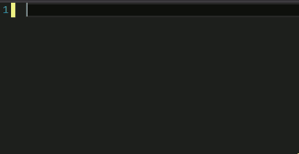

If you have been using Visual Studio for a while you may have some experience with Code Snippets. If you are not familiar with Code Snippets, it's when you type a predetermined short cut and use tab to auto complete a more complex code structure. For instance if you are in a JavaScript file in Visual Studio and type `try` and press `tab` Visual Studio will auto complete a try catch for you.

##### Typing `try` and pressing `tab` in a JavaScript File


You can also use Code Snippets by using the right click context menu and selecting `Insert Snippet...` or `Surround With...`

##### Right Click Context Menu `Insert Snippet...`



Now with this basic understanding of Code Snippets you could look thought the options in the context menu to learn what treasures lay buried behind your right click and learn the short cuts to those treasures.

> Hint: the shortcut is the name of the snippet in the context menu.

#### But the Title Said Creating

And so it did.

I haven't found a built in way to create new Snippets. There is a Menu that can be accessed under `Tools` called the `Code Snippet Manager...`

##### Access the Code Snippet Manager


In the Code Snippet Manager you can select a language from the drop down and see a list of available snippets that can be used. If you select a snippet it gives you greater details such as a description the short cut and the type of snippet it is.

##### Code Snippet Manager


There are even buttons to `Add..` and `Import...` more snippets. Unfortunately bot the `add` and `import` implies you already have snippets ready and there is no button for `Create` so how do we make a new snippet?

#### Enter the XML

To create a new Code Snippet you will need to create a new XML file with a file extension of `.snippet`. The following expert will get you started with the bare minimum of a code snippet that you can use your `Insert Snippet...` context menu to find.

##### Very Basic Code Snippet

```
<?xml version="1.0" encoding="utf-8"?>  
<CodeSnippets  
    xmlns="http://schemas.microsoft.com/VisualStudio/2005/CodeSnippet">
    <CodeSnippet Format="1.0.0">
        <Header>
            <Title></Title>
        </Header>
        <Snippet>
            <Code Language="">
                <![CDATA[]]>
            </Code>
        </Snippet>
    </CodeSnippet>
</CodeSnippets>  
```

In the `Title` node you add the name of your snippet, for this demo I will call it `hello`. On the `Code` node's `Language` attribute you enter the Language you are creating a snippet for, in this case I will enter `JavaScript`. In the `CDATA[]` brackets you add what you want inserted, so I will add a `console.log('hello');`. In the `Header` node I will also add a `Shortcut` node with the value of `hello` so we can access our snippet by typing our shortcut, `hello`, and pressing `tab`. It should now look like this:

##### `hello` Snippet

```
<?xml version="1.0" encoding="utf-8"?>  
<CodeSnippets  
    xmlns="http://schemas.microsoft.com/VisualStudio/2005/CodeSnippet">
    <CodeSnippet Format="1.0.0">
        <Header>
            <Title>hello</Title>
            <Shortcut>hello</Shortcut>            
        </Header>
        <Snippet>
            <Code Language="JavaScript">
                <![CDATA[console.log('hello');]]>
            </Code>
        </Snippet>
    </CodeSnippet>
</CodeSnippets>  
```

Now in a JavaScript file I should be able to insert my snippet snippet by typing our shortcut, `hello`, and pressing `tab`. Like so:

##### Custom Snippet in Action


You can create Code Snippets for VB, CSharp, CPP, XML, JavaScript, SQL, and HTML. And more information, like what other Header nodes can be used, about Code Snippets can be found on the [MSDN](https://msdn.microsoft.com/en-us/library/ms171418.aspx).
