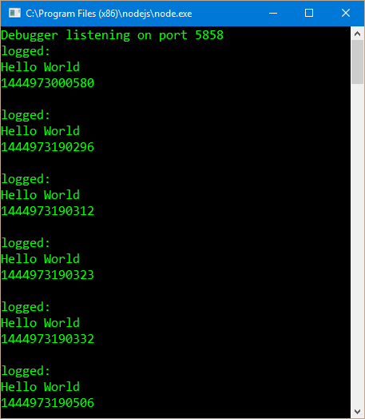

This is a follow up to [TypeScript Accessing Other .ts Files](/2015/10/14/typescript-accessing-other-ts-files/) this time with 100% more [Node.js](https://nodejs.org/en/).

Last time we accessed other `.ts` files by reference and by using the module loader (SystemJS)\[https://github.com/systemjs/systemjs\]. This time we will access multiple `.ts` files inside our overly simplified Node.js project.

#### Somethings to know before hand.

- I don't really know what I am doing in Node.js
- I used Visual Studio 2015 and the [Node.js Tools for Visual Studio](https://www.visualstudio.com/en-us/features/node-js-vs.aspx) 1.1
- Do not consider my structure of a Node.js app as a best practice as I was only trying to demonstrate accessing different `.ts` files and not create and all encompassing guide to the awesomeness that I am sure Node.js is
- I **really** don't know what I am doing in Node.js

#### Structure

I started with the included NodejSWebApp template that came with the Node.js Tools for Visual studio and modified the `server.ts` slightly. I also added two additional `.ts` files so we have three TypeScript files we will be working with: `server.ts` in the root of the project and `helper.ts` with `service.ts` in the `services` folder

##### Solution Explorer


Obviously each file must contain something:

##### `helper.ts`

```javascript
export function log(message: string) {  
    message = 'logged: n' + message;
    console.log(message);
}
```

As you can see `helper.ts` just has a function called 'log' that logs a message to the console.

##### `service.ts`

```javascript
import helper = require('./helper');

export function doSomething(id: string) {  
    let results = id + Date.now().toString() + 'n';

    helper.log(results);

    return results;
}
```

The `service.ts` uses the same `import` and `require` as we used in [TypeScript Accessing Other .ts Files](/2015/10/14/typescript-accessing-other-ts-files/) and specify the module to import with a relative path.

##### `server.ts`

```javascript
import http = require('http');  
import service = require('./services/service');

let port = process.env.port || 1337  
http.createServer(function (req, res) {  
    res.writeHead(200, { 'Content-Type': 'text/plain' });

    let message = service.doSomething('Hello Worldn');

    res.end(message);
}).listen(port);
```

In this last example you can see the `server.ts` uses the same `import` and `require` as before but this time it specifies the folder in the path.

> I did have some issues with Visual Studio resolving the path to modules. Once a path was correct the red squiggly error was still showing in the file and the error wouldn't clear up till I created a new error and cleared it up, usually by removing a semicolon and putting it back.

Now when we run it we should see 'Hello world' and the time in our web browser.


And you should see what was logged in the console.


Now ever time the page is refreshed you should see the results get logged as well.



#### Finally {}

As you can see the `import` and `require` remained the same as when we used the SystemJS module loader when referencing different files or modules. The main issue I had was getting Visual Studio to stop saying there was an error when it had been fixed.

All source code for this example was added to the [Github.com/BrettMN/TypeScriptSamples](https://github.com/BrettMN/TypeScriptSamples) in the NodejsWebApp folder.

Hope this helps, if not leave a comment and I will try and help as best I can.
