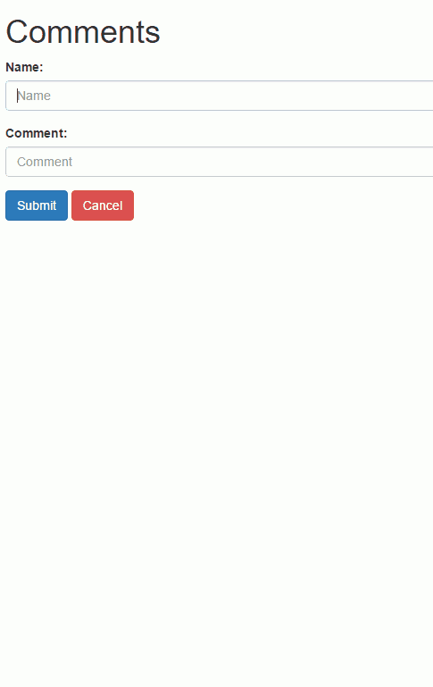
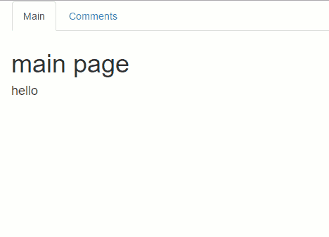

In [Aurelia and ASP.NET 5 - Routing, Views, and Navigation, Oh My](/2015/11/15/aurelia-and-asp-net-5-routing-views-and-navigation-oh-my/) we added a new route to our application and the viewmodel and addition class we would need for our new view. Now lets add the required html.

#### Now We Need A View

Lets add an html file called `comments.html` to our `app` folder so we can have a matching view. Here we are going to put our `<template>` for the `comments` and it will look something like this:

```
<template>
    
```

If you have used Bootstrap before most of this should be familiar to you but I have annotated a few spots with a `<!--Note: ####-->` that should match up with one of the following explanations:

- `<!--Note: One-->`: Here we used `value.bind="name"` to use the data binding of Aurelia so that the value of this input is bound to the value of `name` on the view model. You can use `.one-way` or `.two-way` in place of the `.bind` to specify a certain binding type for your needs. It is also possible to use `.one-time` to when you only want a value to populate in the view from the viewmodel during the initial binding phase.
- `<!--Note: Two-->`: This is the same binding syntax we used with the input for the name in `<!--Note: One-->` but its binding to the viewmodel's `message`.
- `<!--Note: Three-->`:Here we used the `click.trigger="addComment()` to bind an event from the viewmodel to a trigger behavior. In this case the trigger behavior is a click and the event it causes to happen is the `addComment()` method on our viewmodel.
- `<!--Note: Four-->`: This is the same event trigger binding syntax we used with `<!--Note: Three-->` but this time it binds to the viewmodel's `clearData()` method.
- `<!--Note: Five-->`: Here we used `repeat.for="comment of comments"` to iterate over our viewmodel's collection of Comments. The element the `repeat.for` is on acts as the root element for the repeat. The root element could have multiple html child elements or none at all.
- `<!--Note: Six-->`: Here we use the string interpolation syntax to do one way binding of the current comments name.
- `<!--Note: Seven-->`: Similar to `<!--Note: Six-->` here we use the string interpolation syntax to do one way binding of the current comments message.
- `<!--Note: Eight-->`: Here we used `click.delegate="deleteComment(comment)"`, this is similar to the `click.trigger` we used in `<!--Note: Three-->` the difference between the `trigger` and `delegate` is that a `trigger` is bound directly to the element while a `delegate` is bound to the document once and and reused. This means that you can bind to the delegate multiple times without affecting performance.

> I added deleteComment(comment) method to the `comments.js` class we discussed last time. It looks like this:
> 
> ```javascript
> deleteComment(comment){
>     for(let i = 0, m = this.comments.length; i < m; i++ ){
>         if(this.comments[i].name === comment.name && this.comments[i].message === comment.message){
>             this.comments.splice(i, 1);
>             return;
>         }
>     }
> }
> ```

Now if we run our app and go to our new view at `/index.html#/comments`, in my case that means `http://localhost:8339/index.html#/comments`, and we should see our little form with two text boxes and two buttons. Why not try and add a few comments.

##### Comments in Action



Now that we have that working maybe we should do something about that navigation issue.

When last we looked at our `app.html` it looked a little sparse.

##### Original `app.html`

```markup
 <template>
        <router-view></router-view>
</template>
```

So we will need to build this out some so that we are generating our navigation menu based on routes provided when we mapped routes in our `app.js`. In our `app.js` we also stored a reference to our router so we could use it later. Well now is later so lets get to modifying our `app.html`.

```markup
<template>
    <nav class="navbar">
        <ul class="nav nav-tabs">
            <li repeat.for="row of router.navigation" class="${row.isActive ? 'active' : ''}"><!--Note: One-->
                <a href.bind="row.href">${row.title}</a><!--Note: Two-->
            </li>
        </ul>
    </nav>
    <router-view></router-view>
</template>
```

- `<!--Note: One-->`: We have a few things going on in this line. We start with a `repeat.for` like we used before but this time we are iterating over our navigation collection on the router. We also are using some basic logic syntax to inside the string interpolation binding to determine if we should add the `active` Bootstrap class.
- `<!--Note: Two-->`: There are a few things going on here as well. First we use the `.bind` syntax again to bind the href to the rows href. Second we use the string interpolation again to bind the rows title.

Now when we run our app we should have a navigation menu at the top of the screen we can use instead of having to enter in the view we want to visit manually.

##### Navigation in Action



And with that we have a very simple Single Page Application that uses Aurelia. I hope this helps you get started. If you have any questions though feel free to leave a comment or send an email to [brett@wipdeveloper.com](mailto:brett@wipdeveloper.com) and I'll see how I can help.
