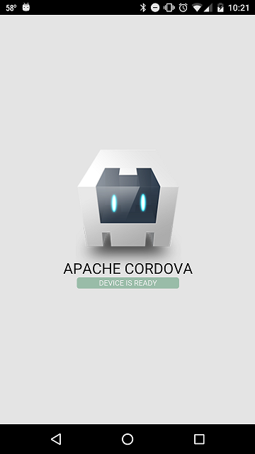

Last time in a [Cordova - Intro](/2016/01/13/apache-cordova-intro/) we created a simple app that used the stock assets and ran it in our browser. Now let's get the Android SDK so we can build and run it on our device or emulator.

#### Downloads

We will start by getting the Android SDK from google at [developer.android.com](http://developer.android.com/sdk/installing/index.html). During installation it will check to see if you have the Java Development Kit installed. If you don't it's available from Oracle on the [Java SE Downloads](http://www.oracle.com/technetwork/java/javase/downloads/index.html) page.

Once you have those two things installed you will need to use the Android SDK Manager to get the tools and platform you want to build for installed. For the tools you will need to latest and for the platform Cordova currently supports up to API 22. This may take a while based on your internet connection so you might want to let Twitter or Facebook know that you are installing the Android SDK and tools to build with Cordova.

#### If You Build It, You Will Have an App

Once you have to tools run `cordova build android` from the root directory of you project. This will of course generate some feedback in the console.

```
 D:WorkspaceCordovaAppsIntrointroproject> cordova build android
Running command: cmd "/s /c "D:WorkspaceCordovaAppsIntrointroprojectplatformsandroidcordovabuild.bat""  
ANDROID_HOME=D:Program Files (x86)Androidandroid-sdk  
JAVA_HOME=C:Program Filesjavajdk1.8.0_71  
Running: D:WorkspaceCordovaAppsIntrointroprojectplatformsandroidgradlew cdvBuildDebug -b D:WorkspaceCordovaAppsIntrointroprojectplatformsandroidbuild.gradle -Dorg.gradle.daemon=true  
:preBuild
:compileDebugNdk UP-TO-DATE
:preDebugBuild
:checkDebugManifest
:CordovaLib:compileLint
:CordovaLib:copyDebugLint UP-TO-DATE
:CordovaLib:mergeDebugProguardFiles UP-TO-DATE
:CordovaLib:preBuild
:CordovaLib:preDebugBuild
:CordovaLib:checkDebugManifest
:CordovaLib:prepareDebugDependencies
:CordovaLib:compileDebugAidl UP-TO-DATE
:CordovaLib:compileDebugRenderscript UP-TO-DATE
:CordovaLib:generateDebugBuildConfig UP-TO-DATE
:CordovaLib:generateDebugAssets UP-TO-DATE
:CordovaLib:mergeDebugAssets UP-TO-DATE
:CordovaLib:generateDebugResValues UP-TO-DATE
:CordovaLib:generateDebugResources UP-TO-DATE
:CordovaLib:packageDebugResources UP-TO-DATE
:CordovaLib:processDebugManifest UP-TO-DATE
:CordovaLib:processDebugResources UP-TO-DATE
:CordovaLib:generateDebugSources UP-TO-DATE
:CordovaLib:compileDebugJava UP-TO-DATE
:CordovaLib:processDebugJavaRes UP-TO-DATE
:CordovaLib:packageDebugJar UP-TO-DATE
:CordovaLib:compileDebugNdk UP-TO-DATE
:CordovaLib:packageDebugJniLibs UP-TO-DATE
:CordovaLib:packageDebugLocalJar UP-TO-DATE
:CordovaLib:packageDebugRenderscript UP-TO-DATE
:CordovaLib:bundleDebug UP-TO-DATE
:prepareAndroidCordovaLibUnspecifiedDebugLibrary UP-TO-DATE
:prepareDebugDependencies
:compileDebugAidl UP-TO-DATE
:compileDebugRenderscript UP-TO-DATE
:generateDebugBuildConfig UP-TO-DATE
:generateDebugAssets UP-TO-DATE
:mergeDebugAssets UP-TO-DATE
:generateDebugResValues UP-TO-DATE
:generateDebugResources UP-TO-DATE
:mergeDebugResources UP-TO-DATE
:processDebugManifest UP-TO-DATE
:processDebugResources UP-TO-DATE
:generateDebugSources UP-TO-DATE
:compileDebugJava UP-TO-DATE
:preDexDebug UP-TO-DATE
:dexDebug UP-TO-DATE
:processDebugJavaRes UP-TO-DATE
:validateDebugSigning
:packageDebug UP-TO-DATE
:zipalignDebug UP-TO-DATE
:assembleDebug UP-TO-DATE
:cdvBuildDebug UP-TO-DATE

BUILD SUCCESSFUL

Total time: 2.693 secs  
Built the following apk(s):  
    D:WorkspaceCordovaAppsIntrointroprojectplatformsandroidbuildoutputsapkandroid-debug.apk
```

The important part is where is says `BUILD SUCCESSFUL` and the location of your apk.

#### Run the App

Now that you can build an Android app with Cordova let's run it on a device. If you have an Android device handy you can enable developer options in the settings and then enable USB debugging.

> There are too many variations of Android for me to cover enable developer options but a quick GoogleBing should help you find the secret button combination. It usually is along the lines of go to your `About Phone` in the settings and tap the `Build Number` 7 times.

Now attach your phone to the computer with a USB cable and use the command `cordova run android`. This will rebuild the app and deploy it to your device.



#### Conclusion

Now with this basic knowledge we can start to do some fun stuff. Next time we will look at starting to modify the assets we use for the app and make it more our own. Think I missed something? Let me know by leaving a comment below or send an email to me at [brett@wipdeveloper.com](mailto:brett@wipdeveloper.com).
