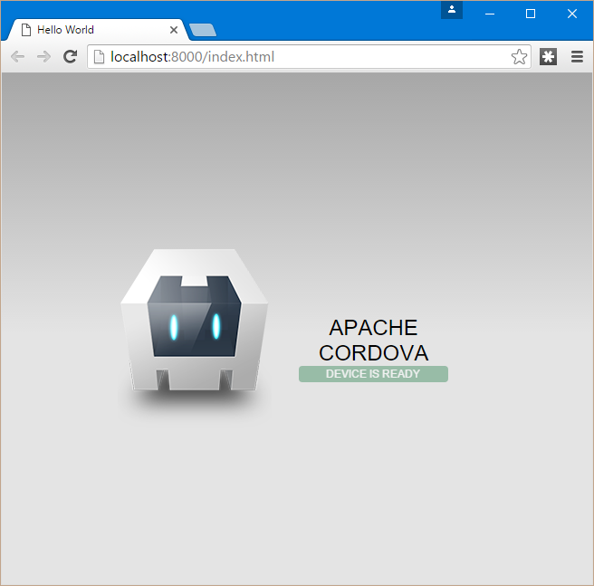

Sometimes you want to build a mobile app. This could be because you have an idea you want to put to use on your phone or it could be because your boss said it's time to make an app. If your focus has been on web technologies like we have discussed in the past using a platform like the Apache foundations Cordova framework opens the door to cross-platform app development with things you already are familiar with.

#### Installation

To install Cordova we will use npm to install it globally with the command:

```
npm install -g cordova  
```

This will add the basic tools needed for Cordova and we will be able to access them from the command line.

#### Create A Project

Next we will use the Cordova command `create` to create a new project. To do this navigate the command line to the directory you would like the project to be created in and type"

```
cordova create introproject  
```

This will create a new project call Cordova project with some defaults that we may not necessarily want. If you open the `config.xml` that was just created in your `introproject` directory you will see a few things.

```
 <?xml version='1.0' encoding='utf-8'?>
<widget id="io.cordova.hellocordova" version="0.0.1" xmlns="http://www.w3.org/ns/widgets" xmlns:cdv="http://cordova.apache.org/ns/1.0">  
    <name>HelloCordova</name>
    <description>
        A sample Apache Cordova application that responds to the deviceready event.
    </description>
    <author email="dev@cordova.apache.org" href="http://cordova.io">
        Apache Cordova Team
    </author>
    <content src="index.html" />
    <plugin name="cordova-plugin-whitelist" spec="1" />
    <access origin="*" />
    <allow-intent href="http://*/*" />
    <allow-intent href="https://*/*" />
    <allow-intent href="tel:*" />
    <allow-intent href="sms:*" />
    <allow-intent href="mailto:*" />
    <allow-intent href="geo:*" />
    <platform name="android">
        <allow-intent href="market:*" />
    </platform>
    <platform name="ios">
        <allow-intent href="itms:*" />
        <allow-intent href="itms-apps:*" />
    </platform>
</widget>  
```

Your id is probably not `io.cordova.hellocordova` and you most likely don't want to name your app `HelloCordova`.

If we look a the help by using `cordova help create` we can see there are some additional options for the create that will allow us to set the app name and an id.

```
PS E:\Workspace\Blog\Cordova\GettingStarted> cordova help create  
Synopsis

    cordova create <PATH> [ID [NAME [CONFIG]]] [options] [PLATFORM...]

Create a Cordova project

    PATH ......................... Where to create the project
    ID ........................... reverse-domain-style package name - used in <widget id>
    NAME ......................... human readable field
    CONFIG ....................... json string whose key/values will be included in
                                    [PATH]/.cordova/config.json

    Options:
        --copy-from|src=<PATH> ... use custom www assets instead of the stock Cordova hell
        --link-to=<PATH> ......... symlink to custom www assets without creating a copy.
```

> You can also see that we could pass in options to copy assets from an alternative location instead of using the default Cordova assets.

Lets delete our previous project and create a new one with some of the additional parameters. This time lets use the following command:

```
cordova create introproject com.wipdeveloper.introproject "Intro Project"  
```

Now if we look at our `config.xml` it should look like the following:

```
<?xml version='1.0' encoding='utf-8'?>  
<widget id="com.wipdeveloper.introproject" version="0.0.1" xmlns="http://www.w3.org/ns/widgets" xmlns:cdv="http://cordova.apache.org/ns/1.0">  
    <name>Intro Project</name>
    <description>
        A sample Apache Cordova application that responds to the deviceready event.
    </description>
    <author email="dev@cordova.apache.org" href="http://cordova.io">
        Apache Cordova Team
    </author>
    <content src="index.html" />
    <plugin name="cordova-plugin-whitelist" spec="1" />
    <access origin="*" />
    <allow-intent href="http://*/*" />
    <allow-intent href="https://*/*" />
    <allow-intent href="tel:*" />
    <allow-intent href="sms:*" />
    <allow-intent href="mailto:*" />
    <allow-intent href="geo:*" />
    <platform name="android">
        <allow-intent href="market:*" />
    </platform>
    <platform name="ios">
        <allow-intent href="itms:*" />
        <allow-intent href="itms-apps:*" />
    </platform>
</widget>  
```

Now our widget name is `com.wipdeveloper.introproject` and the name of our app is `Intro Project`. There are a few other values we may want to change like the author info we can do that later.

#### Run It

Now let's go into the directory we just created so we can add a target platform. I'm going to add the `browser` and `android` with the following commands.

```
cordova platform add browser  
cordova platform add android  
```

> For a complete list of platforms you can target type `cordova platform`. Your results may vary, my results were `amazon-fireos, android, blackberry10, browser, firefoxos, webos, windows, windows8, wp8`

Now I can use the command `cordova run browser` to see the defaults Cordova assets we mentioned earlier as the sample app in the browser window.



Now we have the basic Cordova app running start customizing the app so it does more that tell us the device is ready.

#### Conclusion

We installed the tools necessary to create and run a sample Cordova app in the local browser. Next time, in [Cordova - Build Android](/2016/01/19/apache-cordova-build-android/), we will setup for building the same app to Android. Let me know what you think so far by leaving a comment bellow or, if you want be discreet, send an email to me at [brett@wipdeveloper.com](mailto:brett@wipdeveloper.com).
