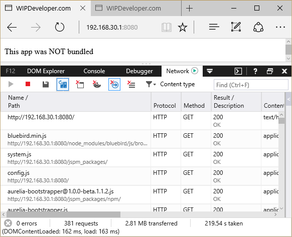
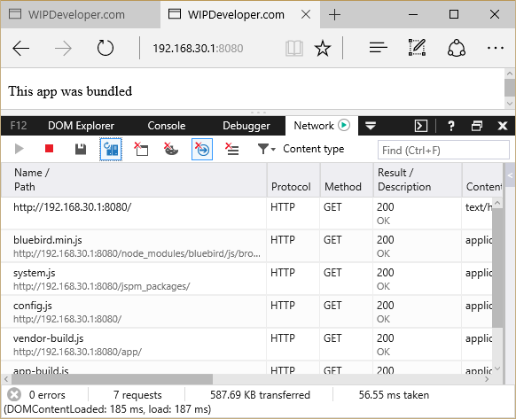

If you have been playing around with Aurelia like I have you may reach a point where you would like to stop sending almost 3MB to load the simplest of sites. Well if you have reached that point you're in luck. **You can bundle your app!**

### What is Bundling

Bundling web assets is a method used, usually with minification, to improve load times of your web app. In the case of my super simple Aurelia app that have one html template and one JavaScript file with a class with one property the unbundled and unminifide page load was 2.8MB.

### What I Started With

For the purpose of learning bundling I created a super simple Aurelia app that had one component consisting of one view and one view-Model. And here they are in there entirety.

#### app.js

```javascript
export class App{  
    constructor(){
        this.message = "This app was NOT bundled";
    }
}
```

#### app.html

```markup
<template>  
    <p>${message}</p>
</template>  
```

Of course I had to have an `index.html` as well and that looked like this:

#### index.html

```
<!DOCTYPE html>  
<html>

<head>  
    <title>WIPDeveloper.com | bundling</title>
</head>

<body aurelia-app>  
    <p>Loading...</p>
    http://node_modules/bluebird/js/browser/bluebird.min.js
    http://jspm_packages/system.js
    http://config.js
    
        SystemJS.import('aurelia-bootstrapper');
    
</body>

</html>  
```

As you can see there really wasn't much to my little app but it still resulted in a page load that required the 2.8MB(!) on downloads I mentioned earlier.

#### Before



Since the this is obviously something that we don't want to see in production something should be done about it.

### The Fix

The folks working on Aurelia have put together a library to help bundle Aurelia app it's called [aurelia-bundler](https://github.com/aurelia/bundler/). You can install it with npm:

```
npm install aurelia-bundler  
```

and use it in a gulp task.

One thing that you will also need is to install the jspm text plugin for the aurelia-bundler to work.

```
jspm install text  
```

> Don't forget to install the text plugin.

Some basic gulp setup is required:

#### Basic Setup

```
var gulp = require('gulp');  
var bundle = require('aurelia-bundler').bundle;  
var del = require('del');

gulp.task('clean', () => {  
    return del(['app/*-build.js']);
});
```

> I added the clean task to remove the previously bundled files when rebundling.

Then a configure is required:

#### Configure

```javascript
var config = {  
    force: true,
    baseURL: '.',                   // baseURL of the application
    configPath: './config.js',      // config.js file. Must be within 'baseURL'
    bundles: {
        "app/app-build": {           // bundle name/path. Must be within 'baseURL'. Final path is: `baseURL/dist/app-build.js`.
            includes: [
                '[*.js]',
                '*.html!text',
                '*.css!text',
            ],
            options: {
                inject: true,
                minify: true
            }
        },
        "app/vendor-build": {
            includes: [
                'aurelia-bootstrapper',
                'aurelia-framework',
                'aurelia-loader-default',
                'aurelia-logging-console',
                'aurelia-router',
                'aurelia-templating',
                'aurelia-templating-binding',
                'aurelia-templating-router',
                'aurelia-templating-resources',
                'aurelia-history-browser'                
            ],
            options: {
                inject: true,
                minify: true
            }
        }
    }
};
```

Some things you may want to understand from the config.

- force : tells the bundler to overwrite previously created bundle files.
- baseURL : is the base URL of the application
- configPath : is the path the config file
- bundles : is a collection of bundle configurations

Each bundle configuration has it's name the `"app/app-build"` specifies the bundle path and name of the file from the root. So in this case the bundle will be put into the `app` folder and the file created will be named `app-build.js`. Other features of a bundle include properties for:  
\- includes : the module names, it may be patterns as well `*`, `**/**/*`, `[*]` - excludes : modules or patterns to exclude - options : a collection of options such as inject, minify, and a few others

So the first bundle in my config is going to consist of my js, html and css files that match the patern provided.

The second bundle will consist of my Aurelia libraries.

Finally, you will need to create a gulp task to use the bundle function and pass it the `config`.

#### The Bundle task

```javascript
gulp.task('bundle', ['unbundle'], function () {  
    return bundler.bundle(config);
});

gulp.task('unbundle', function() {  
  return bundler.unbundle(config);
});
```

### The Results

As you can see the results of bundling greatly reduces the payload size of your page and speeds up the page load times.

#### After



### Conclusion

Bundling can help improve performance of your site. With the possibility to create multiple bundles you could create different bundles for various sections of your site to only users who went to lesser accessed areas would be downloading the additional files. What do you think? Have a suggestion? I would like to hear it, leave a comment below or send an email to me at [brett@wipdeveloper.com](mailto:brett@wipdeveloper.com).
