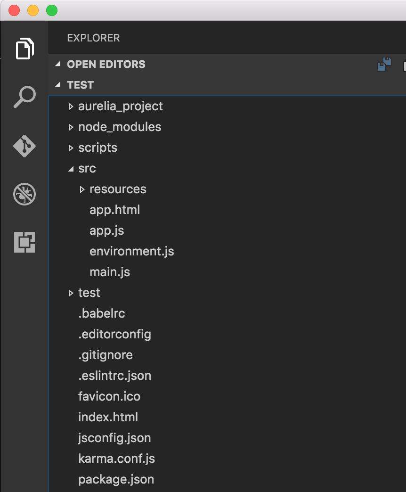
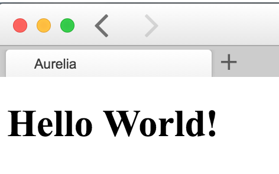
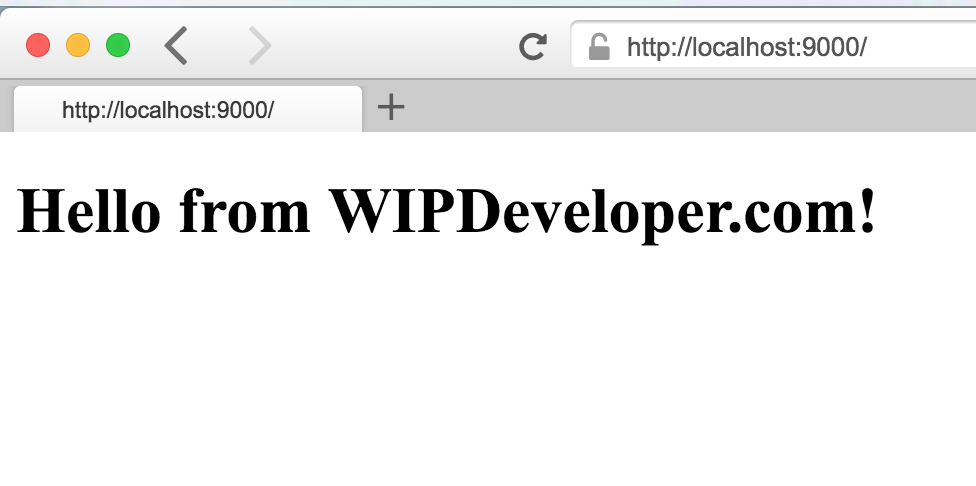

Recently [Aurelia](aurelia.io) anounced it [1.0.0 release](http://blog.durandal.io/2016/07/27/aurelia-1-0-is-here/). This means it is no longer in Beta and they don't foresee any breaking changes in the foreseeable future. Part of the announcement covers an introduction to the various ways that are possible to use Aurelia including:

- the new [CLI](http://aurelia.io/hub.html#/doc/article/aurelia/framework/latest/the-aurelia-cli)
- with [webpack](http://aurelia.io/hub.html#/doc/article/aurelia/framework/latest/setup-webpack)
- JSPM
- NPM
- Bower & Github
- A bundled set of scripts that will be available over CDN in the near future

If you have been holding off on trying Aurelia because you have not wanted to use JSPM you now have options.

Staying true to the notion that they are building the next generation JavaScript framework that is stable enough to use and following the [semantic versioning](http://semver.org/) concept the team behind Aurelia released an [update](http://blog.durandal.io/2016/08/03/releases-august-3-2016/) a week later with notes on the minor and patch releases.

Lets take a quick look at the new CLI.

### CLI

We will need to install it with NPM `npm install aurelia-cli -g` Than we can get started with the `au new` command.

> `au` calls the cli and `new` is the command.

This produces the following output and if you follow the prompts and take most of the defaults you will have a working Aurelia app shortly.

#### `au new`

```
computer:aurelia-cli brettmn$ au new  
                      _ _          ______     ___
  __ _ _   _ _ __ ___| (_) __ _   / ___| |   |_ _|
 / _` | | | | '__/ _  | |/ _` | | |   | |    | |
| (_| | |_| | | |  __/ | | (_| | | |___| |___ | |
 __,_|__,_|_|  ___|_|_|__,_|  ____|_____|___|


Please enter a name for your new project below.

[aurelia-app]> test

Would you like to use the default setup or customize your choices?

1. Default ESNext (Default)  
   A basic web-oriented setup with Babel for modern JavaScript
   development.
2. Default TypeScript  
   A basic web-oriented setup with TypeScript for modern JavaScript
   development.
3. Custom  
   Select transpilers, CSS pre-processors and more.

[Default ESNext]> 1

Project Configuration

    Name: test
    Platform: Web
    Transpiler: Babel
    CSS Processor: None
    Unit Test Runner: Karma
    Editor: Visual Studio Code


Would you like to create this project?

1. Yes (Default)  
   Creates the project structure based on your selections.
2. Restart  
   Restarts the wizard, allowing you to make different selections.
3. Abort  
   Aborts the new project wizard.

[Yes]>
Project structure created and configured.

Would you like to install the project dependencies?

1. Yes (Default)  
   Installs all server, client and tooling dependencies needed to build
   the project.
2. No  
   Completes the new project wizard without installing dependencies.

[Yes]>

Installing project dependencies.  
```

> Once you get to this point there will be a bunch of downloads so we will skip to the end

#### Ready to Roll

```
Congratulations! Your Project "test" Has Been Created!


Now it's time for you to get started. It's easy. First, change directory into  
your new project's folder. You can use cd test to get there.  
Once in your project folder, simply run your new app with au  
run. Your app will run fully bundled. If you would like to have it  
auto-refresh whenever you make changes to your HTML, JavaScript or CSS, simply  
use the --watch flag. If you want to build your app for production,  
run au build --env prod. That's just about all there is to  
it. If you need help, simply run au help.


Happy Coding!  
```

### What Have We here

If you go int other directory you just created you can see you have the basic set up for an Aurelia app.

#### File Structure



Lets run the app to see what we have. On the command line lets go into the directory the Aurelia-CLI create and run `au run --watch`.

> We add the `--watch` flag because we will be making a change and don't want to have to stop and restart everything to see it update.

#### `au run --watch`

```
computer:aurelia-cli brettmn$ cd test  
computer:test brettmn$ au run --watch  
Starting 'readProjectConfiguration'...  
Finished 'readProjectConfiguration'  
Starting 'processMarkup'...  
Starting 'processCSS'...  
Starting 'configureEnvironment'...  
Finished 'processCSS'  
Finished 'processMarkup'  
Finished 'configureEnvironment'  
Starting 'buildJavaScript'...  
Finished 'buildJavaScript'  
Starting 'writeBundles'...  
Tracing app...  
Tracing environment...  
Tracing main...  
Tracing resources/index...  
Tracing app...  
Tracing text...  
Tracing aurelia-binding...  
Tracing aurelia-bootstrapper...  
Tracing aurelia-dependency-injection...  
Tracing aurelia-event-aggregator...  
Tracing aurelia-framework...  
Tracing aurelia-history...  
Tracing aurelia-history-browser...  
Tracing aurelia-loader-default...  
Tracing aurelia-logging-console...  
Tracing aurelia-route-recognizer...  
Tracing aurelia-router...  
Tracing aurelia-templating-binding...  
Tracing aurelia-templating-resources...  
Tracing aurelia-templating-router...  
Tracing aurelia-testing...  
Writing app-bundle.js...  
Writing vendor-bundle.js...  
Finished 'writeBundles'  
Application Available At: http://localhost:9000  
BrowserSync Available At: http://localhost:3001  
Starting 'watch'...  
```

#### First Load



As you can see we have a very basic web page.

We can go into `src/app.js` and change the line `this.message = 'Hello World!';` to something more appealing.

#### New `src/app.js`

```javascript
export class App {  
  constructor() {
    this.message = 'Hello from WIPDeveloper.com!';
  }
}
```

Let go and see what we have again.



As you can see we have updated our Aurelia app.

This is a very simple app to begin with but it is just the starting point. From here you can add routing and expand the number of pages and features that you create.

What do you think? Have you had a chance to take a look at the release notes and the documentation for the CLI? Think there is something better you are waiting for? Let know know by leaving a comment below or emailing [brett@wipdeveloper.com](mailto:brett@wipdeveloper.com).
