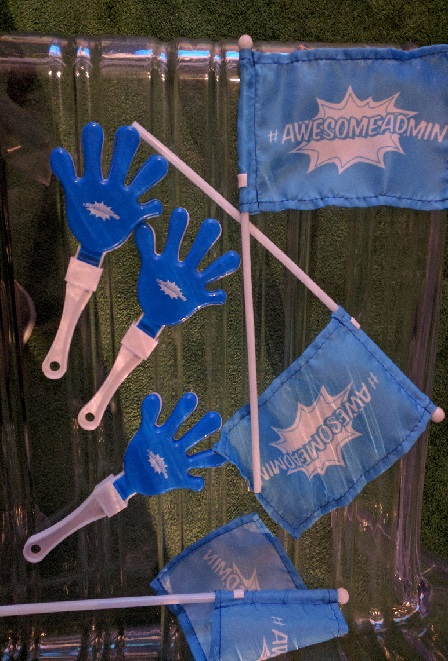

Last week I spent 4 days in San Francisco for the annual Salesforce.com (lets call it SFDC from this point on) conference called Dreamforce. If you follow SFDC things you've probably heard of it. If you don't follow SFDC things you may have heard of it too.

### Presentation

I went to present [Introduction to ECMAScript 6](https://success.salesforce.com/Sessions#/session/a2q3A000000LBSSQA4) and I think it went pretty well. Hopefully the video will be available shortly so I can share it. Sample code for the presentation is available on [GitHub.com/BrettMN](https://github.com/BrettMN/Dreamforce-2016-Introduction-to-ECMAScript-6).

### Salesforce DX

While there I did see them announcement of Salesforce DX a developer tooling system for deploying to a Salesforce org. It looks promising but the pilot program wont even start till next year at the earliest. Some of the highlights for Salesforce DX include:

- move the source of "truth" out of the org and into source control
- cli built on the Heroku cli so it's plugin based
- create "scratch" orgs from a config file
- new temporary Scratch orgs
- perform local diff and only push items that changed to the org (not sure it this would apply to static resources I didn't think to ask)
- the features that use Heroku will require a Heroku account and will probably cost money
- remove the strict project structure requirement

> They mentioned being able to create a working config file, to create scratch orgs, by getting the settings from a current org was in the works but did not have a timeline.

### Mavensmate

Another developer related thing I saw there that was interesting was the new [Mavensmate](http://mavensmate.com/) desktop app and [Visual Studio Code plugin](https://github.com/joeferraro/MavensMate-VisualStudioCode). It's currently in beta but some of the features they demonstrated were pretty neat.

- run test in the background
- support for Lightening
- code coverage metrics
- new UI for the desktop app

### Good Day Sir! Podcast

One night I met up with some of the other listeners of the [Good Day Sir! Podcast](http://www.gooddaysirpodcast.com/). They were all great people and I think we should do it again sometime.

> On a side note if you are looking to a podcast to listen to I would definitely recommend you checkout the [Good Day Sir! Podcast](http://www.gooddaysirpodcast.com/) as Jeremy and John are entertaining and insightful on a broad range of topics.

### The Real Question

But after spending 4 days on the Holy SFDC Dreamforce pilgrimage I do have one question I did not get an answer to.

How come there are no Clappers and Flags for developers?

If you know please let me know by leaving a comment below or emailing [brett@wipdeveloper.com](mailto:brett@wipdeveloper.com). Any insight would be Awesome!
