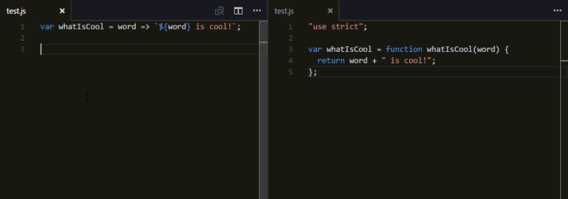

Writing JavaScript with syntax defined in the ECMAScript 6 (ES6), ECMAScript 2016(ES2016) and eventually ECMAScript 2017 (and so on and so forth) to be used in currently browsers can require a little more work that just including a `<script />` tag. While it may be possible to use features that are already implemented in some browsers there is no guarantee your users are going to use the most up-to-date browser. To get around this we will need to use a transpiler.

> If you know you can force your users to using a certain browser you can see what you "get away with" (read: use) with this handy-dandy [compatibility chart](http://kangax.github.io/compat-table/es6/). You can also use ES6 features without a transpiler if you plan on using Node v6 (or later)

Today we will set up [Babel](https://babeljs.io/).

> Before starting I ran npm init on an empty diretory so I would have a `package.json` started.

### Setup

We will setup Babel using it's provided cli tool. It is recommended to install it locally so we will begin with opening a command prompt to our working directory and running `npm init` so that npm walks us through the setup of out `package.json`

#### `npm init`

```
D:WorkspaceDreamforce-2016-Introduction-to-ECMAScript-66-babel>npm init  
This utility will walk you through creating a package.json file.  
It only covers the most common items, and tries to guess sensible defaults.

See `npm help json` for definitive documentation on these fields  
and exactly what they do.

Use `npm install <pkg> --save` afterwards to install a package and  
save it as a dependency in the package.json file.

Press ^C at any time to quit.  
name: (06-babel)

version: (1.0.0)  
description: babel-cli setup example  
entry point: (index.js)  
test command:  
git repository:  
keywords:  
author: BrettMN<brett@wipdeveloper.com>  
license: (ISC) MIT  
About to write to D:WorkspaceDreamforce-2016-Introduction-to-ECMAScript-66-babelpackage.json:

{
  "name": "06-babel",
  "version": "1.0.0",
  "description": "babel-cli setup example",
  "main": "index.js",
  "scripts": {
    "test": "echo "Error: no test specified" && exit 1"
  },
  "author": "BrettMN <brett@wipdeveloper.com> (https://www.WIPDeveloper.com)",
  "license": "MIT"
}


Is this ok? (yes)  
```

> Looking through that you may notice a `label:` `(suggestion)` and an `answer`. So in `name: (Babel) babel-cli-setup`, `name:` is the label, `(Babel)` was the suggestion and `babel-cli-setup` was my answer. If you want to use the suggestion all you have to do is press enter.

In case you are wondering, the answers I provided were:

1. 06-babel
2. 1.0.0
3. babel-cli setup example
4. index.js
5. nothing
6. nothing
7. nothing
8. BrettMN [brett@wipdeveloper.com](mailto:brett@wipdeveloper.com) ([https://www.WIPDeveloper.com](https://www.WIPDeveloper.com))
9. MIT
10. yes

This will result in a `package.json` file in the working directlory that looks likethe following:

#### `package.json`

```javascript
{
  "name": "06-babel",
  "version": "1.0.0",
  "description": "babel-cli setup example",
  "main": "index.js",
  "scripts": {
    "test": "echo "Error: no test specified" && exit 1"
  },
  "author": "BrettMN <brett@wipdeveloper.com> (https://www.WIPDeveloper.com)",
  "license": "MIT"
}
```

Now we can install the Babel cli locally with the `npm install --save-dev babel-cli` command:

#### `npm install --save-dev babel-cli`

```
D:WorkspaceDreamforce-2016-Introduction-to-ECMAScript-66-babel>npm install --save-dev babel-cli  
06-babel@1.0.0 D:WorkspaceDreamforce-2016-Introduction-to-ECMAScript-66-babel  
`-- babel-cli@6.16.0
  +-- babel-core@6.17.0
#### lines removed to make it a little less verbose ####
  `-- v8flags@2.0.11
    `-- user-home@1.1.1

npm WARN optional Skipping failed optional dependency /chokidar/fsevents:  
npm WARN notsup Not compatible with your operating system or architecture: fsevents@1.0.14  
npm WARN 06-babel@1.0.0 No repository field.

D:WorkspaceDreamforce-2016-Introduction-to-ECMAScript-66-babel>  
```

Now if you look in your `package.json` it should have added a `deveDependencies` property:

#### `package.json` Updated

```javascript
{
  "name": "06-babel",
  "version": "1.0.0",
  "description": "babel-cli setup example",
  "main": "index.js",
  "scripts": {
    "test": "echo "Error: no test specified" && exit 1"
  },
  "author": "BrettMN <brett@wipdeveloper.com> (https://www.WIPDeveloper.com)",
  "license": "MIT",
  "devDependencies": {
    "babel-cli": "^6.16.0"
  }
}
```

Now we will add a new line to our `package.json` in the scripts section. Bellow the `"test"` add the following line:

```
"build": "babel src -d lib"
```

Our updated-updated `package.json` should now look like the following:

#### `package.json` Updated-Updated

```javascript
{
  "name": "06-babel",
  "version": "1.0.0",
  "description": "babel-cli setup example",
  "main": "index.js",
  "scripts": {
    "test": "echo "Error: no test specified" && exit 1",
    "build": "babel src -d lib"
  },
  "author": "BrettMN <brett@wipdeveloper.com> (https://www.WIPDeveloper.com)",
  "license": "MIT",
  "devDependencies": {
    "babel-cli": "^6.16.0"
  }
}
```

Now we can create a JavaScript file in a `src` folder and write in an ES6 style and then type `npm run build` on the command line of out root working directory and it will transpile our code.

So we create a file in `src` named `test.js` that contains the following:

#### `src/test.js`

```javascript
var whatIsCool = word => `${word} is cool!`;  
```

and run `npm run build` and it becomes:

#### `lib/test.js`

```javascript
var whatIsCool = word => `${ word } is cool!`;  
```

Now that's not cool! Lets see how to correct this.

> Basically at this point Babel is just taking your JavaScript and copying it to a new location.

## Presets!

If you look at the [Babel plugins](https://babeljs.io/docs/plugins/) page you'll see we need to add presets to compile to ES5.

Lets add the preset for `es2015`

```
npm install --save-dev babel-preset-es2015  
```

Now out `package.json` should be updated again:

#### Updated-Updated-Updated `package.json`

```
{
  "name": "06-babel",
  "version": "1.0.0",
  "description": "babel-cli setup example",
  "main": "index.js",
  "scripts": {
    "test": "echo "Error: no test specified" && exit 1",
    "build": "babel src -d lib"
  },
  "author": "BrettMN <brett@wipdeveloper.com> (https://www.WIPDeveloper.com)",
  "license": "MIT",
  "devDependencies": {
    "babel-cli": "^6.16.0",
    "babel-preset-es2015": "^6.16.0"
  }
}
```

Now lets add a new file to the project directory and name it `.babelrc`. In this new file we will specify our preset:

#### `.babelrc`

```javascript
{
  "presets": ["es2015"]
}
```

Now with the save `src/test.js` if we run `npm run build` it will create a ES5 compatible version of the same code:

#### `lib/test.js`

```javascript
"use strict";

var whatIsCool = function whatIsCool(word) {  
  return word + " is cool!";
};
```

## Success!

That looks more like it! Now we can support all those people who want to use IE11 or an older version of Android.

## But Wait, There's More!

So far we have been running the command every time we want to transpile the code but there has to be an easier way.

In our `package.json` lets add one more `"scripts"`. Under the `build` we previously added add the following line:

```
"watch": "babel src -d lib --watch"
```

Our final `package.json` should look like the following:

#### Final `package.json`

```
{
  "name": "06-babel",
  "version": "1.0.0",
  "description": "babel-cli setup example",
  "main": "index.js",
  "scripts": {
    "test": "echo "Error: no test specified" && exit 1",
    "build": "babel src -d lib",
    "watch": "babel src -d lib --watch"
  },
  "author": "BrettMN <brett@wipdeveloper.com> (https://www.WIPDeveloper.com)",
  "license": "MIT",
  "devDependencies": {
    "babel-cli": "^6.16.0",
    "babel-preset-es2015": "^6.16.0"
  }
}
```

Now you can enter `npm run watch` on the command line and Babel will build your files once and then wait for more changes. When it detects changes it will rebuild your files.

#### Saving In Action



Now you can see the changes as soon as you hit save.

## Now What?

Hey, you can now use the Babel cli to transpile your ES6 to ES5, just think of all those old android devices you can support. There is, of course, more to the Babel cli. If you would like to know more about it let me know by leaving a comment below or emailing [brett@wipdeveloper.com](mailto:brett@wipdeveloper.com).

The code used in this demo is available at [GitHub.com/BrettMN/Dreamforce-2016-Introduction-to-ECMAScript-6/](https://github.com/BrettMN/Dreamforce-2016-Introduction-to-ECMAScript-6/tree/master/06-babel).
