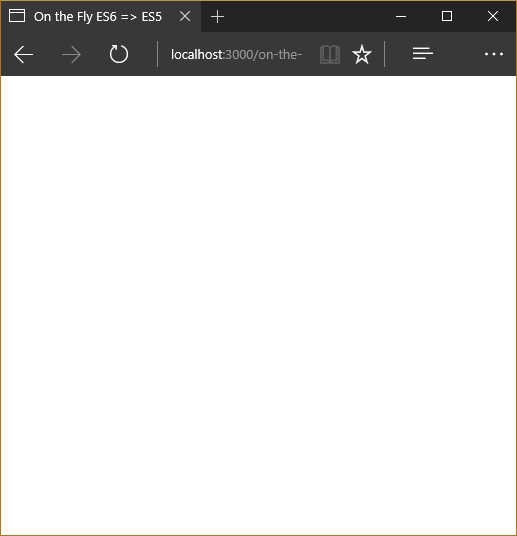
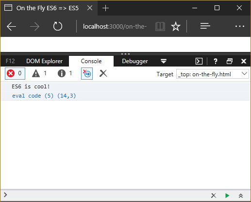

Lets do a quick walk-through of using Traceur to run our ECMAScript 6 (ES6) as ECMAScript 5 for older browsers.

> This a companion article for [Setting Up Babel CLI](/2016/10/19/setting-up-babel-cli/) as we look through a few ways to transpile ES6 to ES5.

If you look at the handy-dandy [compatibility chart](http://kangax.github.io/compat-table/es6/) you'll see that Traceur may not be getting as much love as [Babel](https://babeljs.io/). Being compatible with little over half of ES6 features, 56% as of this writing, Traceur may leave you wondering why use it at all. The answer may surprise you.

### Setup

Lets start simple. Create a new html page, I will call mine `on-the-fly.html` and add the following markup:

```markup
<!DOCTYPE html>  
<html lang="en">

<head>  
    <meta charset="UTF-8">
    <title>On the Fly ES6 => ES5</title>
    https://google.github.io/traceur-compiler/bin/traceur.js
    https://google.github.io/traceur-compiler/bin/BrowserSystem.js
    https://google.github.io/traceur-compiler/src/bootstrap.js
    
        import './src/test.js';
    
</head>

<body>  
</body>

</html>  
```

Lets look at everything that isn't standard here.

> Hopefully you know what the html, head, title, and body tags are doing already ;)

I've added references to 3 scripts for Traceur:

```markup
https://google.github.io/traceur-compiler/bin/traceur.js  
https://google.github.io/traceur-compiler/bin/BrowserSystem.js  
https://google.github.io/traceur-compiler/src/bootstrap.js  
```

- `traceur.js` - is the Traceur compiler
- `BrowserSystem.js` - is used to apply the compiler to the page.
- `bootstrap.js` - seems to coordinate the effort by looking for things to compile and call the compiler.

The fourth script tag we have has a type of `module`, this is what the `bootstrap.js` is looking for to compile from ES6 to ES5.

```
  
    import './src/test.js';
  
```

You can see we are using an import statement. This will load the file named `test.js` that is in a `src` directory I haven't told you about yet.

> The documentation say that modules are _[mostly](https://github.com/google/traceur-compiler/wiki/LanguageFeatures#modules)_ so I'm not too sure how I feel about that but lets use it anyway.

So about that `test.js` lets create a directory and name is `src` and in that new directory lets create a JavaScript file named `test.js` with the following content:

#### `src/test.js`

```javascript
var whatIsCool = word => `${word} is cool!`;

class MyCoolClass {  
    constructor() {
        this.isCool = true;
    }
}

var coolPhrase = whatIsCool('ES6');

console.log(coolPhrase);  
```

And that's all the set up we are going to do for now.

### Lets Run It

And by run it I mean, load it in a browser and look at the developer console to see if we logged anything.

> I use [lite-server](https://www.npmjs.com/package/lite-server) when I just want to server some static content locally but feel free to use what ever you are comfortable with.

If you load the page you should see **nothing**, Good Job!



Everything is proceeding as I have foreseen.

Now open the dev tools (f12, command+alt+i, right-click inspect, whatever suits you) and look at the console.

It should show you the universal truth.



So true!

Now I know that this example doesn't really show all the features that Traceur has but with this little setup you can start working with ES6 and rapidly iterate and see the results with out much time spent.

## Now What?

Who knows? Maybe next time we will try the Traceur compiler. Or perhaps you think I'm crazy for suggesting using Traceur at all. Let me know by leaving a comment below or emailing [brett@wipdeveloper.com](mailto:brett@wipdeveloper.com).

> The code used in this demo is available at [GitHub.com/BrettMN/Dreamforce-2016-Introduction-to-ECMAScript-6/](https://github.com/BrettMN/Dreamforce-2016-Introduction-to-ECMAScript-6/tree/master/07-traceur).
