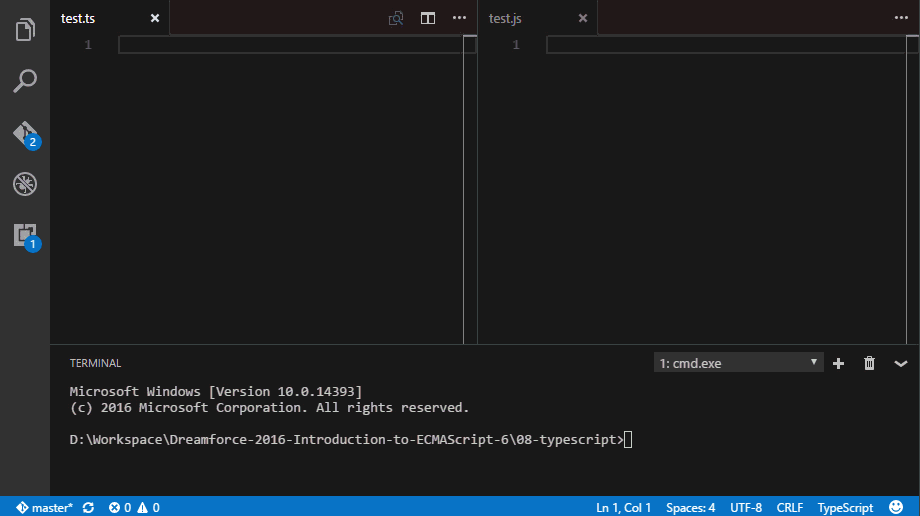

They say that TypeScript is a super set of JavaScript so that means that we should be able to use the TypeScript compiler to covert ECMAScript 6 (ES6) to ECMAScript 5 (ES5). Let take a look at how to do just that.

## Setup

According to the [docs](http://www.typescriptlang.org/docs/tutorial.html) the TypeScript Transpiler should be installed globally. So lets run:

```
npm install -g typescript  
```

Now that that's done let's create a simple file that makes use of some ES6 features. I will call mine `test.ts` and if you read the previous posts on [Babel](/2016/10/19/setting-up-babel-cli/) or [Traceur](/2016/10/20/using-traceur-on-the-fly/) it may look familiar:

#### `test.ts`

```javascript
var whatIsCool = word => `${word} is cool!`;

class MyCoolClass {  
    constructor() {
        this.isCool = true;
    }
}

var coolPhrase = whatIsCool('TypeScript');

console.log(coolPhrase);  
```

## Run It

Now that we have something to play with we can compile our `test.ts` to `test.js` with the command `tsc test.ts`

```
D:WorkspaceDreamforce-2016-Introduction-to-ECMAScript-68-typescript>tsc test.ts  
test.ts(5,14): error TS2339: Property 'isCool' does not exist on type 'MyCoolClass'.  
```

If you are actually reading along you may notice that it says `error TS2339` in that console output and it's description `Property 'isCool' does not exist on type 'MyCoolClass'`. This is because the TypeScript compiler does type checking and we did not define a property on out class named `isCool`. In JavaScript this is wouldn't raise any warnings since it's not a strongly typed language but with TypeScript part of the purpose was to bring strong typing to JavaScript. There are some benefits; tooling support and compile time checking come to mind, but this means you would either have to ignore this error or figure out how to get rid of it.

> If you are using an editor that supports TypeScript you may also have a red squiggly line under `this.isCool`

Since we were previously implying that `MyCoolClass` had a property called `isCool` by setting it in the constructor we could remove this error by explicitly specifying the property. We can do this my adding `iscool;` in our class:

#### `test.ts`

```javascript
class MyCoolClass {

    isCool;

    constructor() {
        this.isCool = true;
    }
}
```

> If you are wondering about the type since this is TypeScript it will default to a type of any since we did not explicitly declare a type or implicitly set the type by assigning a value when the property was declared.

Now if you run the compiler again, it wont show any errors. YAY! but if you look at the output file it might not look any different.



I know what you're thinking, _all_ that work and it didn't actually change anything but that is not actually true. You could say you made your code more easy to understand by removing the implicitness of your classes property. Granted this is a really simple example but what if you hat 10 or more implicet properties in a class? Wouldn't it be easier to work with if they were all declared in one place?

## What About Compiling on Save?

The easiest way to compile when you change something would be to add a `tsconfig.json` file to the root of you project directories. My Super-Simple `tsconfig.json` example bellow will allow us to change files and have the compiler update the output files as I work.

```
{
    "compileOnSave": true
}
```

See? So simple a web developer could..... err hold on... so simple a ... ok look it's just Super-Simple.

Now instead of using `tsc test.ts` in the console use `tsc --watch` in the console and see the magic unfold as you save.

## What About Multiple Files?

See the Super-Simple `tsconfig.json` example above.

## Now What?

This was just a little intro in how you could use TypeScript to compile your ES6 to ES5 but if you are going down this road I would recommend learning more about TypeScript since you may find some of it's other features beneficial.

Are you adamantly against TypeScript or think there is a better way? Let me know by leaving a comment below or emailing [brett@wipdeveloper.com](mailto:brett@wipdeveloper.com).

The code used in this demo is available at [GitHub.com/BrettMN/Dreamforce-2016-Introduction-to-ECMAScript-6/](https://github.com/BrettMN/Dreamforce-2016-Introduction-to-ECMAScript-6/tree/master/07-typescript).
