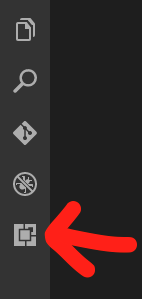
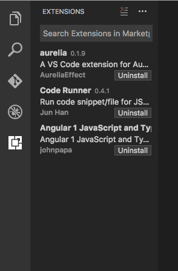
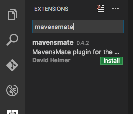
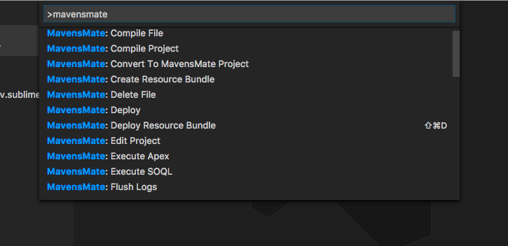

At Dreamforce one of the sessions I was excited to see was the introduction of [Mavensmate](http://mavensmate.com/) with Visual Studio Code (VS CODE). It was presented by [Joseph Ferraro](https://twitter.com/joeferraro) and [David Helmer](https://twitter.com/kidtsunami).

I have been using MavensMate with Sublime and it was an ok experience but I missed some of the features of VS Code. With the new [MavensMate for VS Code](https://marketplace.visualstudio.com/items?itemName=DavidHelmer.mavensmate) plugin and the [MavensMate-Desktop](https://github.com/joeferraro/MavensMate-Desktop/releases/tag/v0.0.11-beta.6) latest release I can now work in a more comfortable environment.

## Setup

Setup is pretty straight forward. Basically follow the directions.

#### Install the MavensMate Desktop app

Go to the [MavensMate Desktop releases](https://github.com/joeferraro/MavensMate-Desktop/releases)page. And install the latest beta, currently v0.0.11-beta.6, for your platform and install it.

> If you have used MavensMate in the past you may notice a few differences with this version. We may talk about that at a later time.

Once the desktop app is installed it's time to get the plugin.

> For this next part we should assume you already have VS Code installed. If you don't, head on over to the [VS Code](https://code.visualstudio.com) site, download and install it for your platform before moving on.

#### Install MavensMate Plugin for Visual Studio Code

In VS Code you can get to the Extensions install "tab" by one of two ways. Through the command palette: open the command palette `cmd+shift+p` for a Mac or `ctrl+shift+p` for Windows. Through the UI: click the bottom square made of little squares icon on the left of VS Code:

#### VS Code Extensions Icon



You should now see the Extensions "tab":

#### VS Code Extensions "tab"



> You should see any other extensions you have installed previously.

In the search box type "mavensmate" and install the "MavensMate plugin for Visual Studio Code" by clicking the little green button.

#### MavensMate Search



> At the time of this writing the version number is 0.4.2

Once it's installed you will need to "enable" you brand new plugin and that will ask you to restart VS Code.

Now you should be ready to start using MavensMate with Visual Studio Code.

## Where Are All the Commands?

If you open the command palette again, `cmd+shift+p` or `ctrl+shift+p` if you forgot, you can see a list of all available commands by typing `mavensmate`:

#### MavensMate Command Palette

 Judging by that scroll bar there are quite a few of them.

## But I Get Tired of Typing

Yeah me too. In the last screen shot you may notice the `cmd+shift+D` key command next to the `MavensMate: Deploy Resource Bundle` on your fresh setup you wont have this. I added the custom key binding so I could cut down a couple steps when deploying static resources to my Salesforce Org **and you can too!**

Open your keyboard shortcuts. On a Mac it's under `CODE > Preferences > Keyboard Shortcuts`. On Windows it's under `File > Preferences > Keyboard Shortcuts`. This should open 2 windows, `Default Keyboard Shortcuts` and `keybinding.json`.

#### Default `keybinding.json`

```javascript
// Place your key bindings in this file to overwrite the defaults
[]
```

In that empty array we are going to add an object with a `key` and a `command`. You can look at the `Default Keyboard Shortcuts` to get an idea of how to define a `key` or you could use the "Define Keybinding" green button.

> I used the keys combination of `"shift+cmd+d"` because I didn't think I would miss the command it would overwrite of `"workbench.view.debug"` but I could be wrong. Only time will tell.

To find the command I wanted to be bound to this combination of keys I went to the [MavensMate-VisualStudioCode/package.json](https://github.com/joeferraro/MavensMate-VisualStudioCode/blob/master/package.json) on github. It contains a list of commands.

> See bellow for a list of the commands as of the time of this writing.

Since I knew I wanted to bind "MavensMate: Deploy Resource Bundle" I searched for it and found the command associated to it was `"mavensmate.deployResourceBundle"`. I used this as the command in my custom `keybinding.json` to create my key short cut to deploy static resources without typing in the command palette.

#### Final `keybinding.json`

```javascript
// Place your key bindings in this file to overwrite the defaults
[
    {
        "key": "shift+cmd+d",
        "command": "mavensmate.deployResourceBundle"
    }
]
```

## The End, or is it?

Now when I want to update my JavaScript, CSS or HTML Templates in my static resources I can do so with one key-combo-press select from the drop down and press enter.

Do you have any tip, tricks or favorite deployment methods? Let me know by leaving a comment below or emailing [brett@wipdeveloper.com](mailto:brett@wipdeveloper.com).

* * *

Full list of commands, pick your favorite:

```
"commands": [
    {
        "command": "mavensmate.openProject",
        "title": "MavensMate: Open Project"
    },
    {
        "command": "mavensmate.openUI",
        "title": "MavensMate: Open MavensMate UI"
    },
    {
        "command": "mavensmate.openSettings",
        "title": "MavensMate: Open MavensMate Settings"
    },
    {
        "command": "mavensmate.openGlobalSettings",
        "title": "MavensMate: Open Global Settings"
    },
    {
        "command": "mavensmate.newProject",
        "title": "MavensMate: New Project"
    },
    {
        "command": "mavensmate.convertProject",
        "title": "MavensMate: Convert To MavensMate Project"
    },
    {
        "command": "mavensmate.editProject",
        "title": "MavensMate: Edit Project"
    },
    {
        "command": "mavensmate.runTests",
        "title": "MavensMate: Run Apex Tests"
    },
    {
        "command": "mavensmate.openSalesforce",
        "title": "MavensMate: Open Salesforce"
    },
    {
        "command": "mavensmate.deploy",
        "title": "MavensMate: Deploy"
    },
    {
        "command": "mavensmate.newLightningApp",
        "title": "MavensMate: New Lightning App"
    },
    {
        "command": "mavensmate.newLightningComponent",
        "title": "MavensMate: New Lightning Component"
    },
    {
        "command": "mavensmate.newLightningEvent",
        "title": "MavensMate: New Lightning Event"
    },
    {
        "command": "mavensmate.newLightningInterface",
        "title": "MavensMate: New Lightning Interface"
    },
    {
        "command": "mavensmate.newLightningToken",
        "title": "MavensMate: New Lightning Token"
    },
    {
        "command": "mavensmate.executeApex",
        "title": "MavensMate: Execute Apex"
    },
    {
        "command": "mavensmate.flushLogs",
        "title": "MavensMate: Flush Logs"
    },
    {
        "command": "mavensmate.startLogging",
        "title": "MavensMate: Start Logging"
    },
    {
        "command": "mavensmate.stopLogging",
        "title": "MavensMate: Stop Logging"
    },
    {
        "command": "mavensmate.cleanProject",
        "title": "MavensMate: Clean Project"
    },
    {
        "command": "mavensmate.compileFile",
        "title": "MavensMate: Compile File"
    },
    {
        "command": "mavensmate.forceCompileFile",
        "title": "MavensMate: Force Compile File"
    },
    {
        "command": "mavensmate.compileProject",
        "title": "MavensMate: Compile Project"
    },
    {
        "command": "mavensmate.refreshFile",
        "title": "MavensMate: Refresh File"
    },
    {
        "command": "mavensmate.openMetadata",
        "title": "MavensMate: Open File In Salesforce"
    },
    {
        "command": "mavensmate.deleteFile",
        "title": "MavensMate: Delete File"
    },
    {
        "command": "mavensmate.getCoverage",
        "title": "MavensMate: Get Apex Coverage"
    },
    {
        "command": "mavensmate.getOrgWideCoverage",
        "title": "MavensMate: Get Org Wide Apex Coverage"
    },
    {
        "command": "mavensmate.indexMetadata",
        "title": "MavensMate: Index Metadata"
    },
    {
        "command": "mavensmate.toggleOutput",
        "title": "MavensMate: Toggle Output"
    },
    {
        "command": "mavensmate.runApexScript",
        "title": "MavensMate: Run Apex Script"
    },
    {
        "command": "mavensmate.newApexScript",
        "title": "MavensMate: New Apex Script"
    },
    {
        "command": "mavensmate.executeSoql",
        "title": "MavensMate: Execute SOQL"
    },
    {
        "command": "mavensmate.flushSoql",
        "title": "MavensMate: Flush SOQL"
    },
    {
        "command": "mavensmate.newApexClass",
        "title": "MavensMate: New Apex Class"
    },
    {
        "command": "mavensmate.newApexTrigger",
        "title": "MavensMate: New Apex Trigger"
    },
    {
        "command": "mavensmate.newVisualforceComponent",
        "title": "MavensMate: New Visualforce Component"
    },
    {
        "command": "mavensmate.newVisualforcePage",
        "title": "MavensMate: New Visualforce Page"
    },
    {
        "command": "mavensmate.createResourceBundle",
        "title": "MavensMate: Create Resource Bundle"
    },
    {
        "command": "mavensmate.deployResourceBundle",
        "title": "MavensMate: Deploy Resource Bundle"
    }
]
```
