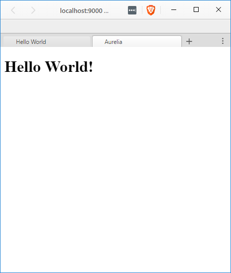
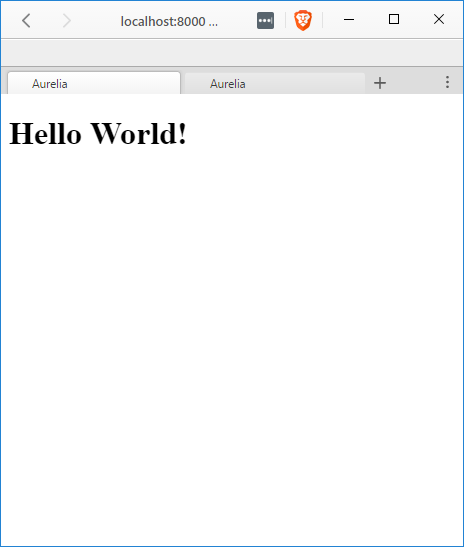

[Previously](/2016/02/05/apache-cordova-setting-up-aurelia/) we looked at using [Aurelia](http://aurelia.io/) with [Cordova](http://cordova.apache.org/) we had to use do some fancy footwork to get our Aurelia into the Cordova App. With the [Aurelia-CLI](http://aurelia.io/hub.html#/doc/article/aurelia/framework/latest/the-aurelia-cli)

> Before you start you may want to get the latest of cordova and the aurelia-cli installed with `npm install -g cordova aurelia-cli`

## Setup Cordova

Create your new Cordova app

#### `cordova create aurelia-cli-sample`

```
PS D:WorkspaceBlogCordova> cordova create aurelia-cli-sample  
Creating a new cordova project.  
PS D:WorkspaceBlogCordova>  
```

go into the new project directory that was created.

#### `cd aurelia-cli-sample`

```
PS D:WorkspaceBlogCordova> cd aurelia-cli-sample  
```

And take a quick look around

#### `ls` or `dir`

```
PS D:WorkspaceBlogCordovaaurelia-cli-sample> ls


    Directory: D:WorkspaceBlogCordovaaurelia-cli-sample


Mode                LastWriteTime         Length Name  
---- ------------- ------ ----
d----- 11/20/2016  11:42 PM                hooks  
d----- 11/20/2016  11:42 PM                platforms  
d----- 11/20/2016  11:42 PM                plugins  
d----- 11/20/2016  11:42 PM                www  
-a---- 11/20/2016  11:42 PM            992 config.xml
```

Since things look in order lets move on to the next part.

## Setup Aurelia

We will create a new Aurelia project with the `au new` command.

> I leave the name of the project blank since I will use the aurelia-cli default of `aurelia-app` since it will create a directory of the same name.

#### `au new`

```
PS D:WorkspaceBlogCordovaaurelia-cli-sample> au new  
                      _ _          ___ _     ___
  __ _ _   _ _ __ ___| (_) __ _   / ___| |   |_ _|
 / _` | | | | '__/ _  | |/ _` | | |   | |    | |
| (_| | |_| | | |  __/ | | (_| | | |___| |___ | |
 __,_|__,_|_|  ___|_|_|__,_|  ___|___|___|


Please enter a name for your new project below.

[aurelia-app]>

Would you like to use the default setup or customize your choices?

1. Default ESNext (Default)  
   A basic web-oriented setup with Babel for modern JavaScript development.
2. Default TypeScript  
   A basic web-oriented setup with TypeScript for modern JavaScript development.
3. Custom  
   Select transpilers, CSS pre-processors and more.

[Default ESNext]>

Project Configuration

    Name: aurelia-app
    Platform: Web
    Transpiler: Babel
    CSS Processor: None
    Unit Test Runner: Karma
    Editor: Visual Studio Code


Would you like to create this project?

1. Yes (Default)  
   Creates the project structure based on your selections.
2. Restart  
   Restarts the wizard, allowing you to make different selections.
3. Abort  
   Aborts the new project wizard.

[Yes]>
Project structure created and configured.

Would you like to install the project dependencies?

1. Yes (Default)  
   Installs all server, client and tooling dependencies needed to build the project.
2. No  
   Completes the new project wizard without installing dependencies.

[Yes]>

Installing project dependencies.

...


Congratulations! Your Project "aurelia-app" Has Been Created!


Now it's time for you to get started. It's easy. First, change directory into your new project's folder. You can use cd  
aurelia-app to get there. Once in your project folder, simply run your new app with au run. Your app will  
run fully bundled. If you would like to have it auto-refresh whenever you make changes to your HTML, JavaScript or CSS, simply use the  
--watch flag. If you want to build your app for production, run au build --env prod. That's just about
all there is to it. If you need help, simply run au help.


Happy Coding!  
PS D:WorkspaceBlogCordovaaurelia-cli-sample>  
```

In this case I used the `Default ESNext` options since the important part will be comi g up later it shouldn't matter what type of configuration you are using

## Build Things

Now lets try and run our cordova project. First add a platform, I will be using 'browser' but you can use whatever one you feel comfortable with. Then I will run it.

#### Run Cordova

```
PS D:WorkspaceBlogCordovaaurelia-cli-sample> cordova platform add browser  
Adding browser project...  
Running command: cmd "/s /c "C:Usersbmn13.cordovalibnpm_cachecordova-browser4.1.0packagebincreate.bat D:WorkspaceBlogCord  
ovaaurelia-cli-sampleplatformsbrowser io.cordova.hellocordova HelloCordova""  
Creating Browser project. Path: platformsbrowser  
Discovered plugin "cordova-plugin-whitelist" in config.xml. Adding it to the project  
Fetching plugin "cordova-plugin-whitelist@1" via npm  
Installing "cordova-plugin-whitelist" for browser  
PS D:WorkspaceBlogCordovaaurelia-cli-sample> cordova run browser  
Running command: cmd "/s /c "D:WorkspaceBlogCordovaaurelia-cli-sampleplatformsbrowsercordovabuild.bat""  
Cleaning Browser project  
Running command: cmd "/s /c "D:WorkspaceBlogCordovaaurelia-cli-sampleplatformsbrowsercordovarun.bat --nobuild""  
Static file server running @ http://localhost:8000/index.html  
CTRL + C to shut down  
```

This should result in a browser window opening and looking something like this:


Now lets open a new terminal/console/powershell in the directory that has our Aurelia app. Here we will use the `au run --watch` command to verify our app was set up correctly.

#### `au run --watch`

```
PS D:WorkspaceBlogCordovaaurelia-cli-sampleaurelia-app> au run --watch  
Starting 'readProjectConfiguration'...  
Finished 'readProjectConfiguration'  
Starting 'processMarkup'...  
Starting 'processCSS'...  
Starting 'configureEnvironment'...  
Finished 'processMarkup'  
Finished 'processCSS'  
Finished 'configureEnvironment'  
Starting 'buildJavaScript'...  
Finished 'buildJavaScript'  
Starting 'writeBundles'...  
Tracing app...  
Tracing environment...  
Tracing main...  
Tracing resources/index...  
Tracing app...  
Tracing text...  
Tracing aurelia-binding...  
Tracing aurelia-bootstrapper...  
Tracing aurelia-event-aggregator...  
Tracing aurelia-dependency-injection...  
Tracing aurelia-history...  
Tracing aurelia-framework...  
Tracing aurelia-history-browser...  
Tracing aurelia-loader-default...  
Tracing aurelia-logging-console...  
Tracing aurelia-route-recognizer...  
Tracing aurelia-router...  
Tracing aurelia-templating-resources...  
Tracing aurelia-templating-router...  
Tracing aurelia-templating-binding...  
Tracing aurelia-testing...  
Writing app-bundle.js...  
Writing vendor-bundle.js...  
Finished 'writeBundles'  
Application Available At: http://localhost:9000  
BrowserSync Available At: http://localhost:3001  
Starting 'watch'...  
```

Open a browser window to `http://localhost:9000` and you should see something like the following:



So now we have 2 separate apps, good job!

## Now What?

Ooo I know, let see if there is a bundle feature we could use to move our Aurelia app into the Cordova app. In fact the [Aurelia docs](http://aurelia.io/hub.html#/doc/article/aurelia/framework/latest/the-aurelia-cli/4) state that the app ran from the cli is **always** bundled.

_Whaaat?_

We just need to figure out how to copy that bundle into the cordova www folder and things should be hunky-dory.

You're probably thinking "Sounds great but where would we start to look for that?"

Well if you look in your `aurelia-cli-sampleaurelia-appaurelia_projecttasks` folder you will see a `'build.js` file that looks like this:

#### Original `build.js`

```javascript
import gulp from 'gulp';  
import transpile from './transpile';  
import processMarkup from './process-markup';  
import processCSS from './process-css';  
import {build} from 'aurelia-cli';  
import project from '../aurelia.json';

export default gulp.series(  
  readProjectConfiguration,
  gulp.parallel(
    transpile,
    processMarkup,
    processCSS
  ),
  writeBundles
);

function readProjectConfiguration() {  
  return build.src(project);
}

function writeBundles() {  
  return build.dest();
}
```

With a slight modification here we can get it to always build out to the `www` folder. Lets add an `import del from 'del';` so we can always remove old files before adding our updated ones to keep things fresh. And after the line that says `writeBundles` lets add a `copyToCordova`, this of course means we will need a `copyToCordova` function. At the bottom of the file create a new `copyToCordova` function that should look similar to this:

#### `copyToCordova`

```javascript
function copyToCordova() {  
  del(['../www/**/*'], {force:true});
  return gulp.src([
    '**/*',

    '!node_modules',
    '!node_modules/**',
    '!aurelia_project',
    '!aurelia_project/**',
    '!custom_typings',
    '!custom_typings/**',
    '!typings',
    '!typings/**',
    '!src',
    '!src/**',
    '!test',
    '!test/**',
    '!*.js',
    '!*.json'

    ])
    .pipe(gulp.dest('../www'))
}
```

The final file should look something like this:

#### New and Slightly Improved `build.js`

```
import gulp from 'gulp';  
import transpile from './transpile';  
import processMarkup from './process-markup';  
import processCSS from './process-css';  
import {build} from 'aurelia-cli';  
import project from '../aurelia.json';  
import del from 'del';

export default gulp.series(  
  readProjectConfiguration,
  gulp.parallel(
    transpile,
    processMarkup,
    processCSS
  ),
  writeBundles,
  copyToCordova
);

function readProjectConfiguration() {  
  return build.src(project);
}

function writeBundles() {  
  return build.dest();
}

function copyToCordova() {  
  del(['../www/**/*'], {force:true});
  return gulp.src([
    '**/*',

    '!node_modules',
    '!node_modules/**',
    '!aurelia_project',
    '!aurelia_project/**',
    '!custom_typings',
    '!custom_typings/**',
    '!typings',
    '!typings/**',
    '!src',
    '!src/**',
    '!test',
    '!test/**',
    '!*.js',
    '!*.json'

    ])
    .pipe(gulp.dest('../www'))
}
```

Now before we can run this we will need to install and save `del` in our `aurelia-app`

#### `npm install --save-dev del`

```
PS D:WorkspaceBlogCordovaaurelia-cli-sampleaurelia-app> npm install --save-dev del  
npm WARN optional Skipping failed optional dependency /chokidar/fsevents:  
npm WARN notsup Not compatible with your operating system or architecture: fsevents@1.0.15  
PS D:WorkspaceBlogCordovaaurelia-cli-sampleaurelia-app>  
```

There is some other things we should do as well.

On the `index.html` in the `www` folder of the cordova project we probably want to copy some line to the `index.html` of our `aureali-app` since we will be replacing it. So grab the following lines from `www/index.html` and add them to the head or `aurealia-app/index.html`:

#### Head updates

```markup
        <meta http-equiv="Content-Security-Policy" content="default-src 'self' data: gap: https://ssl.gstatic.com 'unsafe-eval'; style-src 'self' 'unsafe-inline'; media-src *">
        <meta name="format-detection" content="telephone=no">
        <meta name="msapplication-tap-highlight" content="no">
        <meta name="viewport" content="user-scalable=no, initial-scale=1, maximum-scale=1, minimum-scale=1, width=device-width">
```

We should probably also reference the `cordova.js` as well so in the body of `aurealia-app/index.html` add the following:

#### add referance to `cordova.js`

```markup
 http://cordova.js
```

My `aurealia-app/index.html` ended up looking like the following:

#### `aurealia-app/index.html`

```markup
<!DOCTYPE html>  
<html>

<head>  
  <title>Aurelia</title>
  <meta http-equiv="Content-Security-Policy" content="default-src 'self' data: gap: https://ssl.gstatic.com 'unsafe-eval'; style-src 'self' 'unsafe-inline'; media-src *">
  <meta name="format-detection" content="telephone=no">
  <meta name="msapplication-tap-highlight" content="no">
  <meta name="viewport" content="user-scalable=no, initial-scale=1, maximum-scale=1, minimum-scale=1, width=device-width">
</head>

<body aurelia-app="main">  
  http://cordova.js
  http://scriptsvendor-bundle.js
</body>

</html>  
```

## See the Magic

Now if you run `au run --watch` all the changes you make in your `aurelia-app` folder should propagate to your `www` folder to be picked up the next time you run `cordova build`

#### `cordova run browser`

```
PS D:WorkspaceBlogCordovaaurelia-cli-sample> cordova run browser  
Running command: cmd "/s /c "D:WorkspaceBlogCordovaaurelia-cli-sampleplatformsbrowsercordovabuild.bat""  
Cleaning Browser project  
Running command: cmd "/s /c "D:WorkspaceBlogCordovaaurelia-cli-sampleplatformsbrowsercordovarun.bat --nobuild""  
Static file server running @ http://localhost:8000/index.html  
CTRL + C to shut down  
200 /index.html  
200 /cordova.js (gzip)  
200 /cordova_plugins.js  
200 /scripts/vendor-bundle.js (gzip)  
200 /favicon.ico (gzip)  
200 /scripts/app-bundle.js (gzip)  
200 /index.html  
200 /cordova.js (gzip)  
200 /cordova_plugins.js  
200 /scripts/vendor-bundle.js (gzip)  
200 /favicon.ico (gzip)  
200 /scripts/app-bundle.js (gzip)  
```

You can see above that cordova is serving `/scripts/vendor-bundle.js` and `/scripts/app-bundle.js` that are created by the Aureali-CLI. When I refresh my browser that is looking at `http://localhost:8000/index.html` if now shows the same as the `aurelia-app`



## Conclusion

What do you think? Have a better way to do it? I would love to hear about it, leave a comment below or send an email to me at [brett@wipdeveloper.com](mailto:brett@wipdeveloper.com).
