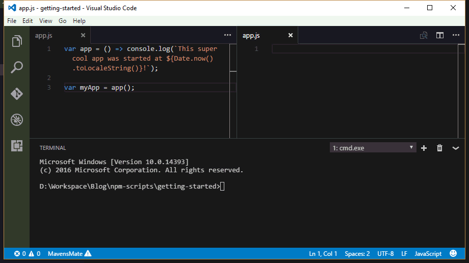

Previously we used [Gulp](https://www.wipdeveloper.com/tag/gulp/) a few time to automate some build steps. Lets take a look at how we can accomplish some of the same things with functionality build in the node ecosystem by using [npm-scripts](https://docs.npmjs.com/misc/scripts).

## Getting Started

To begin we will need to have [Node.js](https://nodejs.org) installed and [npm](https://www.npmjs.com/) conveniently if you install Node.js from the installer on the website npm will be installed as well. to make sure you have the latest version of npm use the following command:

#### Update npm

```
npm install npm -g  
```

> If you are on a Mac or Linux you may need to use the `sudo` command.

Now lets create a new folder for our little project and set up a `package.json`. Let's run `npm init` with the following responses:

- name: (npm-scripts-getting-started)
- version: (1.0.0) 0.0.1
- description: A simple getting started with npm scripts project
- entry point: (index.js) app.js
- test command:
- git repository:
- keywords: npm scripts beginner
- author: BrettMN [brett@wipdeveloper.com](mailto:brett@wipdeveloper.com) ([https://www.wipdeveloper.com](https://www.wipdeveloper.com))
- license: (ISC) MIT

#### Starting `package.json`

```
{
  "name": "npm-scripts-getting-started",
  "version": "0.0.1",
  "description": "A simple getting started with npm scripts project",
  "main": "app.js",
  "scripts": {
    "test": "echo "Error: no test specified" && exit 1"
  },
  "keywords": [
    "npm",
    "scripts",
    "beginner"
  ],
  "author": "BrettMN <brett@wipdeveloper.com> (https://www.wipdeveloper.com)",
  "license": "MIT"
}
```

Now that we have that out of they way we can move on to the meat and potatoes of our topic.

## Setting Up Babel

To add [Babel](http://babeljs.io/) we will need to run `npm install --save-dev babel-cli babel-preset-es2015`.

> If you read the [last time](/2016/10/19/setting-up-babel-cli/) we set up Babel you may remember we need to add a preset for doing ES6 => ES5 so that things actually get transpiled to ES5 so we just added the preset at the same time as the `babel-cli`

That should add a new section to your `package.json` that called `devDependencies` that looks like the following:

#### New Section in `package.json`

```
  "devDependencies": {
    "babel-cli": "^6.18.0",
    "babel-preset-es2015": "^6.18.0"
  }
```

Now lets go to our `scripts` section and add a new one right bellow the `test` script we will add the following:

#### New `build:js` script

```
"build:js": "babel src -d dist --presets es2015"
```

This will allow us to type `npm run-script build:js` or `npm run build:js` and the babel-cli will transpile everything in our `src` directory into ES5 in out `dist` directory.

So if we have an file named `src/app.js` that looks like this:

#### `src/app.js`

```javascript
var app = () => console.log(`This super cool app was started at ${Date.now().toLocaleString()}!`);

var myApp = app();  
```

then we run `npm run build:js` on the command line we will get a new file named `dist/app.js` that will look like this:

#### `dist/app.js`

```javascript
"use strict";

var app = function app() {  
  return console.log("This super cool app was started at " + Date.now().toLocaleString() + "!");
};

var myApp = app();  
```

#### Yay it Worked!



In case you are wondering the final `package.json` looked like this:

#### Final `package.json`

```
{
  "name": "npm-scripts-getting-started",
  "version": "0.0.1",
  "description": "A simple getting started with npm scripts project",
  "main": "app.js",
  "scripts": {
    "test": "echo "Error: no test specified" && exit 1",
    "build:js": "babel src -d dist --presets es2015"
  },
  "keywords": [
    "npm",
    "scripts",
    "beginner"
  ],
  "author": "BrettMN <brett@wipdeveloper.com> (https://www.wipdeveloper.com)",
  "license": "MIT",
  "devDependencies": {
    "babel-cli": "^6.18.0",
    "babel-preset-es2015": "^6.18.0"
  }
}
```

## Conclusion

We are just getting started but one thing you may have noticed is that we didn't need to install any npm modules globally so we wont have to worry about what version anything is we used on different projects. This this has been silly so far and you will never try anything besides your beloved `${readersFavoriteJavaScriptBuildTool}`? I would love to hear about it, leave a comment below or send an email to me at [brett@wipdeveloper.com](mailto:brett@wipdeveloper.com).
