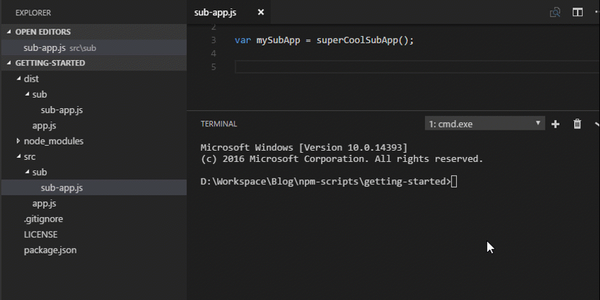

[Previously](/2016/12/06/getting-started-with-npm-scripts-watch/) on WIPDeveloper. We set up an npm script to watch for file changes and then had it run our `build:js` script. This time we will set it up to remove the all the JavaScript files, or "clean" them, before building the latest files.

## More Journeys

Like last we will be starting from where we left off before.

> If you would like to join in at this point you can get the code to begin with at [Getting Started with NPM Scripts - Babel](https://github.com/BrettMN/npm-scripts-getting-started/releases/tag/post02).

This time we will be using the [del-cli](https://www.npmjs.com/package/del-cli) so lets install it as a dependency with the following command `npm install --save-dev del-cli`

> Once again we are saving the cli version as a dependency but expecting to only use it from within an npm script so it will not be usable from the command line outside of our script.

With that all our installs of the day are complete.

## Next New Script Time

In our `package.json` lets add another line to our scripts section with the following name `"clean:js"`. For the script actions that will be called we will use the following glob `"del-cli dist/**/*.js"`.

> I'm currently using windows so for my script command I use `del-cli` since windows already has a `del` command on the command line and things don't work correctly when you call the wrong function from the command line. If you are on some \*nix system you probably can get by with just using `"del dist/**/*.js"`

#### Full `clean:js`

```
"clean:js": "del-cli dist/**/*.js"
```

Now if we run our new script with `npm run clean:js` we should delete all the JavaScript from within the `dist/` folder.

> I say should but I noticed an issue with using this on the Bash on Ubuntu on Windows where it doesn't delete all the js files on the first go round. I will try this on a \*nix machine when I get a chance to see what happens.

So with our new script we can remove all previous js files from our `dist/` folder before building the new ones so we can alway have the cleanest JavaScript in town, or at least as clean as you wrote it.

To make that clean JavaScript a real thing lets add it to our watch command.

## Updating `watch:js`

To use our shinny new `clean:js` script in our watch lets add it as the first step when a JavaScript file changes. Our starting `watch:js` script looked like the following:

#### Starting `watch:js`

```
"watch:js": "chokidar src/**/*.js -c "npm run build:js""
```

Now lets add `npm run clean:js &&` after the first `"` and before the `npm run build:js` with the final results looking like this:

#### Ending `watch:js`

```
"watch:js": "chokidar src/**/*.js -c "npm run clean:js && npm run build:js"",
```

> I added a folder called `sub/` to the `src/` folder and a file named `sub-app.js` to the `sub/` folder to see if sub folders would be handled properly.

Our Final `package.json` should look like the following:

#### Final `package.json`

```
{
  "name": "npm-scripts-getting-started",
  "version": "0.0.3",
  "description": "A simple getting started with npm scripts project",
  "main": "app.js",
  "scripts": {
    "test": "echo "Error: no test specified" && exit 1",
    "build:js": "babel src -d dist --presets es2015",
    "watch:js": "chokidar src/**/*.js -c "npm run clean:js && npm run build:js"",
    "clean:js": "del-cli dist/**/*.js"
  },
  "keywords": [
    "npm",
    "scripts",
    "beginner"
  ],
  "author": "BrettMN <brett@wipdeveloper.com> (https://www.wipdeveloper.com)",
  "license": "MIT",
  "devDependencies": {
    "babel-cli": "^6.18.0",
    "babel-preset-es2015": "^6.18.0",
    "chokidar-cli": "^1.2.0",
    "del-cli": "^0.2.1"
  },
  "repository": {
    "type": "git",
    "url": "https://github.com/BrettMN/npm-scripts-getting-started.git"
  }
}
```

## See It In Action

Now lets run our watch `npm run watch:js`

#### `npm run watch:js` in Action



> All code used in this example can be found at [BrettMN/npm-scripts-getting-started](https://github.com/BrettMN/npm-scripts-getting-started)

## Conclusion

Don't you love the smell of a clean directory in the morning? What other tasks should we add to our automation through npm scripts? Leave a comment below or send an email to me at [brett@wipdeveloper.com](mailto:brett@wipdeveloper.com) and let me know.
