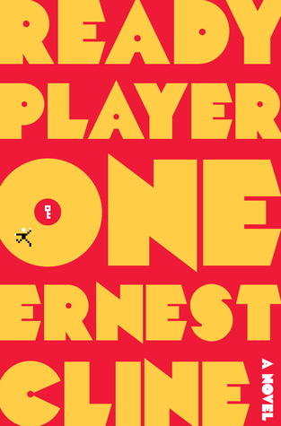

[Ready Player One](https://www.amazon.com/gp/product/0307887448/ref=as_li_qf_sp_asin_il_tl?ie=UTF8&tag=wipdevelope05-20&camp=1789&creative=9325&linkCode=as2&creativeASIN=0307887448&linkId=b872bc801238f9199f78cb02eaa6d8b6) by Ernest Cline is a wonderful book that has amazing references to video games, movies role-playing game supplements from the late 70's and 80's. If you haven't read it yet and enjoy some near future science fiction I recommend you stop reading this review and just go get the book.

## Not Convinced?

[Ready Player One](https://www.amazon.com/gp/product/0307887448/ref=as_li_qf_sp_asin_il_tl?ie=UTF8&tag=wipdevelope05-20&camp=1789&creative=9325&linkCode=as2&creativeASIN=0307887448&linkId=b872bc801238f9199f78cb02eaa6d8b6) is set in the middle of the 21st century when the worlds resources have been used up and as the global energy crisis continues, overpopulation, coupled with the lack of affordable transportation cause the population to coalesce around major cities leaving roving gangs to rule the remains of the highways but don't worry people aren't bored.

They have the OASIS (Ontologically Anthropocentric Sensory Immersive Simulation), an VR internet that contains different worlds and settings, to pass the time. And that is where most of the story takes place. As the creator, James Halliday, of the OASIS passed away years before the book starts his will left his vast fortune and control of the OASIS to the person who solves a series of puzzles and quests and finds Halliday's Easter Egg.

Those looking for the egg are called egg hunters or `gunters` for short. And there is an 'evil' corporation looking for the egg as well in an attempt to gain control of the OASIS and "properly monetize" it. Halliday left clues about how to find the egg and by clues I mean in the announcement about the Easter Egg made numerous references to movies, songs, video games, and analog games from the late 70's and 80's causing a resurgence in 80's pop-culture.

Enough backstory. What about...

## The Protagonist

Wade Watts is a senior high school who really doesn't have much going in his favor. He lives in an over crowded trailer with his aunt and spend almost all his free time "studying" for the `hunt` (read: playing video games, usually inside another video game). One day he happens to be paying enough attention in Latin class to make a connection that sends him on a journey as he attempts to find the Halliday's Easter Egg.

Obviously there's more to the story but you should consider reading it yourself.

  

## What do You Think?

Do you have a fondness for dystopian books you would like to share? Let me know by leaving a comment below or emailing [brett@wipdeveloper.com](mailto:brett@wipdeveloper.com).
