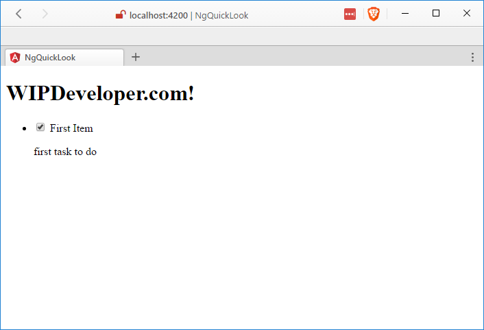
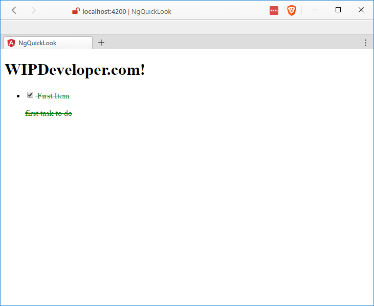

[Last Time](/2017/02/16/quick-look-angular/) we used the Angular-CLI to make a starter app and as impresive mediocre as it was I thought we could create a TODO app. Because what good is a single page application framework if you can't use it to make a TODO app?

We begin where we left off Add a Model for task in my model folder:

#### `src/app/models/task.ts`

export class Task{
  title:string;
  complete:boolean;
  description:string;
}

Now, create a component to show all the tasks with the cli using the generate command:

#### Create `TaskListComponent`

ng g component task-list

> docs at [https://github.com/angular/angular-cli#generating-components-directives-pipes-and-services](https://github.com/angular/angular-cli#generating-components-directives-pipes-and-services)

This command generated a new folder named `task-list` with 4 files:

- task-list.component.css
- task-list.component.html
- task-list.component.spec.ts
- task-list.component.ts

##### task-list.component.css

This is the component level css files

> this starts out empty.

##### task-list.component.html

This is the component html template. the html can also be placed in the TypeScript or JavaScript file.

  task-list works!

##### task-list.component.spec.ts

This is the component test class

/\* tslint:disable:no-unused-variable \*/
import { async, ComponentFixture, TestBed } from '@angular/core/testing';
import { By } from '@angular/platform-browser';
import { DebugElement } from '@angular/core';

import { TaskListComponent } from './task-list.component';

describe('TaskListComponent', () => {
  let component: TaskListComponent;
  let fixture: ComponentFixture<TaskListComponent>;

  beforeEach(async(() => {
    TestBed.configureTestingModule({
      declarations: \[ TaskListComponent \]
    })
    .compileComponents();
  }));

  beforeEach(() => {
    fixture = TestBed.createComponent(TaskListComponent);
    component = fixture.componentInstance;
    fixture.detectChanges();
  });

  it('should create', () => {
    expect(component).toBeTruthy();
  });
});

#####  task-list.component.ts

import { Component, OnInit } from '@angular/core';

@Component({
  selector: 'app-task-list',
  templateUrl: './task-list.component.html',
  styleUrls: \['./task-list.component.css'\]
})
export class TaskListComponent implements OnInit {

  constructor() { }

  ngOnInit() {
  }

}

Now lets add out `task-list` components to our app. The CLI already added `TaskListComponent` to our declarations in `app.module.ts` so we should just need to place our module in the markup.

In `src/app/app.component.html` add `<app-task-list></app-task-list>` bellow `<router-outlet></router-outlet>`.

#### `app.component.html` Updated

<h1>
  {{title}}
</h1>
<router-outlet></router-outlet>
<app-task-list></app-task-list>

If you have the page open and are using `ng serve` it should update to show your changes.

#### Used `TaskListComponent`

This isn't too exciting yet but lets add a few things to our `src/app/task-list/task-list.component.ts`:

- import our `src/app/models/task.ts` into our `TaskListComponent`
- add a collection of `Task`'s to the `TaskListComponent` class as a property
- in the `ngInInit()` method lets prepopulate our new `tasks` array with at least one value

#### Updated `task-list.component.ts`

import { Component, OnInit } from '@angular/core';
import { Task } from '../models/task';                  // <= this is new

@Component({
  selector: 'app-task-list',
  templateUrl: './task-list.component.html',
  styleUrls: \['./task-list.component.css'\]
})
export class TaskListComponent implements OnInit {

  tasks: Task\[\];                                        // <= this is new

  constructor() { }

  ngOnInit() {
    this.tasks = \[                                      // <= this is new
      {                                                 // <= this is new
        "title": "First Item",                          // <= this is new
        "complete": true,                               // <= this is new
        "description": "first task to do"               // <= this is new
      }                                                 // <= this is new
    \];                                                  // <= this is new
  }

}

Now lets display our brand new list. In `src/app/task-list/task-list.component.html` lets replace what was there originally with this:

#### Updated `task-list.component.html`

<ul>
  <li \*ngFor="let task of tasks">
    

      <label for="task-title">
        <input type="checkbox" \[(ngModel)\]="task.complete" name="task-title" id="task-title" /> {{ task.title }}
      </label>
      
{{ task.description }}

    

  </li>
</ul>

Here you can see we have a unordered list that contains a `<li>` that we use `*ngFor` on to repeat over the items of the `tasks` collection. Each of these `<li>`'s contains a `<label>` with a checkbox to represent the `complete` on each `task` and the `title` of the `task`, there's also a `
` with the description.

#### Showing `tasks`

Lets add some styling in the `src/app/task-list/task-list.component.css`

#### Updated `task-list.component.css`

label{
  color:red;
}

This is pretty straight forward, all the `<labels>` will be red and this makes sense for our incomplete tasks but lets try an make our completed tasks a nice soothing green. Lets add 2 new selectors for when the `
` has a class of `complete`:

#### Updated `task-list.component.css`

div.complete > label,
div.complete > p{
  color: green;
  text-decoration: line-through;
}

Now, when we first load the page it should look more like this:

#### Showing `tasks` Complete

## Code

Code can be found at [Github/BrettMN/quick-look](https://github.com/BrettMN/quick-look/tree/master/ng-quick-look)

## More Interesting?

This is a little better than we left off with last time but lets see what else we could add. What feature do you think should be added next? Let me know by leaving a comment below or emailing [brett@wipdeveloper.com](mailto:brett@wipdeveloper.com).
