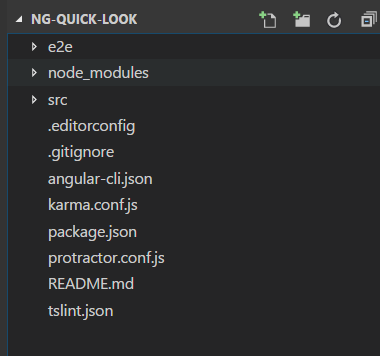
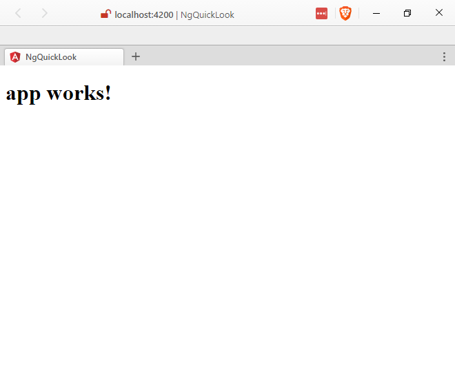
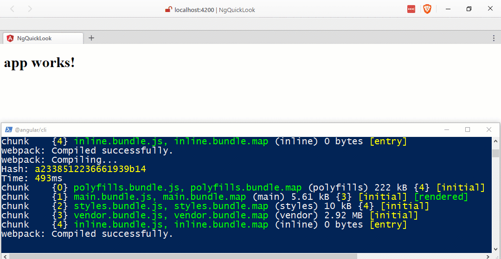

There seems to be some difficulty just trying out a modern Single Page Application framework. Gone are the day of adding a script tag to the page and doing simple binding syntax to just see how things could start to work.

#### Remember?

  <input type="text" ng-model="sometext"/>
  <h4>{{sometext}}</h4>

#### You Typed: {{someText}}

> Ah the "good 'o days"...

## Problem

How do we get started with Angular with out spending months mastering the intricacies of setting the most basic project? After all we may just being evaluating it to see if the development style is something our team can work with. Having a huge time sink before we can even evaluate it is going to be a detractor.

## Solution

Use the Angular-CLI!

> Or it may be called `@angular/cli` now. Let's worry about that later.

done?

## ok, But How?

Lets take a look at what it takes to go from empty directory to "working" project using the Angular CLI.

### First

Install `angular-cli` using npm or yarn.

> Want to know more about yarn? [Read here](/2017/01/26/playing-around-with-yarn/).

#### npm

npm install -g @angular/cli

#### yarn

yarn global add @angular/cli

> If you have used the Angular-CLI previously you should uninstall the previous version

npm uninstall -g angular-cli @angular/cli
npm cache clean
npm install -g @angular/cli@latest

> or

yarn global remove angular-cli @angular/cli
yarn cache clean
yarn global add @angular/cli

With the cli installed globally we can now create a new project.

### Next

Lets create that project.

#### Creating a new Angular Project

ng new ng-quick-look --routing

> Options at [https://github.com/angular/angular-cli/blob/master/docs/documentation/new.md](https://github.com/angular/angular-cli/blob/master/docs/documentation/new.md)

The cli we installed is invoked with the `ng` command on the command line/shell of your choice.

We used the `ng new` to create our new app.

We threw in the `--routing` flag to add some routing down the line.

Once it says `Project 'ng-quick-look' successfully created.` you can `cd ng-quick-look` into and have a look around.

> It looks like you can set the package manager the Angular-CLI will use with `ng set --global packageManager=yarn` if that's your ball of yarn...

It should look something like this:

#### ng-quick-look File Structure

### Now Lets Run It

Since we have a basic app, lets see if it loads.

Start it up with `ng serve`

#### `ng serve`

ng serve

> options availible at [https://github.com/angular/angular-cli/blob/master/docs/documentation/serve.md](https://github.com/angular/angular-cli/blob/master/docs/documentation/serve.md)

If you didn't specify a port number open a browser and enter the address "[http://localhost:4200/](http://localhost:4200/)" and you should see =>

## Update something

If you go into the `src/app` folder and open `app.component.ts` and update line 9

#### Original Title

export class AppComponent {
  title = 'app works!';
}

#### New Title

export class AppComponent {
  title = 'WIPDeveloper.com!';
}

And as long as you kept the server running when you made the change it should automatically reload the page with the change in the browser when you save after a quick rebuild. Quick because we don't have anything yet.

#### Save, Compile and Reload

## TLD?

Really?

Ok, since you asked so nicely.

#### Install Angular-CLI

##### npm

npm install -g @angular/cli

##### yarn

yarn global add @angular/cli

#### Create a New Project

ng new ng-quick-look --routing

#### Go into the new project

cd ng-quick-look

#### Serve the app

ng serve

Open a browser to "[http://localhost:4200/](http://localhost:4200/)" and Ta-done!

## Code?

Code can be found at [Github/BrettMN/quick-look](https://github.com/BrettMN/quick-look/tree/master/ng-quick-look)

## Wasn't that Fun?

No? Let's take a look at creating something useful next time. What do you think it should be? Let me know by leaving a comment below or emailing [brett@wipdeveloper.com](mailto:brett@wipdeveloper.com).
