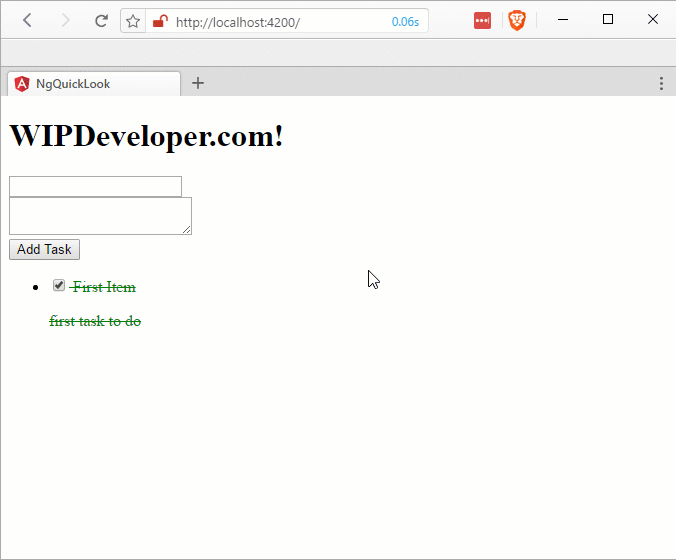
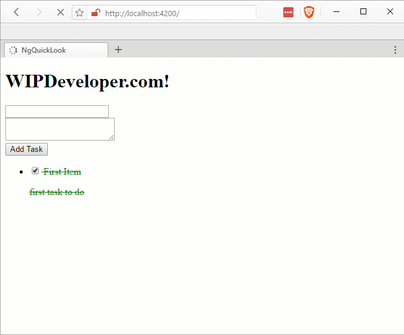

If you've been following along you have [created a simple app](/2017/02/16/quick-look-angular/), [added a component](/2017/02/20/quick-look-angular-part-ii-add-a-component/), [added a service](/2017/02/22/quick-look-angular-part-iii-create-a-service/) and [updated your Angular-CLI](2017/02/17/quick-look-angular-part-iv-updating-angular-cli). Now that we can show our list of tasks from the service, lets create a component to add new tasks.

#### Create `NewTaskComponent`

ng g component new-task

And lets add it to our `src/app/app.component.html`:

#### `app.component.html` Updated

<h1>
  {{title}}
</h1>
<router-outlet></router-outlet>
<app-new-task></app-new-task>
<app-task-list></app-task-list>

We can now see it was added if we look back in the browser:

#### default `<app-new-task>`

This of course isn't that interesting so lets update our `new-task.component.html` to accept a `title` and a `description`:

#### Updated `new-task.component.html`

  

    <label for="title">
      <input \[(ngModel)\]="newTask.title" name="title" type="text">
    </label>
  

  

    <label for="description">
      <textarea \[(ngModel)\]="newTask.description" name="description"></textarea>
    </label>
  

  <input (click)="addTask()" type="button" value="Add Task">

Of course this wont do anythign without updating the `new-task.component.ts`

#### Not Adding a New Task

#### Updated `new-task.component.ts`

import { Component, OnInit } from '@angular/core';
import { Task } from '../models/task';              

@Component({
  selector: 'app-new-task',
  templateUrl: './new-task.component.html',
  styleUrls: \['./new-task.component.css'\]
})
export class NewTaskComponent implements OnInit {

  newTask: Task;

  constructor() { }

  ngOnInit() {
    this.newTask = new Task();
  }
}

This makes a little form to add a new task but doesn't actually function yet.

## Update `TaskService`

First thing we should do is update `TaskService` so it can accept a new task to add to the collection of `tasks` and make any service calls that are needed.

#### Add to `src/app/services/tast.service.ts`

addTask(newTask: Task) {

  return new Promise((resolve, reject) => {
    console.log('pretend we called a service with our new task here')
    this.tasks.push(newTask);

    resolve();
  });
}

Now we can call this from our `NewTaskComponent`.

## Update `NewTaskComponent`

Lets add a method to `src/app/new-task.component.ts` called `addTask`. This `addTask` method will call the `TaskService` so we will need to have access to it. To get that access we will need to import the `TaskService` and pass it into the constructor.

#### `new-task.component.ts` Updated

import { Component, OnInit } from '@angular/core';
import { Task } from '../models/task';              
import { TaskService } from '../services/task.service';        // <= This is new

@Component({
  selector: 'app-new-task',
  templateUrl: './new-task.component.html',
  styleUrls: \['./new-task.component.css'\]
})
export class NewTaskComponent implements OnInit {

  newTask: Task;

  constructor(private \_taskService: TaskService) { }           // <= This is updated

  ngOnInit() {
    this.newTask = new Task();
  }

  addTask(){                                                   // <= This is new
    this.\_taskService.addTask(this.newTask)                    // <= This is new
    .then(results =>{                                          // <= This is new
      this.newTask = new Task();                               // <= This is new
    });                                                        // <= This is new
  }                                                            // <= This is new

}

Now we should be able to add a new task:

#### Adding New Tasks

Looks like a success!

> You may notice that there is data validation, we are not currently checking if a task has a title or maybe a description. We could add that but since this is just a sample app I'm going to put it off for meow.

## Code

Code can be found at [Github/BrettMN/quick-look](https://github.com/BrettMN/quick-look/tree/master/ng-quick-look)

## Moor the Tasks

We can now add new tasks from inside our little Angular app. How do you think it is shaping up so far? Let me know by leaving a comment below or emailing [brett@wipdeveloper.com](mailto:brett@wipdeveloper.com).
