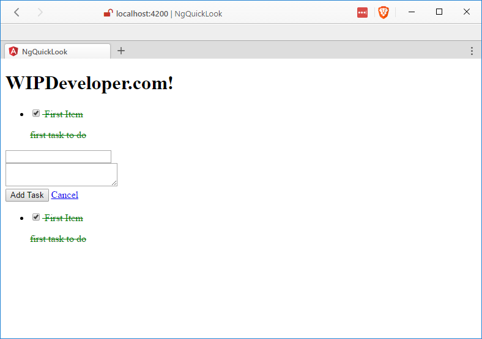
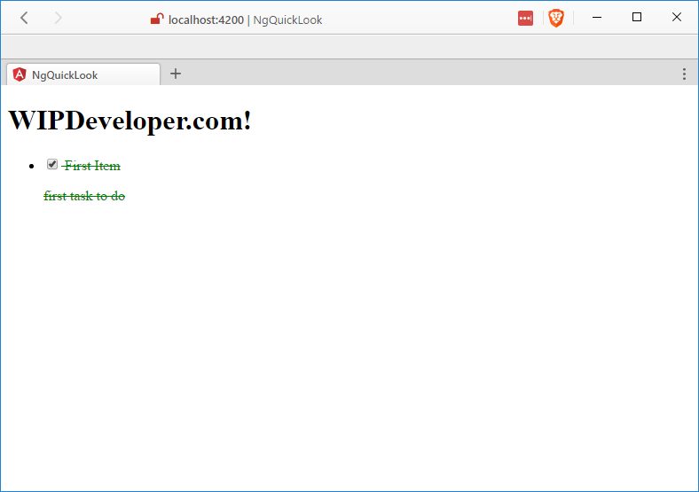
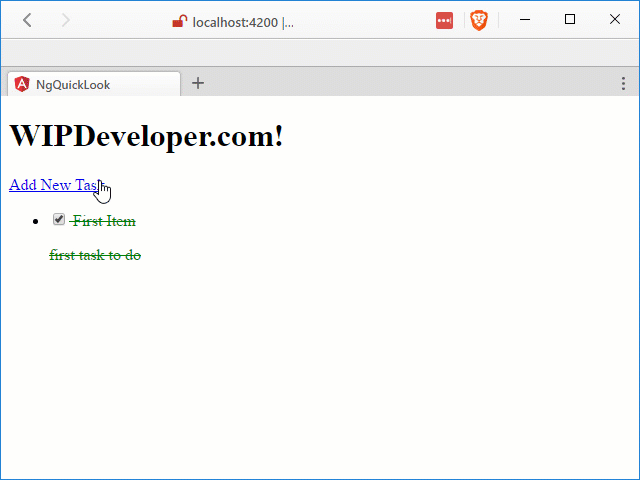
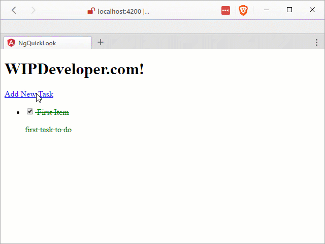

Previously on WIPDeveloper.com => we [created a simple app](/2017/02/16/quick-look-angular/), [added a component](/2017/02/20/quick-look-angular-part-ii-add-a-component/), [added a service](/2017/02/22/quick-look-angular-part-iii-create-a-service/), [updated your Angular-CLI](2017/02/17/quick-look-angular-part-iv-updating-angular-cli) and [added a second component that used the service](/2017/03/01/quick-look-angular-part-iv-add-new-component/). Now Lets try adding routing.

## Update Routing

In the [beginning](/2017/02/16/quick-look-angular/) we created our little project with routing:

#### Back when we made the app

ng new ng-quick-look --routing

This created the file `src/app/app-routing.codule.ts`. It looked something like this:

#### Original `app-routing.codule.ts`

import { NgModule } from '@angular/core';
import { Routes, RouterModule } from '@angular/router';

const routes: Routes = \[
  {
    path: '',
    children: \[\]
  }
\];

@NgModule({
  imports: \[RouterModule.forRoot(routes)\],
  exports: \[RouterModule\],
  providers: \[\]
})
export class AppRoutingModule { }

To create routes to our componetns we will beed to import both `TaskListComponent` and `NewTaskComponent`. With those imported we will add to the existing `routes` object. We will use the `TaskListComponent` as the component of our base route, this is the one with the empty path `''`. The `NewTaskComponent` will be used with a second route that will use the path `newtask`. It should look something like this:

#### Updated `app-routing.codule.ts`

import { NgModule } from '@angular/core';
import { Routes, RouterModule } from '@angular/router';
import { TaskListComponent } from './task-list/task-list.component';  // <= This is new
import { NewTaskComponent } from './new-task/new-task.component';     // <= This is new

const routes: Routes = \[
  {
    path: '',
    component: TaskListComponent                                      // <= This is new
  },
  {                                                                   // <= This is new    
    path: 'newtask',                                                  // <= This is new  
    component: NewTaskComponent                                       // <= This is new
  }                                                                   // <= This is new
\];

@NgModule({
  imports: \[RouterModule.forRoot(routes)\],
  exports: \[RouterModule\],
  providers: \[\]
})
export class AppRoutingModule { }

Since we never removed the `<router-outlet></router-outlet>` from the `app.component.html` we are going to see our new routes displayed above our existing rendering of our components.

#### Double Rainbow Components!

Lets fix that by removing our other components tags. The updated `app.component.html` should look like the following:

#### Updated `app.component.html`

<h1>
  {{title}}
</h1>
<router-outlet></router-outlet>

Now our markup looks a little cleaner and our "Developer UI" is less cluttered:

#### Router Output Only

## Add Navigation Through Links

But we don't have a way to navigate without manually entering the url. Lets add an anchor tag for a link but instead of using an `href` attribute we will use the angular component attribute of `routerLink="/newtask"` to the top of `src/app/task-list/task-list.component.html`. Something like this should be ok:

#### Updated `task-list.component.html`

<a routerLink="/newtask">Add New Task</a>                             // <= This is new

<ul>
  <li \*ngFor="let task of \_taskService.tasks">
    

      <label for="task-title">
        <input type="checkbox" \[(ngModel)\]="task.complete" name="task-title" id="task-title" /> {{ task.title }}
      </label>
      
{{ task.description }}

    

  </li>
</ul>

While we are at it we might as well add link to `src/app/task-list/task-list.component.html` to cancel and navigate back to the task list (`/`) .

#### Updated `new-task.component.html`

  

    <label for="title">
      <input \[(ngModel)\]="newTask.title" name="title" type="text">
    </label>
  

  

    <label for="description">
      <textarea \[(ngModel)\]="newTask.description" name="description"></textarea>
    </label>
  

  <input (click)="addTask()" type="button" value="Add Task">
  <a routerLink="/">Cancel</a>                                        // <= This is new

#### Navigation In Action

## Navigate from Code

Now that we can navigate through the links we should also add navigating to the task list after a new component is added.

In `src/app/new-task/new-task.component.ts` lets import the `Router` from `@angular/router` and then add a call to the router `navigate` method to root (`./`).

#### Updated `app-routing.module.ts`

import { Component, OnInit } from '@angular/core';
import { Task } from '../models/task';              
import { TaskService } from '../services/task.service';
import { Router } from '@angular/router';                                       // <= This is new

@Component({
  selector: 'app-new-task',
  templateUrl: './new-task.component.html',
  styleUrls: \['./new-task.component.css'\]
})
export class NewTaskComponent implements OnInit {

  newTask: Task;

  constructor(private \_taskService: TaskService, private \_router: Router) { }   // <= This is updated

  ngOnInit() {
    this.newTask = new Task();
  }

  addTask(){
    this.\_taskService.addTask(this.newTask)
    .then(results =>{
      this.newTask = new Task();
      this.\_router.navigate(\['./'\]);                                            // <= This is new
    });
  }
}

Now we can navigate AND add tasks and things are a little more intuitive.

> To prevent the `TaskService` from reinitalizing the array of `tasks` each time the `TaskListComponent` everytime it loads I added a check to verify that the `tasks` are undefined.

#### Complete App in Action

## Code

Code can be found at [Github/BrettMN/quick-look](https://github.com/BrettMN/quick-look/tree/master/ng-quick-look)

## All Done

There you go. Our little to do app is complete, is there anything you think we should add? Let me know by leaving a comment below or emailing [brett@wipdeveloper.com](mailto:brett@wipdeveloper.com).
