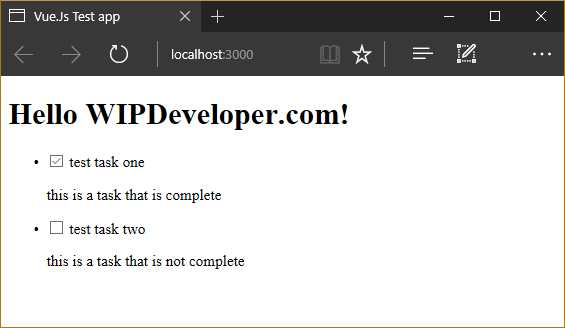

We've already [started](/2017/03/06/quick-look-vue-js) a Vue.js app. Let's add a little more content to it and get it to display a list of Tasks, similar to what we did with the [Angular app](/2017/02/20/quick-look-angular-part-ii-add-a-component/).

## Add Data

In our `app.js` file we are going to add some tasks to the data property. Let's start with 2 for now, each of these will have a title, description and a Boolean for whether it was completed or not.

#### Updated `app.js`

var app = new Vue({
  el: '#app',
  data: {
    message: 'Hello WIPDeveloper.com!',
    tasks: \[                                                   // <= This is New
      {                                                        // <= This is New
        title: 'test task one',                                // <= This is New
        complete: true,                                        // <= This is New
        description: 'this is a task that is complete'         // <= This is New
      },                                                       // <= This is New
      {                                                        // <= This is New
        title: 'test task two',                                // <= This is New  
        complete: false,                                       // <= This is New
        description: 'this is a task that is not complete'     // <= This is New
      }                                                        // <= This is New
    \]                                                          // <= This is New
  }
})

Pretty simple so far. Now lets update the markup.

## Rinse and Repeat

Lets add a `<ul>` with one `<li>` bellow our `message` text. To make the `<li>` repeat we will use the `v-for` attribute to iterate over each `task` in `tasks`.

#### Repeat Basics

<ul>
  <li v-for="task in tasks">
  </li>
</ul>

With this in place we can reference the `task` inside the `<li>` and access the properties for each task. So we should add some markup for that to display something.

Inside the `<li>` we'll break out the details inside a `div`:

#### Inside `<li>`

 

    <label for="task-title">
      <input type="checkbox" v-model="task.complete" /> {{ task.title }}
    </label>
    

      {{ task.description }}
    

You can see we use the same `v-model` binding for the checkbox that we used for the text input [last time](2017/03/06/quick-look-vue-js) the rest of the binding is the same double brackets as previously as well.

Here's the whole Index page:

#### Updated index.html

<!DOCTYPE html>
<html lang="en">
<head>
  <meta charset="UTF-8">
  <meta name="viewport" content="width=device-width, initial-scale=1.0">
  <meta http-equiv="X-UA-Compatible" content="ie=edge">
  <title>Vue.Js Test app</title>
</head>
<body>
  

    <h1>{{ message }}</h1>
    <ul>                                                                        // <= This is New
      <li v-for="task in tasks">                                                // <= This is New
        
                                                                   // <= This is New
          <label for="task-title">                                              // <= This is New  
            <input type="checkbox" v-model="task.complete" /> {{ task.title }}  // <= This is New
          </label>                                                              // <= This is New  
          
                                                                   // <= This is New  
            {{ task.description }}                                              // <= This is New  
          
                                                                  // <= This is New  
        
                                                                  // <= This is New  
      </li>                                                                     // <= This is New                                              
    </ul>                                                                       // <= This is New  
  

  
  
</body>
</html>

Now we can see how that works out:

#### Display Task List

## Code

Code can be found at [Github/BrettMN/quick-look](https://github.com/BrettMN/quick-look/tree/master/vue-quick-look)

## Conclusion

Our little app is starting to take shape but are you getting tired of todo apps yet? Let me know by leaving a comment below or emailing [brett@wipdeveloper.com](mailto:brett@wipdeveloper.com).
