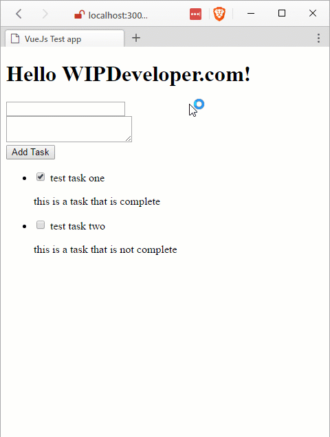

Just a quick recap in case you forgot, so far we [created Vue.js App](/2017/03/06/quick-look-vue-js), [added some content](/2017/03/07/quick-look-vue-js-part-ii-add-some-content) and [made a component](/2017/03/08/quick-look-vue-js-part-iii-my-first-component). Lets separate out our JavaScript into different files so we don't have one huge file that is difficult to maintain.

## Separate Files

Lets begin by creating a folder called `app` so we have a place to put everything. In our `app` folder lets create a file called `data.js`. In this new file we will move all our sample tasks data so let's copy it over from the `app.js` and assign it to a `task` variable.

#### New `app/data.js`

var tasks = \[
  {
    title: 'test task one',
    complete: true,
    description: 'this is a task that is complete'
  },
  {
    title: 'test task two',
    complete: false,
    description: 'this is a task that is not complete'
  }
\]

Add a reference to this above your `app.js` script tag on the index page and in`app.js` adjust the data object of the app to have one property with a name of `tasks` that and a value of `tasks` and the app should still work.

With this done you should be able to create a file for the `task-list`, I called mine `task-list.js`, in the app folder and move the code to the new file from `app.js`. Add a reference to the new file on your `index.html` above the `app.js` but bellow the `app/data.js` reference and things should still work as before.

Your `app.js` should start to look pretty empty by now.

#### Near Empty `app.js`

var app = new Vue({
  el: '#app',
  data: {
    message: 'Hello WIPDeveloper.com!',
    tasks: tasks
  }
})

##  Our Second Component

Now that we have created some breathing space for ourselves, lets add a second component.

Create a new file in the `app` folder, I will call mine `new-task`, that we will put the component for creating new tasks. This component will have many similarities to our `task-list` component like use `props` and have a `template` but it will also use a `data` property to pre-populate some data for the component to use, and a methods property to hold a method used in the component.

#### `app/new-task.js`

Vue.component('new-task', {
  props: \['tasks'\],
  template: \`
    

    

      <label for="title">
        <input v-model="title" name="title" type="text">
      </label>
    

    

      <label for="description">
        <textarea v-model="description" name="description"></textarea>
      </label>
    

    <input v-on:click="addTask()" type="button" value="Add Task">
  

  \`,
  data: () => {
    return {
      title: '',
      description: ''
    }
  },
  methods: {
    addTask: function () {
      this.tasks.push({'title': this.title, 'description': this.description})
      this.title = ''
      this.description = ''
    }
  }
})

Here you can see that our `data` property is a function that returns and object, unlike in our app where it was just an object.

You may also notice our `methods` is an object with names of the methods the component contains. In this case our component has a methods called `addTask` that pushes a task onto the `tasks` array and clears out the `title` and description.

## But Will it Blend?

Well, yes. I think so.

#### Two Components in Action

## Code

Code can be found at [Github/BrettMN/quick-look](https://github.com/BrettMN/quick-look/tree/master/vue-quick-look)

## Until Next Time

We have separated our code out into their own little files and added a second component. At this rate we could be done after a little routing was added in, what do you think? Let me know by leaving a comment below or emailing [brett@wipdeveloper.com](mailto:brett@wipdeveloper.com).
