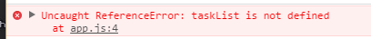
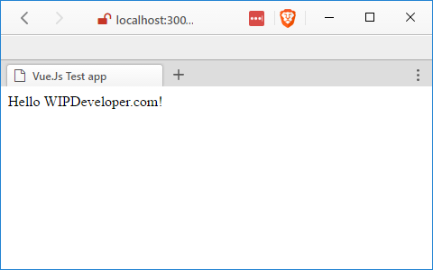
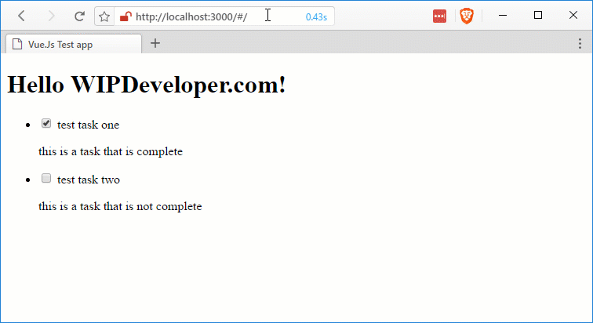
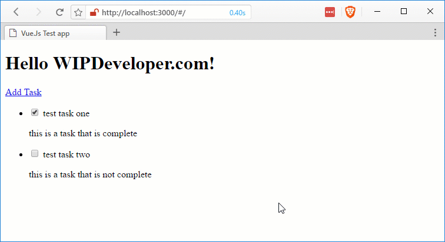

Previously we have [created a Vue.js App](/2017/03/06/quick-look-vue-js), [added some content](/2017/03/07/quick-look-vue-js-part-ii-add-some-content), [made a component](/2017/03/08/quick-look-vue-js-part-iii-my-first-component) or [two and separated our code](/2017/03/09/quick-look-vue-js-part-iv-more-components-and-code-seperation/). But what about routing?

## Include Routing

Since we are just playing around we can include routing by adding a reference to the CDN. So lets add the following after our `vue.js` script tag:

#### `vue-router.js` CDN

## Create Routes

In out `app.js` lets add an array called `routes`. This will be a collection of objects that have a `path` and a `component`. The `path` will be what the url path that is entered after the hashmark (`#`). Since we have 2 components already lets create 2 routes, a default route `/` that shows the `task-list` component, and a `/newtask` route to show the `new-task` component.

#### `routes` array in `app.js`

var routes = \[
  {
    path: '/',
    component: taskList
  },
  {
    path: '/newtask',
    component: newTask
  }
\]

If you are using `lite-server` or some other server that does changes detection and reloads you page you may notice you now have an error.

#### `taskList is not defined`

This is because we registered our components with Vue but we didn't assign the component to a variable so it's not currently defined for use outside of Vue. To fix this lets assign the result of creating our `task-list` component to a variable named `taskList` in `app/task-list.js` on line 1

#### Update `app/task-list.js`

var taskList = Vue.component('task-list', {
  //everything else remains the same for now
})

And while we are at it let's do the same to `app/new-task.js`

#### Update `app/new-task.js`

var newTask = Vue.component('new-task', {
  //everything else remains the same for now
})

## Create and Register Router

Now that we have a couple routes defined lets create the router.

Back in `app.js` lets add a variable called `router` and assign the results of `new VueRouter` that we provide the routes to.

#### Create `router`

var router = new VueRouter({routes})

This `router` object will need to be passed into our app. So in the object we pass to Vue when we create the app lets add a property names `router` and for the value use the `router` object we just created.

Our entire `app.js` should now look like this:

#### Complete `app.js`

var routes = \[
  {
    path: '/',
    component: taskList
  },
  {
    path: '/newtask',
    component: newTask
  }
\]

var router = new VueRouter({routes})

var app = new Vue({
  router: router,
  el: '#app',
  data: {
    message: 'Hello WIPDeveloper.com!',
    tasks: tasks
  }
})

> I've thought about moving the route stuff out of `app.js` but decided against it for now. If there gets to be more going on I would move all the route specific things to a `routes.js` file to keep things a little neater.

## Fix the Views

Now we should be ready to start using the router. Lets remove our components from the `index.html` and in there place put a `<router-view></router-view>`.

Our completed `index.html` should now look like this:

#### Complete `index.html`

<!DOCTYPE html>
<html lang="en">
<head>
  <meta charset="UTF-8">
  <meta name="viewport" content="width=device-width, initial-scale=1.0">
  <meta http-equiv="X-UA-Compatible" content="ie=edge">
  <title>Vue.Js Test app</title>
</head>
<body>
  

    <h1>{{ message }}</h1>
     <router-view></router-view>
  

  
  
  
  
  
  
</body>
</html>

Now if you look in the browser you should see the header we put in the page but the tasks will be missing.

#### working but not showing any tasks

This is because we were binding the tasks to the view by passing them in through the markup. Since we removed the markup we can no longer configure this binding.

Let's fix this by updating the components to use the `data` property instead of the `props` property.

## Components Use `data` Too

In our `app/task-list.js` lets remove the `props` property and add a `data` property. The `data` property is going to be a function that returns and object. In this case it's going to return an object that contains our `tasks`.

Here is what our complete `app/task-list.js` data property should look like:

#### `app/task-list.js` `data` property

data: function () {
  return {tasks}

We will also need to update our `app/new-task.js` in a similar manner by removing the `props` and adding `tasks` to the object returned by the `data` function.

## Actually Navigate

Now things are looking like they are working and if you go to `/#/newtask` from the address bar you should be able to see the new task component and add one. Unfortunetly to see the new task you have to manually navigate back to the the root path `/#/`.

#### Adding Tasks

Lets start by adding a link to go from the `task-list` to the `new-task`. In `app/task-list.js` add `<router-link to="/newtask">Add Task</router-link>` on the line before the `<ul>`.

#### Complete `app/task-list.js`

var taskList = Vue.component('task-list', {
  template: \`
  

    <router-link to="/newtask">Add Task</router-link>
    <ul>
      <li v-for="task in tasks">
        

          <label for="task-title">
            <input type="checkbox" v-model="task.complete" /> {{ task.title }}
          </label>
          

            {{ task.description }}
          

        

      </li>
    </ul>
  

  \`,
  data: function () {
    return {tasks}
  }
})

Now we can navigate to the `new-task` without using the `navbar`.

In our `app/new-task.js` lets add `router.push('/')` as the last line of our `addTask` method.

This will navigate to the root of the single page app without the user having to click a link.

#### Complete \`app/new-task.js

var newTask = Vue.component('new-task', {
  template: \`
    

    

      <label for="title">
        <input v-model="title" name="title" type="text">
      </label>
    

    

      <label for="description">
        <textarea v-model="description" name="description"></textarea>
      </label>
    

    <input v-on:click="addTask()" type="button" value="Add Task">

  

  \`,
  data: () => {
    return {
      title: '',
      description: ''
      tasks: tasks
    }
  },
  methods: {
    addTask: function () {
      this.tasks.push({'title': this.title, 'description': this.description})
      this.title = ''
      this.description = ''
      router.push('/')
    }
  }
})

With that we should be done for now.

#### Complete App in Action!

## Code

Code can be found at [Github/BrettMN/quick-look](https://github.com/BrettMN/quick-look/tree/master/vue-quick-look)

## How About That Vue?

We now have a simple ToDo app that lets us add tasks and navigate without using the nav bar. Of course we could probably do with a few more features like accepting the enter key to create a task. What do you think? Let me know by leaving a comment below or emailing [brett@wipdeveloper.com](mailto:brett@wipdeveloper.com).
