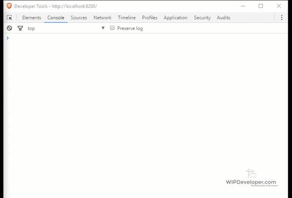
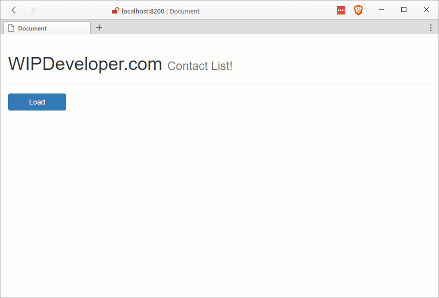

We've [set up](/2017/03/14/using-forcejs-with-vue-js/) our Vue.js app and included [ForceJS](https://github.com/ccoenraets/forcejs) while serving it thorugh [ForceSever](https://github.com/ccoenraets/force-server), now lets make a query to get contacts from our Salesforce.com org.

## Make the Call

We are going to start by using the sample code from the [ForceJS ECMAScript 5 Usage](https://github.com/ccoenraets/forcejs#ecmascript-5-usage) example and getting it to work with our little app.

To do that we will need to add a `methods` property to out app. For now lets add one method, I named mine `load` and put the example code in teh function.

While we are changing our app lets also add a `contacts` array to our `data`.

#### Updated `app`

 var app = new Vue({
  el: '#main',
  data: {
    header: 'WIPDeveloper.com',
    subHeader: 'Contact List!',
    contacts: \[\]
  },
  methods: {
    load: function () {
      app.contacts = \[\]

      var oauth = force.OAuth.createInstance()
      oauth.login().then(function (oauthResult) {
        force.DataService.createInstance(oauthResult)

        loadContacts()
      })

      function loadContacts () {
        var service = force.DataService.getInstance()
        service.query('select id, Name from contact LIMIT 50')
          .then(function (response) {
            app.contacts = response.records
          })
      }
    }
  }
})

1. In the load method you can see the first thing I do is assign an empty array to `app.contacts` just because I like to see the screen empty on each call of the method.
2. The `loadContacts` is called in the promise fulfillment of the `oath.login()` so that the service will have been created.
3. In `loadContacts` we assign the `response.records` to the `app.contacts` so they will be available in the view model.

All this is great but we can't call it without using the console.

Try it. In your browser console enter `app.load()` and you should be prompted to login to Salesforce.

#### `app.load()` With No UI

 

> If it's your first time you will be asked to provide your credentials. I have already logged in so I just need to authorize the app. The same thing happened in the `data` of the app but if you didn't notice that yet, I am not going to be the one to point it out :P

## Lets Add a Button

In our `index.html` lets add a `button` that bound to `load()` on click. Since we are in there lets also add a list to display our contacts.

We will add this bellow the

with our header but above all our scripts.

#### Updated `index.html`

   

     <h1>
       {{ header }}
       <small>{{ subHeader }}</small>
     </h1>
   

   

     

       <button v-on:click="load()" class="btn btn-primary btn-block">Load</button>
     

     

       <ul class="list-group">
         <li v-for="contact in contacts" class="list-group-item">
           

             

               <h4>Id: <small>{{contact.Id}}</small></h4>
             

             

               <h4>Name: <small>{{contact.Name}}</small></h4>
             

           

         </li>
       </ul>
     

   

 

> In case you are paying super-duper close attention, I modified the previous `{{ message }}` to be a `{{ header }}` and `{{ subHeader }}`

#### It Works!

## Some Flaws

Of course this does work but we should probably avoid putting all our logic in what might be considered the button click handler. Also if you press the `Load` button a second time it ask for permissions again, organizing our code for reuse will help prevent this.

## Conclusion

We now know we can get our information out of Salesforce.com using ForceJS and display it in out Vue.js app. Next time we should organize out code a little better for reuse and enhance the user experience, unless there is something you would like to see first? Let me know by leaving a comment below or emailing [brett@wipdeveloper.com](mailto:brett@wipdeveloper.com).
