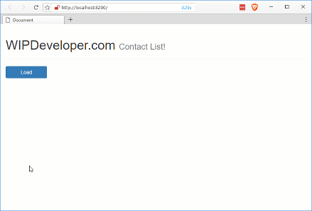

Let' see so far we have done [set up](/2017/03/14/using-forcejs-with-vue-js/), [queried Salesforce.com](/2017/03/15/using-forcejs-with-vue-js-part-ii-first-call/) using [ForceJS](https://github.com/ccoenraets/forcejs) and [ForceSever](https://github.com/ccoenraets/force-server) with [Vue.js](https://vuejs.org/) but last time we noticed out code was getting a little messy so let's clean it up.

## Lets make a Service

Ok I am not sure if services are a thing when using Vue.js but I feel a need to move our repeatable logic into a separate file and I will choose to call it a service. Lets begin by creating a folder in our `app/` folder named `services`. If the new `services/` folder create a JavaScript file to move our code that interacts with ForceJS, I named mine `sf.service.js` but you may use what ever name you feel is appropriate.

In our `sf.service.js` we are going to create an [IIFE](https://en.wikipedia.org/wiki/Immediately-invoked_function_expression) to encapsulate our service logic and we will asign the object this IIFE returns to a variable that will be a global JavaScript variable so we can call it else where.

#### `app/services/sf.service.js` Skeleton

let sfService = (() => {

  // private variables

  // public variables

  // private functions

  // public functions

  // return object
  return {
   
  }
})()

As you can see I left some comments in to see where things should go when we add them.

1. private variables is where we will declare any variable we don't plan on exposing outside our service
2. public variables is where we will declare variables we do plan on exposing outside out service
3. private functions is where we will declare any functions we don't plan on exposing outside our service
4. public functions is where we will declare functions we do plan on exposing outside out service
5. the return object is how we expose variables and functions. Being a JavaScript object we use object notation to name properties and assign the values we want outside the service

That's the start of our service now we just need it to do something.

## Give the Service Some Features

First we will need to be able to login so let's make a function under the private functions comments named `login`. This will create and instance of OAuth to use to login and then create an instance of the ForceJS Data Service.

#### Private `login` Function

// private functions
function login () {
  let oauth = force.OAuth.createInstance()
  return oauth.login()
    .then(oauthResult => {
      return force.DataService.createInstance(oauthResult)
    })
}

Now lets make a function named `getDataService` under the `login` function. We will use this only inside our service to get an instance of the ForceJS Data Service. This function will return a Promise.

In the success path of the promise we will get an instance of the Data Service from ForceJS and if it is not valid will ask the user to login. If it is valid or after the user logs in the `getDataService` success path will resolve the service once complete.

#### Private `getDataService` Function

function getDataService () {
  return new Promise(
    (resolve) => {
      dataService = force.DataService.getInstance()
      if (!dataService) {
        login()
          .then(() => {
            dataService = force.DataService.getInstance()
            resolve(dataService)
          })
      } else {
        resolve(dataService)
      }
    },
    (reject) => {
      reject('Danger, Will Robinson!')
    })
}

Next lets add a function named `query` under the public function comment. This function will accept one parameter, I called mine `soql`, and return the promise.

#### Public `query` Function

// public functions
function query (soql) {
  return getDataService()
    .then(dataService => {
      return dataService.query(soql)
    })
}

All that is left is to add `query` to the return object. I like to keep the names the same so my return object looks like this:

#### Exposing `query`

// return object
return {
  query: query
}

With out service ready we will add a `<script>` tag to `index.html` before the `app/app.js` and we will be ready to update out `app/app.js`

## Update `App.js`

[Last time](/2017/03/15/using-forcejs-with-vue-js-part-ii-first-call/) we had all the logic that is now in our service in the function that was called every time the button was pressed. This means our `load` method was a little bigger than it maybe should have been.

#### Old `load` Method

load : () => {
  app.contacts = \[\]

  var oauth = force.OAuth.createInstance()
  oauth.login().then(function (oauthResult) {
    force.DataService.createInstance(oauthResult)

    loadContacts()
  })

  function loadContacts () {
    var service = force.DataService.getInstance()
    service.query('select id, Name from contact LIMIT 50')
      .then(function (response) {
        app.contacts = response.records
      })
  }
}

Now instead of doing all that work the new `load` method empties the `app.contacts` and calls the service to make a query, loading the `app.contacts` with the results.

#### New `load` Method

load: () => {
    app.contacts = \[\]

    sfService.query('select id, Name from contact LIMIT 50')
      .then(response => {
        app.contacts = response.records
      })
}

Now if you run the app it should still work and as an added bonus it will only ask you to authorize the app accessing you data the first time.

#### It Still Works

## Conclusion

Now that we have cleaned up our app maybe we should add a new feature. What should we try next? Let me know by leaving a comment below or emailing [brett@wipdeveloper.com](mailto:brett@wipdeveloper.com).
