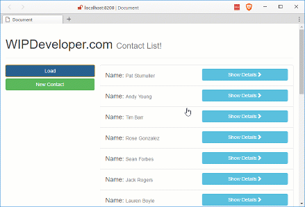

A quick recap: so far we have [set up our app](/2017/03/14/using-forcejs-with-vue-js/), [queried Salesforce.com](/2017/03/15/using-forcejs-with-vue-js-part-ii-first-call/) using [ForceJS](https://github.com/ccoenraets/forcejs) and [ForceSever](https://github.com/ccoenraets/force-server) with [Vue.js](https://vuejs.org/), [created a reuseable service](/2017/03/16/using-forcejs-with-vue-js-part-iii-create-a-service/), [event hub](/2017/03/20/using-forcejs-with-vue-js-part-iv-event-hub/) and [pass parameters through URL and Update Salesforce object](/2017/03/22/using-forcejs-with-vue-js-part-iv-dynamic-urls-and-editing-objects/). Now lets create a new Salesforce object

## Update `sfService`

We will began by adding a new function to our `sfService` called `create` after our `update` function in the public function. We will also update our return object to expose the `create` function. All in all the changes should look like this:

#### `app/services/sf.service.js` Updated to Create!

function create (objectName, value) {
  return getDataService()
    .then(dataService => {
      return dataService.create(objectName, value)
    })
}

// return object
return {
  query: query,
  update: update,
  create: create
}

Without new function in place lets add a new component to call the `create`.

## Create `new-contact` Component

Crete a new JavaScript file named `new-contact.js` in your component folder. The new component will have a template, data function, and one method.

The `template` will contain our form with an input for `First Name`, `Last Name` and `Languages`. You may wonder why we are using `First Name` and `Last Name` instead of just `Name` the Contacts object name field is actually a combination of the first and last name so to set the name we have to set the fields individually but we can query it by just the `Name` field.

The `data` function will return an object with 3 property's all set to null: `firstName`, `lastName`, and `languages`. These will be bound to our inputs and be used to create the object we send to Salesforce to create our new Contact.

Our one `method` will be to save the contact. I called mine `saveContact` and it is bound to a button in the template. It creates the object that we will send to the `sfService.create` function to create our new Contact.

It should look something like this:

#### Our Brand Nwowew `app/components/new-contact.js`

let newContactVM = Vue.component('new-contact', {
  template: \`
  

    

      <h4 class="col-xs-12">
        Name: <input v-model="firstName" placeholder="First Name" />
      </h4>
      <h4 class="col-xs-12">
        Name: <input v-model="lastName" placeholder="Last Name" />
      </h4>
      <h4 class="col-xs-12">
        Languages: <input v-model="languages" placeholder="Languages" />
      </h4>
      
      

        <router-link to="/" class="btn btn-danger btn-block">Cancel</router-link>
      

      

        <button v-on:click="saveContact()" class="btn btn-success btn-block">Save</button>
      

    

  

  \`,
  data: () => {
    return {
      firstName: null,
      lastName: null,
      languages: null
    }
  },
  methods: {
    saveContact: function () {
      let toUpdate = {
        FirstName: this.firstName,
        LastName: this.lastName,
        Languages\_\_c: this.languages
      }
      sfService.create('contact', toUpdate)
        .then(() => {
          router.push('/')
        })
    }
  }
})

## Add Some Navigation

Now we need to have a route that can access our new component so lets update our `routes` in `app/app.js`.

#### Our New Route

{
  name: 'newcontact',
  path: '/newcontact/',
  component: newContactVM
}

This makes it so we can add a `router-link` after our Load `<button>` in our `contacts` template:

#### `contacts` `router-link`

<router-link to="/newcontact" class="btn btn-success btn-block">New Contact</router-link>

## And Action!

Run the app and see if we can create a new component.

#### New Contact

## Conclusion

Now that we can add Contacts maybe we should see about deleting them. What do you think? Let me know by leaving a comment below or emailing [brett@wipdeveloper.com](mailto:brett@wipdeveloper.com).
