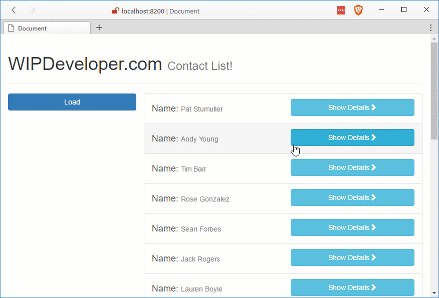

Last time we set up an [event hub](/2017/03/20/using-forcejs-with-vue-js-part-iv-event-hub/) so we could pass events between components and since we already did the [set up](/2017/03/14/using-forcejs-with-vue-js/), [queried Salesforce.com](/2017/03/15/using-forcejs-with-vue-js-part-ii-first-call/) using [ForceJS](https://github.com/ccoenraets/forcejs) and [ForceSever](https://github.com/ccoenraets/force-server) with [Vue.js](https://vuejs.org/) and [created a reuseable service](/2017/03/16/using-forcejs-with-vue-js-part-iii-create-a-service/) lets add an update feature to the service and to update our contacts and through in some routing with route parameters.

## Add Link to `edit-contact`

We will add routing to our app very similar to how we added in [Quick Look @ Vue.js Part V - Adding Routing](/2017/03/13/quick-look-vue-js-part-v-adding-routing/) except this time we will also pass a parameter in the url.

Lets start by adding a `router-link` in our `contactDetail` near the end of the template:

#### Add `router-link`

```
<h4 class="col-xs-12">
  <router-link v-bind:to="{ name: 'editcontact', params: { id: currentContact.Id } }" class="btn btn-warning btn-block">Edit</router-link>
</h4>
```

Maybe you noticed that for the `to` attribute we used what looked like a JavaScript object that's because it was. The `router-link` will use this object to build the url route to a named route with a parameter. This of course means we need to have a route that is named.

## Add Routes with Names

In our `app.js` lets create a router with the following paths:

#### `app/app.js` `router`

```
var routes = [
  {
    path: '/',
    component: contactsVM
  },
  {
    name: 'editcontact',
    path: '/editcontact/:id',
    component: editContactVM,
    props: true
  }
]
```

> Don't forget to register it with the app and add `<router-view></router-view>` in place of your `<contacts></contacts>` on the `index.html`

In the second route you see we also provided a `name` attribute. This will allow the link we made in our `contactDetail` to generate the path based on the name.

The `path` itself has an interesting feature of `:id`. This means that this section of the path is a parameters named `id`.

You'll also see we added an attribute of `props` and set it to `true`. These means that the components `props` values will be set with the url parameters, in this case `id`.

## Another New Component

We will now need a the component we just registered with our routes so lets create one in and add a reference to in on `index.html` before the `app.js` reference.

#### `app/components/edit-contact.js`

```
let editContactVM = Vue.component('edit-contact', {
  props: ['id'],
  template: `
  <div>
    <div class="row" v-if="loading">
      <h4 class="col-xs-12">
      Loading, please wait...
      </h4>
    </div>
    <div class="row" v-if="currentContact">
      <h4 class="col-xs-12">
        Name: <small>{{ currentContact.Name }}</small>
      </h4>
      <h4 class="col-xs-12">
        Languages: <input v-model="currentContact.Languages__c" placeholder="Languages" />
      </h4>
      
      <div class="col-xs-6">
        <router-link to="/" class="btn btn-danger btn-block">Cancel</router-link>
      </div>
      <div class="col-xs-6">
        <button v-on:click="saveContact()" class="btn btn-success btn-block">Save</button>
      </div>
    </div>
  </div>
  `,
  data: () => {
    return {
      currentContact: null,
      loading: false
    }
  },
  created: function () {
    this.loadContact()
  },
  watch: {
    '$route': 'loadContact'
  },
  methods: {
    loadContact: function () {
      this.loading = true
      this.currentContact = null

      sfService.query(`SELECT Id, Name, Languages__c FROM Contact WHERE Id = '${this.id}'`)
        .then(response => {
          this.currentContact = response.records[0]
          this.loading = false
        })
    },
    saveContact: function () {
      let toUpdate = {
        Id: this.currentContact.Id,
        Languages__c: this.currentContact.Languages__c
      }
      sfService.update('contact', toUpdate)
      .then(() => {
        router.push('/')
      })
    }
  }
})
```

This new component has a `props` of `id` so that the router can set that value from the url parameters. It also has a method names `saveContact` that uses `sfService.update` so we should probably add that before we run the app.

## Add an Update

In our `sf.service.js` lets add a new function after the `query` public function:

#### `app/services/sf.service.js`'s New `update` function

```
function update (objectName, value) { 
  return getDataService()
  .then(dataService => {
    return dataService.update(objectName, value) 
  })
}
```

We will also need to expose it through our return object:

#### `app/services/sf.service.js`'s Updated `return` Object

```
return { 
  query: query,
  update: update 
}
```

## Run It

Now we should be able to run it and edit the `Languages__c` of our contacts:

#### Editing Languages



## Conclusion

Now that we can edit contacts maybe we should add in the ability to create new contacts altogether. What do you think? Let me know by leaving a comment below or emailing [brett@wipdeveloper.com](mailto:brett@wipdeveloper.com).
