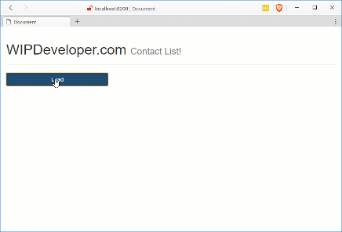

Quick recap up to now we have done [set up](/2017/03/14/using-forcejs-with-vue-js/), [queried Salesforce.com](/2017/03/15/using-forcejs-with-vue-js-part-ii-first-call/) using [ForceJS](https://github.com/ccoenraets/forcejs) and [ForceSever](https://github.com/ccoenraets/force-server) with [Vue.js](https://vuejs.org/) and [created a service](/2017/03/16/using-forcejs-with-vue-js-part-iii-create-a-service/) to make our calls to Salesforce.com more re-useable. Now let pass some data between 2 components using an even hub.

## Please Pass the Event... Hub

We are going to create a new component and pass information from our `contact` component to our new component using a message buss. To make a message buss is pretty easy we will make a new instance of a Vue object and only use it to register event related actions.

In your services folder lets make a new file, I called mine `eventHub.service.js` but feel feel to call yours what ever suits your naming desires. In this new file create a new instance of Vue and give it a name you feel would suit a level 1 event hub, I called my instance `eventHub`.

#### `app/services/eventHub.service.js`

let eventHub = new Vue()

That's it. Your event hub is ready for use.

## New Component has Entered the App

One thing we want to be able to do is select a contact and show the details for that contact. Sicne our contacts list is a component lets make a local component to our `contacts` component. First thing you will need to do is add a property for `components` to the `contacts` component. This new property will be a JSON object that is the name of the components and the object, or options, that defines the component. Lets call our new component `contact-detail` and give it an object named `contactDetail`.

#### `app/components/contacts.js`'s New `components` Section

components: {
    'contact-detail': contactDetail
  },

If you try the app now you will get an error because we haven't defined this new component yet, we'll add that in a moment but first lets add a button to `Show Details` in each contact that has a `v-on:click` that calls a method `select`. This means we need to add a select method to `contacts`

#### `app/components/contacts.js`'s New `select` Method

select: (id) => {
  console.log(id)
  eventHub.$emit('selectedContact', id)
}

The `eventHub.$emit('selectedContact', id)` in our `select` method will send a message to our event hub that other components can register to listen for. When they the event is sent they will also receive the `id` that is sent with it. Now lets create that `contactDetail` to listen for events

Create a new file in the component folder, I named mine `contact-details.js` and it will look something like this:

#### New `app/components/contact-details.js`

let contactDetail = {
  template: \`
  

    <h4 class="col-xs-12">
      Name: <small>{{ currentContact.Name }}</small>
    </h4>
    <h4 class="col-xs-12">
      Title: <small>{{ currentContact.Title }}</small>
    </h4>
    <h4 class="col-xs-12">
      MobilePhone: <small><a v-bind:href="'tel:' + currentContact.MobilePhone">{{ currentContact.MobilePhone }}</a></small>
    </h4>
    <h4 class="col-xs-12">
      Email: <small><a v-bind:href="'mailto:' + currentContact.Email">{{ currentContact.Email }}</a></small>
    </h4>
    <h4 class="col-xs-12">
      Department: <small>{{ currentContact.Department }}</small>
    </h4>
    <h4 class="col-xs-12">
      Lead Source: <small>{{ currentContact.LeadSource }}</small>
    </h4>
    <h4 class="col-xs-12">
      Languages: <small>{{ currentContact.Languages\_\_c }}</small>
    </h4>
  

  \`,
  data: () => {
    return {
      currentContact: { },
      showContact: false
    }
  },
  created: function () {
    eventHub.$on('selectedContact', this.loadContact)
  },
  methods: {
    loadContact: function (id) {
      this.showContact = false
      this.currentContact = {}

      sfService.query(\`SELECT Id, Name, MobilePhone, Email, Title, Department, LeadSource, Level\_\_c, Languages\_\_c FROM Contact WHERE Id = '${id}'\`)
        .then(response => {
          this.currentContact = response.records\[0\]
          this.showContact = true
        })
    }
  }
}

We have covered most of this [before](/2017/03/09/quick-look-vue-js-part-iv-more-components-and-code-seperation/) but we have a new section called `created`. This will be called when the components is created allowing us to register to listen to events on the `eventHub`. The `eventHub.$on` takes an event name and a method to call when it occurs. In this case it will call `loadContact`.

Let's see it in action:

#### Events In Action!

## Conclusion

Now we can pass information between components and trigger events. What should we try next? Let me know by leaving a comment below or emailing [brett@wipdeveloper.com](mailto:brett@wipdeveloper.com).
