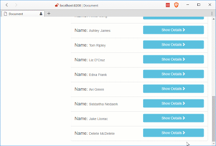

Up to now we have [set up our app](/2017/03/14/using-forcejs-with-vue-js/), [queried Salesforce.com](/2017/03/15/using-forcejs-with-vue-js-part-ii-first-call/) using [ForceJS](https://github.com/ccoenraets/forcejs) and [ForceSever](https://github.com/ccoenraets/force-server) with [Vue.js](https://vuejs.org/), [created a reuseable service](/2017/03/16/using-forcejs-with-vue-js-part-iii-create-a-service/), [event hub](/2017/03/20/using-forcejs-with-vue-js-part-iv-event-hub/), [pass parameters through URL and Update Salesforce object](/2017/03/22/using-forcejs-with-vue-js-part-iv-dynamic-urls-and-editing-objects/) and [created a new Salesforce Object](/2017/03/23/using-forcejs-with-vue-js-part-iv-creating-salesforce-objects/). Now that we can indiscriminately create objects we should make it so we can delete them.

## Update `sfService` Again

Once again we began by adding a new function to our `sfService` this time called `del`. Let's place it after our `create` function in the public function section. The `del` function will call `getDataService` and eventually return the promise created by `forsejs`'s del function. We will also update our return object to expose the `del` function. Once we are done we will the changes should look something like this:

#### `app/services/sf.service.js` Updated to Delete!

function del(objectName, id) {
  return getDataService()
    .then(dataService => {
      return dataService.del(objectName, id)
    })
}

// return object
return {
  query: query,
  update: update,
  create: create,
  del: del
}

Now that the service is up to date we can call `del` from the `contact-detail` component.

## Update `contact-detail` Component

Since we are goign to add the option to delete a contact in the section where we display the contacts details we will need to add a button to the `template`. I added it as the last item after the row for edit button a row for the delete button that has it's click bound to a method named `deleteContact`:

#### Delete `button`

  <button v-on:click="deleteContact(currentContact.Id)" class="btn btn-danger btn-block">Delete</button>

Since we don't have a method named `deleteContact` we should probably add that.

The new method will take the id can call the `sfService.del` passing it the name of the object we want to delete, in this case `Contact` and the `id`:

#### `deleteContact` in `app/components/contact-detail.js`

deleteContact: function (id) {

      sfService.del('Contact', id)
        .then(response => {
          console.log(response)

          this.showContact = false
          this.currentContact = {}
        })
    }

That's it!

## Let's Delete Something!

Now we should be able to run the app and delete a contact.

#### Delete Contact

## Conclusion

That seems to sum up the basic needs we may encounter with our little app. Is there any thing you think should be added or feel left out for not seeing? Let me know by leaving a comment below or emailing [brett@wipdeveloper.com](mailto:brett@wipdeveloper.com).
