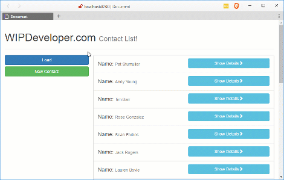

Before we move on from our sample app I thought we would add an overlay when we load `contacts` but before we do, let's recap. So far we have [set up our app](/2017/03/14/using-forcejs-with-vue-js/), [queried Salesforce.com](/2017/03/15/using-forcejs-with-vue-js-part-ii-first-call/) using [ForceJS](https://github.com/ccoenraets/forcejs) and [ForceSever](https://github.com/ccoenraets/force-server) with [Vue.js](https://vuejs.org/), [created a reuseable service](/2017/03/16/using-forcejs-with-vue-js-part-iii-create-a-service/), [event hub](/2017/03/20/using-forcejs-with-vue-js-part-iv-event-hub/), [pass parameters through URL and Update Salesforce object](/2017/03/22/using-forcejs-with-vue-js-part-iv-dynamic-urls-and-editing-objects/) and [created a new Salesforce Object](/2017/03/23/using-forcejs-with-vue-js-part-iv-creating-salesforce-objects/), and [delete a Salesforce Object](/2017/03/27/using-forcejs-with-vue-js-part-vii-deleting-salesforce-objects/). Now lets use the `eventHub` to show an overlay and reload the contacts when a change is made.

## `overlay.js`

First lets add an component that will overlay the screen when called though the even bus. This new component will be a div we position absolutely on the screen through some css I added to the `index.html`

> Pro-tip: Don't just add styles to your html, create separate css files for them and don't be lazy like I am doing here.

#### All the Styles for our `overlay` Component

> With Vue.js if you are using the single file components you can have styles scoped to components. We haven't set up a build for this little project yet so we may do that in the future and remove the style "hack" from our `index.html` at that time.

Now that for the component it's self. It will basically be a div that we hide and show depending on if it has been told to show or not from the event hub.

#### `app/component/overlay.js`

let overlayVM = Vue.component('overlay', {
  template: \`
    

    

  \`,
  created:function(){
    eventHub.$on('overlay:show', this.show)
    eventHub.$on('overlay:hide', this.hide)    
  },
  data: () => {
    return {
      showCount:0
    }
  },
  methods: {
    show:function(){
      this.showCount++
    },
    hide:function(){
      this.showCount--
      this.showCount = this.showCount < 0 ? 0 : this.showCount
    }
  }
})

With that in place we can use the even hub when loading contacts in the `contacts` component.

## Update `contacts` Component

In the `contacts` component add 2 `eventHub.$emit`'s: one to `overlay:show` when `load` is just called and one to `overlay:hide` in the promise fulfillment.

#### `app/component/contacts.js` Updated `load` Method

load: function() {
      contactsData.contacts = \[\]
      eventHub.$emit('overlay:show')

      sfService.query('select id, Name from contact LIMIT 50')
        .then(function(response) {
          contactsData.contacts = response.records
          eventHub.$emit('overlay:hide')
        })
    },

Now when we load contacts an overlay should appear.

#### Our Overlay is Showing

## Conclusion

Now that we have an `overlay` component we can easily add it to other actions if we wanted. Is there anything else you feel we should look at? Let me know by leaving a comment below or emailing [brett@wipdeveloper.com](mailto:brett@wipdeveloper.com).
