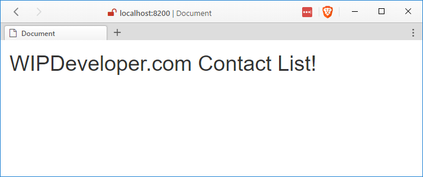

Lets take a momment to use some of what we learned about [Vue.js](tag/vue-js/) and use it to make something with data from Salesforce.com.

Two things we will be using that we haven't talked about before are:

- [ForceJS](https://github.com/ccoenraets/forcejs) - "a micro-library that makes it easy to use the Salesforce REST APIs in JavaScript applications"
- [ForceServer](https://github.com/ccoenraets/force-server) - "a simple development server aimed at providing a simple and integrated developer experience when building applications that use Salesforce OAuth and REST services"

## Setup

To get things started lets set up our [basic Vue app](/2017/03/06/quick-look-vue-js/). We will also need to download ForceJS, you can get the JavaScript [here](https://github.com/ccoenraets/forcejs/blob/master/dist/force.all.js) or do as I did and downloaded the repo as a [zip](https://github.com/ccoenraets/forcejs/archive/master.zip) and put the whole thing in my project directory.

> We are using the ES5 usage scenario for now.

Up to you.

However you decide to do it, add a reference to `force.all.js`, I added it after the `vue` reference.

Now let's create a file for our apps custom JavaScript. For this I created a folder named `app` and a file named `app.js` in that folder. Feel free to spice things up and do them your own way.

I also added a reference to my `app/app.js` file after the so my scripts look like this so far:

#### All the JavaScripts

<!-- Latest compiled and minified CSS -->
<link rel="stylesheet" href="https://maxcdn.bootstrapcdn.com/bootstrap/3.3.7/css/bootstrap.min.css" integrity="sha384-BVYiiSIFeK1dGmJRAkycuHAHRg32OmUcww7on3RYdg4Va+PmSTsz/K68vbdEjh4u"
    crossorigin="anonymous">

> I'm tired of looking at plain html so I added Bootstrap as well but you don't have to.

## Install `ForceServer`

For this we are going to use ForceServer installed globally. I'm going to be using Yarn, learn more [here](/2017/01/26/playing-around-with-yarn/), but I will try to remember to also show the npm commands.

#### yarn

npm install -g force-server

#### npm

npm install -g force-server

Now we should be able to run `force-serve` from the command line and see... well nothing since we didn't put markup that would render output.

Let's fix that!

## Create Base App

In `index.html` lets add some content to the `body` above our scripts.

#### `index.html` Starter `body` Content

  

    <h1 class="col-xs-12">{{ message }}</h1>
  

In `app/app.js` lets create our basic Vue app:

var app = new Vue({
  el: '#main',
  data: {
    message: 'WIPDeveloper.com Contact List!'
  }
})

## Run `force-server`

Now lets see if we left anything broken. In the console run:

#### Start ForceServer

force-server

It should open a browser and show you things are working.

#### Working So Far

## Conclusion

We are just getting started but so far we have proven that include ForceJS and Vue.js on the same page and serve it with ForceServer and things haven't blown up yet! Isn't that exciting? Let me know by leaving a comment below or emailing [brett@wipdeveloper.com](mailto:brett@wipdeveloper.com).
