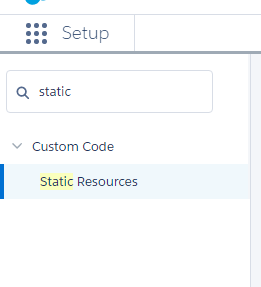

We've taken a look at using [Vue.js](/tag/vue-js/) and using [ForceJS with Vue.js](/tag/forcejs/) now lets add some Vue.js to a Visualforce page. I will be using [Mavensmate](http://mavensmate.com/) with [Visual Studio Code](https://code.visualstudio.com/). Learn a little about setting it up [here](/2016/10/28/visual-studio-code-with-mavensmate/).

> I'm going to assume you already have an org to play around with. If you do not have one you can get a free trial [here](https://www.salesforce.com/form/signup/freetrial-sales.jsp?d=70130000000Enus&internal=true).

## Create a Page

First we will need a Visualforce page to use with our Vue.js app so lets create one. In the Mavensmate desktop app after you have added your project you can add a new Visualforce page from the second left hand menu popup.

#### New Visualforce Page

In the `Metadata Template` drop down choose `Visualforce Page` and give your new page an api name before selecting the `Create Metadata` Button

#### New Visualforce Page Menu

Now, if everything went properly you should see it in your `src/pages/` folder.

#### `TryVuejs.page` Created!

## Create Static Resource

If creating a static resource is an option in Mavensmate I haven't figured it out yet. Since this only happens ocasionally anyway I will create it through the Lightening UI.

> Yay!

When you are logged into your org go to set up in the upper right hand corner

#### Go to Setup

In the Quick Find Search box type Static and choose `Static Resources`

#### Quick Find

Now choose the `New` button at the top of the table and open the `Static Resource` setup dialog.

#### `Static Resource` Setup

> I'm just adding some `html` file to the file selector for now so that I can create the Static Resource. I'll replace it's contents later.

Once you hit save your new Static Resource should be listed and ready for use.

#### New Static Resource!

## Sync New Static Resource

Now that we have that new Static Resource lets get Mavensmate to pull it down to our desktop.

In Mavensmate go to the project home

#### Project Home

And Choose Edit Project

#### Edit Project

Now `Refresh Metadata Index`

#### `Refresh Metadata Index`

And expand `ApexPage` and check our new Visualforce page from early then expand `StaticResource` and check our new static resource before choosing `Update Project`

#### Things to Update

> We select the things we want to have access to on our machine so if we did not select our new Visualforce page it would have been removed from the local directory when we updated the project.

## Conclusion

Now that we have created a Static Resource and a Visualforce page to use with our Vue.js app we can get started. Is there anything you would like to see the app do? Let me know by leaving a comment below or emailing [brett@wipdeveloper.com](mailto:brett@wipdeveloper.com).
