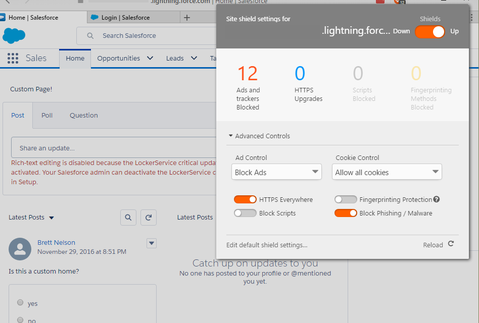
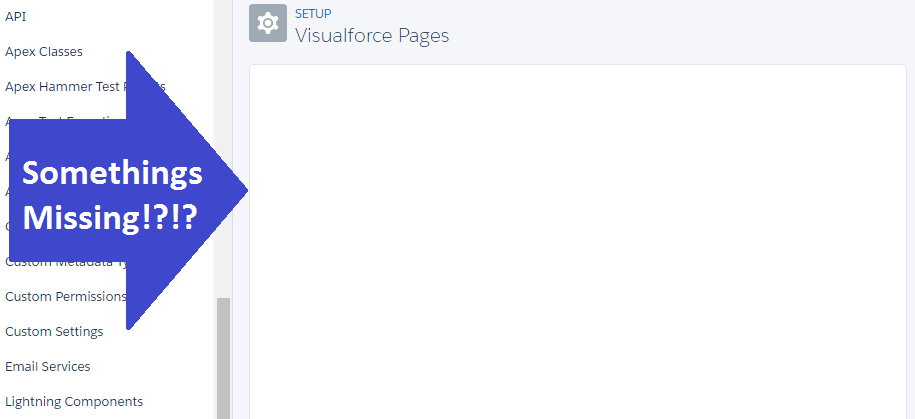
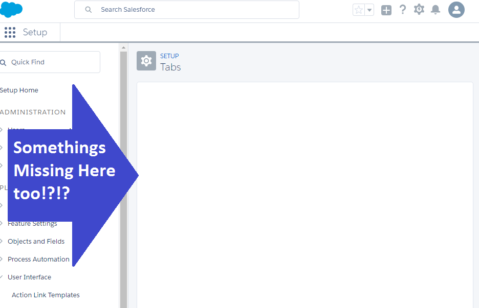
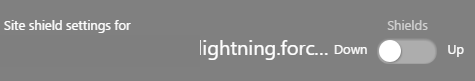
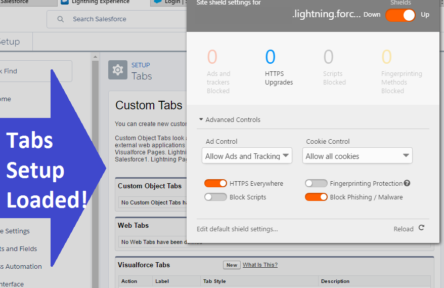

I've been using Brave for a while now as my main desktop browser. It have been a great experience and I would recommend it if you are concerned with your safety on the web.

## The Catch

The only issue I have encountered with using Brave is when working with Salesforce Lightning Experience. When you first load up your org with Lightning enabled if you look at the Brave Shield statistics (by clicking the Brave icon) you will see that 12 ads and trackers were blocked.

#### 12 Blocked Ads and Trackers

Everything seems to work ok until you go into the Setup. Some things work properly but I noticed when trying to load the Visualforce Pages or Tabs Setup menus something is missing.

#### No VF Pages Setup

#### No Tabs Setup

## The Workaround

Since Brave is built on Electron it should be a similar rendering engine as is used in Chrome and since Lightning is working ok in Chrome the quick workaround was disable the Brave Shield.

#### Shields Are Down

And this did allow the page to work I would rather not have it turned off. So Turning the Brave Shields back on and changing `Ad Control` to `Allow Ads and Tracking` allows the page to load properly.

#### Working Tabs

Now that my Tabs and Visualforce Setup menus are working I can get back to working myself.

## Conclusion

I think Brave is awesome and you should too! But with all new things it takes some adjusting to get things right. Have you tried anything new lately you would like to share? Let me know by leaving a comment below or emailing [brett@wipdeveloper.com](mailto:brett@wipdeveloper.com).
