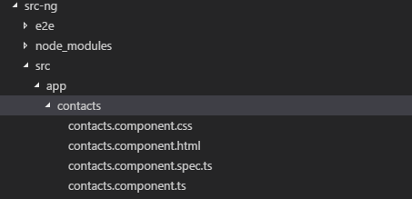
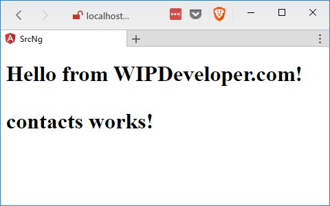
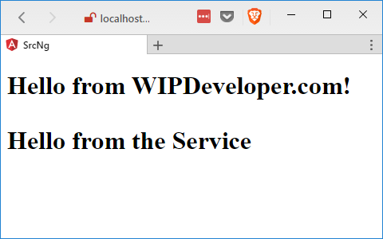

We have an Angular app running in Salesforce but so far there isn't much too it. Lets take some time and add a component and a service.

## Make a Component

First we should make a component. I'm going to call mine `contacts` and I will eventually use it to display a list of contacts. Enter the following in terminal:

#### Make a Component for `contacts`

ng generate component contacts

You should see the following output:

#### `contacts` Component Created

installing component
  create src\\app\\contacts\\contacts.component.css
  create src\\app\\contacts\\contacts.component.html
  create src\\app\\contacts\\contacts.component.spec.ts
  create src\\app\\contacts\\contacts.component.ts
  update src\\app\\app.module.ts

In you folders view you should see a new folder in you `src-ng/src/app` folder called `contacts` with the following 4 files:

- contacts.component.css
- contacts.component.html
- contacts.component.spec.ts
- contacts.component.ts

#### New `contacts` Component Folder

Lets take a look at each one:

##### contacts.component.css

This is the component level css files.

> this starts out empty.

##### contacts.component.html

This is the component html template. The html can also be placed in the TypeScript or JavaScript file.

  contacts works!

##### contacts.component.spec.ts

This is the component test class.

import { async, ComponentFixture, TestBed } from '@angular/core/testing';

import { ContactsComponent } from './contacts.component';

describe('ContactsComponent', () => {
  let component: ContactsComponent;
  let fixture: ComponentFixture<ContactsComponent>;

  beforeEach(async(() => {
    TestBed.configureTestingModule({
      declarations: \[ ContactsComponent \]
    })
    .compileComponents();
  }));

  beforeEach(() => {
    fixture = TestBed.createComponent(ContactsComponent);
    component = fixture.componentInstance;
    fixture.detectChanges();
  });

  it('should create', () => {
    expect(component).toBeTruthy();
  });
});

##### contacts.component.ts

This is the controller for the component. Think of it as where the logic that is specific to the controller should go.

import { Component, OnInit } from '@angular/core';

@Component({
  selector: 'app-contacts',
  templateUrl: './contacts.component.html',
  styleUrls: \['./contacts.component.css'\]
})
export class ContactsComponent implements OnInit {

  private contacts;

  constructor() { }

  ngOnInit() {
  }

}

Now let's add our component to the page by using the `selector` that is defined in the `contacts.component.ts` as `app-contacts` to add a tag to our `app.component.html`.

#### Updated `app.component.html`

<h1>
  {{title}}

  <app-contacts></app-contacts>
</h1>

It's not much but if you run `ng serve --open` you should see the following:

#### App with `contacts` Component

## Add A Service

Now we are going to need a service so we have one location to call the `@RemoteActions` from so let's make that now.

#### Create `remote-actions` Service

ng generate service services/remote-actions

> For the name we included the name of the folder where we want the service to be created.

#### `services/remote-actions` Created

installing service
  create src\\app\\services\\remote-actions.service.spec.ts
  create src\\app\\services\\remote-actions.service.ts
  WARNING Service is generated but not provided, it must be provided to be used

And you should now have a folder names `services` in you `src-ng/src/app` with the following files:

- remote-actions.service.ts
- remote-actions.service.spec.ts

Let's take a look at these:

##### remote-actions.service.ts

This is the actual service. We will put logic we want to be shared or it not specific to a single component.

import { Injectable } from '@angular/core';

@Injectable()
export class RemoteActionsService {

  constructor() {

  }

}

##### remote-actions.service.spec.ts

This is the test specification for the service.

import { TestBed, inject } from '@angular/core/testing';

import { RemoteActionsService } from './remote-actions.service';

describe('RemoteActionsService', () => {
  beforeEach(() => {
    TestBed.configureTestingModule({
      providers: \[RemoteActionsService\]
    });
  });

  it('should ...', inject(\[RemoteActionsService\], (service: RemoteActionsService) => {
    expect(service).toBeTruthy();
  }));
});

Let's add the following line to the service:

#### Add To `remote-actions.service.ts`

serviceMessage = "Hello from the Service";

We will use this message to verify we have the service working.

Have to register the service so we can use it.

In your `app.module.ts` import the `RemoteActionsService`

#### Import Statement

import { RemoteActionsService } from './services/remote-actions.service';

Then in the `providers` array add the `RemoteActionsService`

#### Providers

providers: \[
    RemoteActionsService
\],

Now we will inject the service to the `contacts.component.ts` with the same inject statement as we used on the `app.module.ts`. We will also pass the `RemoteActionsService` into the constructor as `private` with a property name of `remoteActions`. We also add a property of `message` with a type of `string`. The updated class should look like this:

#### Updated `contacts.component.ts`

import { Component, OnInit } from '@angular/core';
import {RemoteActionsService} from  '../services/remote-actions.service';

@Component({
  selector: 'app-contacts',
  templateUrl: './contacts.component.html',
  styleUrls: \['./contacts.component.css'\]
})
export class ContactsComponent implements OnInit {

  message:string;

  constructor(private remoteActions : RemoteActionsService) {
    this.message = remoteActions.serviceMessage;
   }

  ngOnInit() {
  }

}

We will also need to update `contacts.component.html` to use the new `message` value:

#### Updated `contacts.component.html`

  {{message}}

Save it and now you should see your app reload and see the message from the service.

#### Message from Service!

## Side Note: Zone.js Error

I noticed I was getting an error with Zone.js to fix this I installed version 0.8.5 `zone.js@0.8.5`. If you don't see an error with Zone.js feel free to skip this.

#### Fix `zone.js` Error

npm install zone.js@0.8.5

## Conclusion

We now have a component and a service in our Angular App. Next time we will call one of our remote actions. Do you have any questions so far? Let me know by leaving a comment below or emailing [brett@wipdeveloper.com](mailto:brett@wipdeveloper.com).
